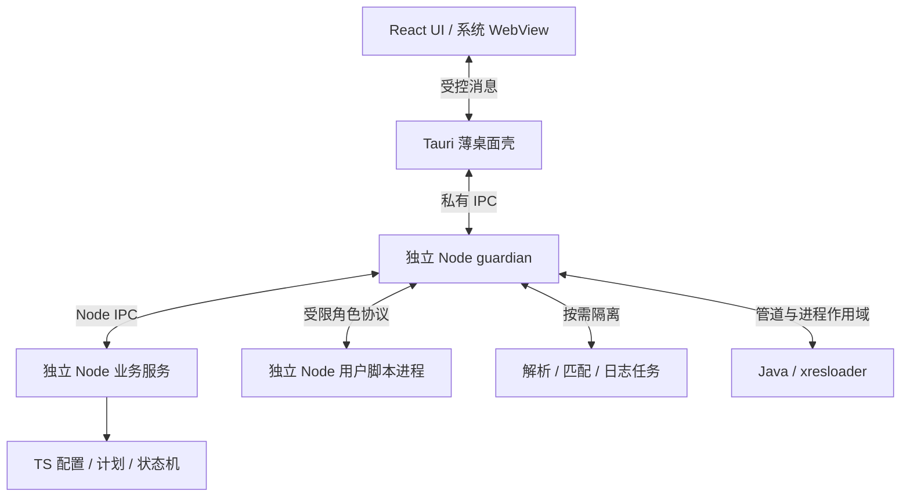

# xresconv-gui 全面重构执行计划与测试计划

**请确保深度思考调研后再执行，禁止猜测。按需更新AI agent提示词、skills和各类文档。及时更新完成进度。**

Hint:

- 注意测试过程中可能涉及GUI阻塞或异常，无论何种测试，都要限定超时时间，不要卡死。
- xresloader的jar包可以复用 ../xresloader/target/xresloader-XXX.jar 。验证测试可以参考 ../xresloader/sample 里 gen_sample_output.ps1 或 gen_sample_output.sh 的内容编写
- <https://github.com/xresloader/xresconv-conf/blob/main/sample.xml> 和 <https://github.com/xresloader/xresconv-conf/blob/main/sample_include.xml> 有更完整的配置文件规范和建构。可以参考规划设计单元测试。

## 0. 执行入口与分册

本文件保留目标、选型、版本快照及 P0–P7 阶段出口；具体任务、接口、测试步骤和证据格式见 [执行计划索引](docs/plan/README.md)。完成证据与决策记录见 [records 索引](docs/plan/records/README.md)；模块测试通过不等于跨平台阶段验收。

| 阅读顺序 | 分册 | 用途 |
| --- | --- | --- |
| 1 | [基线与工具链](docs/plan/01-baseline-toolchain.md) | P0/P1，旧行为取证、依赖升级、工程骨架及回退 |
| 2 | [接口与脚本宿主](docs/plan/02-contracts-script-host.md) | P2，IPC、脚本上下文、节点镜像、监督与资源回收 |
| 3 | [配置与转换内核](docs/plan/03-domain-conversion.md) | P3，XML、选择、转换计划、Java 协议及日志 |
| 4 | [UI 与交互](docs/plan/04-ui.md) | P4，页面组成、状态所有权、可访问性及迁移 |
| 5 | [安装与 CI 发布](docs/plan/05-packaging-release.md) | P5，双版本安装包、运行时、签名、Actions 和产物矩阵 |
| 6 | [测试与验收](docs/plan/06-testing-acceptance.md) | P6，fixture、具体步骤/断言、覆盖映射和证据 |
| 7 | [切换与交接](docs/plan/07-cutover.md) | P7，删除旧架构、数据兼容、回滚和交付清单 |

分册细化主计划，不复制依赖版本表；发生范围或兼容性变化时同时更新主计划和对应合同。未经实测的实现策略均是拟定方案；不能将兼容性风险记成已解决。

## 1. 状态、目标与实施边界

- 编制日期：2026-09-23；源码基线 `3e8ec5773368ce02455a74bcd42d7ff03487be08`，应用版本 `2.6.0`。
- 当前状态（2026-09-25）：P0–P3 完成（G0 通过、Windows 实测）；P4 已至 P4-05，P5 已至 P5-02；553 例 Node/前端与 8 例 Rust 测试通过；Windows 桌面 E2E、八格式真实 JAR 差分通过。**暂停：P4-06 至 P4-09、P5-03+；Linux/macOS、POSIX 多层进程组、实体安装包与发布矩阵待验收。** 证据见 `docs/plan/records/`。

用户已确定的目标：

1. 将保留的依赖、工具链及全部 GitHub Actions 升级到实施时最新稳定版本。
2. 采用 **Tauri 2 薄桌面壳 + 系统 WebView + 独立 Node.js 进程**；配置、领域模型、转换调度、日志和脚本宿主使用 TypeScript/Node.js，不开发 Rust 业务层。
3. 全面重构 UI、数据模型、配置加载、转换调度、日志、脚本宿主及发布流程；移除 jQuery、Fancytree、Bootstrap 等旧 UI 依赖。
4. 保留现有业务功能、XML 配置格式、启动参数、自定义按钮、JavaScript 用户脚本和必要的 Node.js 模块能力。
5. 用户脚本发生异常、死循环、进程退出或资源超限时，不得导致 GUI 白屏、主进程退出或任务状态永久卡住。
6. 每个正式支持的平台/架构同时提供引导安装版和离线安装版。系统运行时满足要求时复用，否则引导安装或从包内安装。

实施边界：本仓库负责 GUI 与宿主，不自行变更 xresconv-conf 或 xresloader 的协议。Java 与 xresloader.jar 仍为用户提供的业务运行环境；“离线安装版”默认覆盖本 GUI 的 Node.js 与 WebView/GUI 运行依赖，不擅自附带或升级用户的 JDK、JAR。

完成条件：功能对照表、旧脚本回归、故障隔离、三平台真实应用测试、安装矩阵和产物检查均通过，才允许切换正式发行。体积数字必须来自完整产物，不能以空 Tauri 应用或运行时本体替代。

## 2. 源码事实与待决策事项

### 2.1 旧实现行为基线（v2.6.0，迁移前取证）

下表为迁移前旧实现行为事实（兼容对照基线，P0 记录见 [基线审阅](docs/plan/records/P0-07.md)），不代表当前工作树。

| 范围 | 当前行为与重构影响 | 源码依据 |
| --- | --- | --- |
| 桌面入口 | Electron 主进程创建窗口，解析启动参数，提供少量 IPC | `src/setup.js` |
| 权限与脚本 | 渲染器启用 Node integration、关闭 context isolation；脚本与界面共享渲染进程，使用 `node:vm` | `src/setup.js:188`、`src/main.js:521` |
| 脚本能力 | 转换事件、按钮脚本、日志事件注入原始 `require`；官方示例使用子进程与定时器 | `src/main.js:564`、`src/main.js:2297`、[配置示例](https://github.com/xresloader/xresconv-conf/blob/master/sample.xml) |
| UI 耦合 | `selected_nodes` 为真实 Fancytree 对象，`selected_items[].ft_node` 指回节点 | `src/main.js:510`、`src/main.js:1854` |
| 配置与规则 | XML/include、全局选项、Java 参数、输出矩阵、tag/class、glob 与 JavaScript RegExp | `src/main.js:131`、`src/main.js:1192` |
| 转换执行 | 启动外部 `java -jar ... --stdin`，维持多个进程，读取 stdout/stderr | `src/main.js:1898`、`src/main.js:2119` |
| 事件链 | before → 转换 → after；拒绝会中断 Promise 链，不能改为忽略错误继续转换 | `src/main.js:2301`、`src/main.js:2397` |
| 状态差异 | 按钮 `data` 可跨同一按钮调用共享；当前 `set_name` 和 before/after 的 `data` 每次创建，不能仅按 README 的“全局状态”文字实现 | `src/main.js:612`、`src/main.js:1712`、`src/main.js:2350` |
| 结束通知 | 实际注入 `resolve/reject`；README 部分 XML 注释仍写 `done()` | `README.md`、`src/main.js:2329` |
| 打包 | Electron 41.10.3、packager 19.1.0；已有 prune/ASAR，macOS 当前关闭 ASAR | `package.json`、`yarn.lock`、`gulpfile.js` |
| 工程规则 | Yarn 为唯一包管理器；新增测试体系前记录选型到来源索引 | `AGENTS.md`、`docs/ai/source-index.md` |
| 测试基础 | 当前没有完整单元/集成/桌面端到端测试体系 | 工程文件清单、`package.json` |

此前实际检查的 v2.6.0 Windows x64 发布包为 97.14 MiB，解压约 363.88 MiB，应用 ASAR 约 20.65 MiB；该发布包使用 Electron 41.1.0，不能当作当前提交的新构建结果。实施 P0 必须重新记录同架构基线、压缩参数、签名状态及依赖清单。[正式发布](https://github.com/owent/xresconv-gui/releases/tag/v2.6.0)

### 2.2 决策记录（2026-09-23 用户已定，详见 [P0-06](docs/plan/records/P0-06.md)）

| ID | 原未决问题 | 决策结论 | 影响范围 |
| --- | --- | --- | --- |
| D1 | Windows ia32、Linux armv7l 是否必须进入新架构发行矩阵 | **已定：允许删除。** 新矩阵仅 64 位；旧 2.6.0 发行与 tag 保留为 32 位用户终点版本 | 正式平台清单与最终发行 |
| D2 | Linux 首批支持哪些发行版/版本 | **已定：Ubuntu 22.04/24.04 LTS、Debian 12/13、Fedora 最近两个正式版本；GNOME/KDE、X11/Wayland。** 离线变体优先单一自含包（含 WebKitGTK），P5 原型验证，不可行回退按发行版闭包 | Linux 最终产物矩阵 |
| D3 | 真实用户脚本是否使用 DOM、jQuery、Electron 或未记录的 Fancytree 方法 | **已定：兼容范围收敛为文档化公开接口（README + 脚本契约）。** 移除 jQuery/Fancytree/Bootstrap；依赖未公开实现的脚本不在兼容承诺内，检测到给诊断与迁移指引 | 旧脚本完整兼容与移除旧 UI |
| D4 | 脚本沙箱需要防普通故障，还是也要防恶意访问系统 | **已定：可信脚本 + 故障隔离。** 允许脚本访问文件系统与外部进程；验收边界是故障不得白屏/杀主进程/卡死任务，且 IPC 上不能获取未授权主进程能力；不声称防恶意沙箱 | 安全验收声明 |
| D5 | 对 macOS 的系统 WebView 交付方式 | **已定：只用系统 WKWebView，系统不足时引导升级 macOS。** 最低系统取 Node/Tauri/前端交集（候选 13.5，P5 复核） | macOS 发行说明与安装验收 |

D1–D5 已全部决策，不再阻塞任何阶段；D2 离线自含包与 D5 最低系统版本仍有实现期复核点，见 [P0-06](docs/plan/records/P0-06.md)。

### 2.3 D6：业务层统一为 Node.js（用户要求）

取消自研 Rust 配置、领域、调度、协议源和 guardian 工程；改用 TypeScript/Node.js。Tauri 2 自身以 Rust 构建，仍保留其必要工具链、入口、插件注册及最小消息/生命周期胶水，不能把本方案表述成完全没有 Rust。开发机/CI 需要 Rust，最终用户无需安装 Rust。[Tauri 构建前提](https://v2.tauri.app/start/prerequisites/)、[官方 Node sidecar 路线](https://v2.tauri.app/learn/sidecar-nodejs/)

此调整用于减少双语言业务重写、重复数据模型和维护成本，不声称已实测证明 Rust 性能或体积收益低。体积目标继续由最终 Tauri + Node 产物验证，额外 Node 进程的内存与启动开销也要计入。D1–D5、全部功能、脚本故障隔离及双变体交付要求继续有效。

## 3. 新技术栈及选型依据

### 3.1 选定方案

| 层次 | 选择 | 职责与理由 |
| --- | --- | --- |
| 桌面壳 | Tauri 2 与官方插件 | 窗口、原生对话框、参数、受控消息转发和 Node 启停；只留必要 Rust 入口/胶水，不承载业务 |
| 前端 | React 19、TypeScript、Vite | 本地静态 SPA，组件与业务状态分离；不需要 SSR、RSC 或额外 Web 服务 |
| 可访问组件 | React Aria Components | 按钮、选择器、对话框、树与键盘交互；取代依赖 DOM 全局修改的旧组件 |
| 样式 | CSS Modules、CSS 自定义属性、Grid/Flex | 本地设计令牌与主题，按最低 WebView 实测兼容；避免仅为样式引入新的浏览器版本门槛 |
| 前端状态 | Zustand | 保存 UI 展示状态及后端快照；任务真相由独立 Node 业务服务管理 |
| 大列表 | React Aria 树；日志使用 TanStack Virtual | 树的虚拟化与键盘焦点必须做组合验证；不得把普通列表虚拟化直接当成可访问树实现 |
| 配置/领域层 | TypeScript、Node.js、fast-xml-parser | XML、路径、领域模型、转换计划与状态机；解析器须通过 BD-07 和既有 fixtures |
| 监督/日志 | 独立 Node guardian、node:child_process、log4js | 外部硬截止、进程所有权、管道背压与日志；guardian 不运行用户脚本或重业务 |
| 旧脚本 | 随包 Node.js、独立脚本执行器 | 保留 JS/Node/CommonJS 语义；与 GUI、主调度、可信日志服务分进程 |
| 旧语义辅助 | Node 模块与按需独立任务 | 复用 minimatch/JS RegExp/log4js；复杂解析、regex、自定义 appender 放入可终止隔离域 |
| 契约 | JSON Schema → TypeScript 类型，Ajv 验证 | schema 在 packages/contracts 唯一维护；UI/业务/guardian/worker 共用，不再经 Cargo 导出 |
| 质量工具 | TypeScript、Biome、markdownlint；Tauri 壳的 rustfmt/clippy | 业务检查统一 JS/TS；原生检查只覆盖必要桌面胶水 |
| 测试 | Vitest、Node 子进程、Testing Library、Playwright、WDIO Tauri | 领域及脚本用 JS/TS 测试；Tauri 只保留桥接/生命周期的原生检查 |

React 官方提供 Vite + TypeScript 的客户端应用路线，适合本地 Tauri 应用（[React 指引](https://react.dev/learn/build-a-react-app-from-scratch)、[Tauri Vite 接入](https://v2.tauri.app/start/frontend/vite/)）。2026-09-23 npm 周下载统计 React 约为 Vue 的 11 倍、Svelte 的 31 倍（含 CI 与间接使用，仅作生态体量依据，统计来源见来源索引）；选 React 是为组件、测试与可访问性生态，不声称执行性能绝对最佳。Tailwind 4 的现代浏览器要求会额外约束系统 WebView，故采用 CSS Modules 与渐进增强；React Aria 的三态/树焦点/虚拟化仍须在实际 WebView 验证（[Tailwind 兼容要求](https://tailwindcss.com/docs/compatibility)、[React Aria Tree](https://react-aria.adobe.com/Tree)）。

### 3.2 版本快照与升级规则

锁定版本以 `package.json` / `yarn.lock` / `Cargo.lock` 为准；2026-09-23 调研快照（npm registry、crates.io、官方发行页）已迁入 [来源索引](docs/ai/source-index.md)。正式发布冻结前复查一次，选择非预发布版本并记录版本、日期、来源、校验值及兼容性证据。关键策略：

- Node.js：以最新稳定（26.x Current）为候选、24.x LTS 为兼容测试基线；Current 非 LTS，不静默替换发行目标。
- Tauri：使用最新 2.x，3.x alpha 不采用；CLI/JS API 按官方兼容范围配套，不要求所有包补丁号相同。
- 已知冲突：`typescript-eslint@8.70.1` 的 TypeScript peer 范围不覆盖 TypeScript 7.0.2，不引入该组合，采用 Biome + tsc 自身检查；禁止忽略 peer 错误、强制安装或悄悄降级宣称“升级成功”。
- React Compiler 单独验证后再启用；WDIO 按官方版本矩阵补齐本体的最新兼容版。
- Tauri 原生传递依赖由锁定的 Tauri/插件决定；不为业务层直接引入 quick-xml、schemars、Tokio/tracing 等，也不要求传递依赖中不存在 Rust 库。

当前依赖处理（P7 前）：electron/@electron/packager/gulp 过渡期保留，切换后删除；jquery/jquery.fancytree/bootstrap/@popperjs 不进入新 UI 或 Node 发行依赖（fancytree 安装修补脚本一并删除）；adm-zip/compressing/log4js/minimatch 保留为脚本/兼容服务模块并验证边界。升级流程：清点直接/传递依赖 → 阅读变更与运行时要求 → 小批升级 → 锁文件与行为差异检查 → 对应测试 → 记录结果；传递依赖只在上游允许且测试通过的范围内更新。

Yarn 4 为唯一 JS 包管理器（`nodeLinker: node-modules`，便于动态 require 与离线部署）；Cargo.lock 只服务 Tauri 壳。（[Yarn 配置](https://yarnpkg.com/configuration/yarnrc)、[Node 版本清单](https://nodejs.org/dist/index.json)、[fast-xml-parser 仓库](https://github.com/NaturalIntelligence/fast-xml-parser)）

## 4. 目标架构与职责



### 4.1 目标目录

```text
apps/desktop/                 React 页面、组件、样式和 Tauri 客户端适配
src-tauri/                    Tauri 必要入口、官方插件和最小消息/生命周期胶水
packages/backend/             TypeScript 业务入口、配置/领域/计划/状态机模块
packages/guardian/            Node 生命周期、子进程作用域、外部超时、清理
packages/contracts/           手工维护的 JSON Schema、生成 TS 类型与校验器
packages/ipc/                 字节帧编解码（壳↔guardian↔worker 边界）
packages/script-host/         用户脚本宿主及旧接口兼容层
packages/compat-service/      glob/RegExp、log4js 等受控兼容服务
packages/packaging/           发行目标/manifest 校验与 production 布局组装
tests/fixtures/               XML、脚本、Java 输入输出和故障样例
tests/desktop/                真实桌面 E2E
tests/installers/             （目标）干净系统安装/升级/离线验收
packaging/                    targets.json 与 manifest/targets JSON Schema
scripts/                      版本核验、资源组装、产物检查
docs/                         架构、脚本 API、支持矩阵、迁移与发布说明
```

目录已按此落地（tests/installers 随 P5 建立）；不得把拆目录本身视为架构完成。所有新增模块必须具有明确输入、输出、所有者和测试边界。

### 4.2 数据与 IPC

- Node 业务服务维护配置、选择集合、转换计划和任务状态的权威版本；UI 持有只读快照及局部输入状态。Tauri 不维护另一份业务模型。
- 区分 `ItemId`、`TreeNodeId`、`ConfigRevision`、`RunId`、`ScriptInvocationId`、`WorkerGeneration`；旧公开数值 ID 通过映射保留，不能仅因新模型改成字符串而破坏脚本。
- 请求包含协议版本、请求 ID、配置版本与运行 ID；响应为明确结果或结构化错误。UI 在重载/重启后通过全量快照恢复，不依赖丢失的事件。
- 事件带单调序号，增量更新可补发/重同步；旧运行、旧 worker 的迟到消息不能修改新状态。
- Tauri 与 Node guardian 使用有界私有管道；Node 各角色优先使用 child_process.fork 的独立 IPC，显式使用包内 execPath。不建立 HTTP/WebSocket 业务服务器。
- 控制通道与脚本 stdout/stderr 分离；设置消息长度、队列、日志速率和解析预算，畸形消息只终止对应执行器。
- 不向脚本发送主进程对象、Rust 句柄或任意 Tauri 命令权限。回传数据和操作逐项验证，禁止原型污染键及未声明操作。
- JSON Schema 是唯一业务契约源，生成 TS 类型并用 Ajv 在 Node 角色边界校验；Tauri 只校验桥接 envelope、窗口权限和长度。共享合法/非法样例覆盖端到端，不能认为 TS 类型等于运行时校验。

### 4.3 业务流与任务状态

```text
Idle → Loading → Ready → BeforeHooks → Converting → AfterHooks → Succeeded
                  │          │             │           │
                  └──────────┴─────────────┴───────────┴→ Failed / Cancelled
```

1. 原生选择 XML 或处理 `--input`，规范化路径并读取配置。
2. 解析 include 图、全局配置、条目、树、输出矩阵与脚本；发现语法错误时保留当前可用会话，不提交半份配置。
3. 批量在隔离进程执行 `set_name`，验证返回修改后建立树快照。
4. 根据用户选择、tag/class、scheme/sheet、输出矩阵生成可检查的转换计划。
5. 冻结 `RunContext`，执行启用的 before 事件，然后运行 Java 转换，成功路径再执行 after 事件。
6. Node 业务服务将失败/取消映射为终态；独立 guardian 负责截止时间和资源回收。业务服务异常时 Tauri 保持窗口可用并显示服务故障，不重放已产生副作用的任务。

计划冻结时点须与旧实现做差异测试：旧代码在 before 事件之前已构造待执行命令，不能未经说明把 before 中对象修改改成影响当前命令。新设计若希望调整此行为，必须单独记录兼容变更并提供迁移说明。

## 5. 功能保留与 UI 重构

| 功能 ID | 必须保留的行为 | 新实现与验收重点 |
| --- | --- | --- |
| F01 | XML 加载、相对路径、include、循环/重复 include 检测 | Node/TypeScript 严格 XML 解析；按 BD-07 修正旧 HTML 容错/转义缺陷，其余路径与覆盖规则对照基线 |
| F02 | tree/category、条目名称/描述、scheme/default_scheme、options、tag/class | 独立领域模型；重复键/数组/缺失属性/空值均有测试 |
| F03 | 勾选、父子级联、全选/全不选、展开/折叠、键盘空格/双击 | React 树与三态选择，禁止条目继续禁止，焦点不随虚拟化丢失 |
| F04 | scheme/sheet 自定义选择器，精确/glob/regex 匹配，默认选中 | 保留 JS RegExp/minimatch 语义，含无效规则的旧回退行为 |
| F05 | reload/select_all/unselect_all/script 自定义按钮动作链 | 保留顺序、共享按钮 data、错误中断及重载后重绑定 |
| F06 | Java 参数、工作目录、JAR、协议文件/数据目录多值、数据版本 | 跨平台参数编码，原生文件选择，执行前诊断 |
| F07 | bin/lua/msgpack/json/xml/javascript/ue-json/ue-csv、自定义输出矩阵 | 保留 rename、output_dir、tag/class 限定及未知格式的处理 |
| F08 | 并发转换、日志输出、运行结果、重置 | Node 业务状态机与独立 guardian，重置清理旧执行与回调 |
| F09 | 五类脚本入口及事件 name/checked/mutable/timeout | 原语义兼容、明确故障处理、配置层级可诊断 |
| F10 | 日志颜色、级别、模块名、日志事件改写、外部 log4js 配置 | 结构化日志、可访问样式、受限富文本与磁盘完整日志 |
| F11 | 启动参数和调试 | 保留 `--input`、`--debug-mode`、`--custom-selector/--custom-button`、`--log-configure` |
| F12 | Windows/Linux/macOS、多分辨率、版本与 Java 环境检查 | 正式支持矩阵内逐项验证，原生窗口行为与开发者工具可用 |

新界面布局：顶部为配置文件和环境状态；左侧为可搜索的转换树；右侧为配置/条目详情及输出矩阵；底部为运行进度与日志；自定义按钮和转换事件开关有固定区域。布局可伸缩，支持高 DPI、键盘操作、明暗主题和空状态/错误状态，不依赖固定 1366×768 尺寸。

所有原功能必须有入口。新增搜索、取消、日志筛选等能力不取代原有全选、重置与自定义按钮。产品文案只呈现用户可行动的错误；详细 IPC/进程诊断进入展开详情或日志。

不在新 UI 保留 `$`、`window.jQuery`、全局 DOM 插件初始化或 Bootstrap JS。旧按钮 `style` 字段的 Bootstrap 名称通过语义映射保留视觉含义，而不是重新引入 Bootstrap。界面内富文本采用明确标签/属性白名单，保留必要强调、颜色与安全链接；脚本提供的事件属性、可执行 URL 或脚本标签不得运行。

## 6. 用户脚本兼容与隔离设计

### 6.1 宿主边界

- 随包只带一份指定架构 Node.js；可信兼容服务和脚本执行器分别启动进程，绝不依赖用户 PATH 上的 Node。
- 执行器内部保留 `vm.Script` 作为上下文管理方式，但故障边界是操作系统进程。Tauri、Node 业务服务、guardian 均不执行用户 JS；worker_threads 不替代该进程边界。
- 宿主脚本可用 TypeScript 开发，发布为普通 JS；用户输入的脚本仍按既有 JavaScript 方式编译和执行。
- 初期使用普通脚本文件与经过裁剪的 `node_modules`，不依赖 Node SEA/打包器静态发现动态 `require`。所有允许的运行依赖随包提供，离线执行不能临时访问 npm。
- `require` 的基准路径、相对导入、模块缓存及允许加载的项目外模块按 P0 契约实现；不能把旧注入 require 的解析基准自动改成 XML 目录。
- 原生模块分别验证 Node-API 和绑定 V8 ABI 的情况，禁止直接沿用 Electron 构建的二进制扩展。

### 6.2 五类入口的行为

| 入口 | 正常语义 | 异常/超时语义 |
| --- | --- | --- |
| set_name | 每个条目执行，允许修改 item_data；按旧数据生命周期创建上下文 | 外部硬超时；记录条目错误并应用已定义的旧行为兼容策略，不冻结加载界面 |
| on_before_convert | 按顺序执行已启用事件；resolve/reject 控制继续 | 失败则本次运行失败，不启动后续转换 |
| on_after_convert | 在转换阶段满足旧成功条件后按顺序执行 | 失败显示后处理失败，不伪装整个运行成功 |
| script | 按钮动作链顺序执行，同按钮 data 保持共享 | 中断对应动作链、报告原因，其他会话仍可操作 |
| on_append_log | 修改 message/module_name/style；保持同一日志内 hook 顺序和递归保护 | 保留原始日志及错误诊断；隔离故障 hook，不能阻塞 Java 管道读取 |

脚本进程按配置会话/事件契约组织。不能简单“每次脚本启动一个全新进程”而丢失按钮状态，也不能让日志 hook 与长时间按钮脚本共用一个会被相互阻塞的事件循环。P2 确定 worker 分组、重入策略、按钮状态生命周期、require 缓存边界，并用真实脚本验收。

`resolve/reject` 只允许生效一次。完成后的定时器、回调和副作用必须定义归属：不能提前释放正常弹框回调，也不能让过期执行污染新运行。执行器崩溃后的任意 JS 闭包不能承诺恢复；标记会话状态失效并通知用户，禁止自动重放可能已写文件或执行外部命令的脚本。

### 6.3 节点、对象和回调兼容

- 用稳定 ID 和数据镜像建立 `selected_nodes` / `selected_items` / `ft_node` 兼容对象，不传递真实 React/DOM 对象。
- 在 worker 内重建必要的对象引用关系和函数接口；跨 IPC 只传快照、版本和操作，不直接 JSON 序列化循环对象。
- 依据 P0 记录按 D3 分类节点属性和方法。公开合同内的读取/操作须验证同步返回值、回调与修改可见性；旧实现偶然暴露的方法不自动扩为兼容承诺。
- worker 的同步读写在本地镜像执行，提交有序操作到 Node 业务服务，再由 UI 更新；D3 已排除的 DOM/jQuery/未公开接口给出诊断，不恢复旧 UI 依赖。
- `alert_warning` 的 yes/no/on_close 以回调 ID 往返；超时、取消、窗口关闭后清除回调，不执行旧 generation 的回调。
- 按钮 data 中的 JS 值留在 worker 内；如需跨执行器持久化，明确允许的数据类型，不能静默 JSON 化函数、Buffer、BigInt 或循环引用。

兼容门槛（D3 已定）：脚本兼容范围以文档化公开接口为准（README 与脚本契约）。依赖任意 DOM/jQuery/Electron 或真实 Fancytree 内部对象的脚本不在兼容承诺内；运行时检测到此类用法必须给出可定位诊断与迁移指引，不做透明模拟。完全去除旧 UI 与无限制模拟其所有内部对象不具备自动兼容保证；不以“脚本能编译”判定兼容完成。

### 6.4 故障与权限

- 超时器由独立 Node guardian 维护；它不运行脚本、XML 解析、regex 或自定义 appender。VM timeout 是第二道保护；脚本或业务服务事件循环阻塞不能阻断 guardian 的截止时间。
- 限制 worker 数量、内存、CPU/执行时长、消息大小、日志速率和派生进程数量；不要只使用 `--max-old-space-size`，它不覆盖所有原生内存。
- 平台进程树能力通过 Node 系统调用/受维护适配层验证；Windows 的 Job Object 等 Node 无直接接口的能力单列原型，不假设 child.kill() 覆盖进程树。若必须补原生代码，仅限最小生命周期适配，先给出具体缺口与方案，不自动扩回 Rust 监督/业务工程。
- 不把普通进程组当成防恶意逃逸边界。`detached` 子进程、信号、FFI/原生模块和同用户进程访问必须单列测试；不能证明的强隔离能力不得写成保证。
- D4 已定：脚本按**可信脚本**处理，保有文件系统与外部进程能力；验收边界是故障隔离（不得白屏/杀主进程/卡死任务）与 IPC 授权（脚本不能获得未声明的主进程能力）。受限能力模式为可选增强，不阻塞发行；若实现，按工作目录、输出目录、网络与程序能力授权。不能靠 Node VM 或 Node Permission Model 宣称完全防恶意代码。
- 在支持范围内，子进程清理必须覆盖取消、超时、GUI 关闭、重置、宿主崩溃和更新。清理失败可观测，不把仍在运行的任务显示成已安全停止。

[Node VM 边界](https://nodejs.org/api/vm.html)、[Node Permission Model](https://nodejs.org/api/permissions.html)、[Electron 原生模块 ABI](https://www.electronjs.org/docs/latest/tutorial/using-native-node-modules)

## 7. 配置、转换协议与日志

### 7.1 配置与规则

- 固定 XML 实体、CDATA、空白、include 覆盖次序、相对路径基准及默认值；禁用外部实体与网络实体解析，避免读取配置触发非预期外部访问。
- 将文件选择、配置解析和原配置文本分离；任何错误都返回文件、节点/字段、行列或可定位上下文。
- 保留 JS RegExp 与 minimatch 的语义。复杂匹配在受监督的独立 Node 任务内批量执行，防止异常表达式阻塞 GUI 或业务服务。
- 对 Windows 盘符、UNC、长路径、空格、中文、非 BMP 字符、大小写与软链接建立测试。工作目录、资源目录、配置目录分别建模。

### 7.2 Java 进程池

已读取 xresloader 提交 `1f34e9b80d2b8c199e62453cdb104e47b87530a3` 的 `Main.java`：`--stdin` 按行读参数，支持单/双引号分组，循环调用转换并累计退出码。**没有据此证明 stdout/stderr 的一次 data 事件就是某条任务完成。** 该上游快照用于设计，用户实际 JAR 版本仍需单独验证。[协议源码](https://github.com/owent/xresloader/blob/1f34e9b80d2b8c199e62453cdb104e47b87530a3/src/org/xresloader/core/Main.java)

- 主进程以参数数组启动 Java，不经 shell 拼接命令。
- stdin 模式采用符合该解析器的专用编码器；不要套用 shell 转义规则。换行、双类引号等不可表达输入应拒绝并明确诊断，或走经过验证的逐任务 argv 执行路径。
- 默认设计为可追踪的 worker 分片/有限批次：按确定顺序写入并处理背压，写完关闭 stdin，以进程退出作为该批次完成边界。
- stdout/stderr 只承担日志流，不用任意数据块驱动调度或判定完成；支持 UTF-8 字符拆包、半行、多行、无换行和尾部缓冲。
- 无可靠逐条确认协议时，只展示提交数、批次状态和可证明的完成信息，不能伪造精确单项成功计数。
- 保留多进程复用与并发参数，单独验证失败累计、任务顺序、输出冲突及退出码截断；与旧行为不同的策略必须记录。
- 取消/重置先冻结状态与禁止新派发，再关闭/终止所属进程树，收集退出结果，最后释放上下文。

### 7.3 日志

- 区分原始进程日志、脚本 hook 处理后的用户日志和应用诊断日志。
- 日志队列有界；完整日志可落盘，UI 虚拟列表只保留可管理窗口，滚动加载历史。不得悄悄丢弃业务日志来满足性能指标。
- hook 处理使用有序队列和独立执行器，避免日志回调再次记录日志导致递归；失败回退为原始日志并显示 hook 故障。
- 保留 `--log-configure` 的 log4js 行为；自定义 appender 作为有副作用的扩展明确隔离，文件轮转、路径、退出 flush 均需验证。
- 脚本/Java 输出不能作为未过滤 HTML 注入 WebView；保留 ANSI 颜色和受支持富文本的展示效果。

## 8. 跨平台和双版本运行时交付

### 8.1 通用约束

每个支持的目标都提供 `bootstrap` 与 `offline` 两种发行变体；二者包含同一版本 GUI、同一 Node.js 和同一业务依赖。不同之处只在平台运行时的准备方式，不能做成精简功能版/完整版。

统一引导顺序：校验架构/系统 → 检查运行时能力与最低版本 → 已满足则直接启动 → 缺失或过旧则进入对应安装流程 → 复检 → 启动应用。安装检查必须先于创建 WebView；不能指望缺少运行时的 GUI 自己显示修复界面。

运行时清单记录版本、架构、下载来源、SHA-256、签名、许可、支持系统与构建日期。下载失败、安装拒绝、权限不足、需要重启和安装后仍不满足要求均有明确退出码/恢复路径。已经满足要求时不下载、不强制重装、不降级。

“已有则复用”的运行时策略在本方案中用于系统 WebView 及其平台依赖。脚本宿主需要固定 Node/模块 ABI 和可复现的加载行为，因此系统 Node.js 不作为依赖，所有变体内嵌匹配架构的同一份 Node。Java/JAR 缺失仍显示原有环境诊断，不能因 GUI 离线安装成功便宣称业务环境齐全。

### 8.2 Windows

| 变体 | Tauri 配置 | 行为 |
| --- | --- | --- |
| bootstrap | `webviewInstallMode.type = embedBootstrapper` | 包内带 Evergreen Bootstrapper；系统无合适 WebView2 时由其下载并安装 |
| offline | `webviewInstallMode.type = offlineInstaller` | 包内带对应架构离线安装程序；无网络也能安装 WebView2 |

- 主发行采用 NSIS 安装器；根据实际分发需要附 MSI，不能将裸 exe 当作已包含运行时引导。
- 使用两份可合并的配置覆盖相同公共配置，输出名必须含版本、架构和变体，避免覆盖。
- 支持 per-user 安装，并测试企业限制/per-machine 需要提权的情形。安装过程中只在必要步骤请求权限。
- 按实际前端能力设置最低 WebView2 版本；区分已安装旧版和完全未安装。
- 离线包测试须关闭网络并清空可影响结果的运行时缓存；已有运行时的干净副本再测复用路径。

官方文档列出的离线安装器约增加 127 MB，引导器约 1.8 MB，均随版本变化；离线包不适用“小于旧 Electron 压缩包”的硬要求。必须分开报告应用负载、运行时安装器和整包体积。[Tauri Windows 交付](https://v2.tauri.app/distribute/windows-installer/)、[微软 WebView2 分发](https://learn.microsoft.com/en-us/microsoft-edge/webview2/concepts/distribution)

### 8.3 macOS

- 使用系统 WKWebView；不存在可随包安装的独立 WKWebView 运行时。
- 输出两个明确命名的 DMG/PKG 发行变体，允许共用已签名的应用 payload。manifest 标明 `runtimeStrategy: system-only`，不能伪装存在 WebView 离线安装器。
- bootstrap：检查受支持 macOS 与 WebKit 能力，版本不足时引导系统更新。
- offline：在支持的系统上完全离线安装并运行；系统不符合要求时明确无法靠本包补装 WKWebView，不能联网后再声称离线成功。
- 最新 Node 26 的官方 macOS 最低要求为 13.5；最终取 Node、Tauri、前端能力与签名部署目标的交集。D5 已定：系统不足时引导用户升级 macOS，不为更旧系统提供特殊支持；P5 定稿前复核该交集。
- x64、arm64 分开构建和验证。Universal 包仅在确有需求且 GUI/Node/原生模块均满足双架构时附加提供。
- 应用、Node sidecar 与原生模块一起验证签名、entitlements、notarization/stapling。离线 Gatekeeper 验证不得依赖首次联网补取票据。

[Tauri WebView](https://v2.tauri.app/reference/webview-versions/)、[macOS Bundle](https://v2.tauri.app/distribute/macos-application-bundle/)、[Node 支持平台](https://github.com/nodejs/node/blob/v26.x/BUILDING.md)

### 8.4 Linux

Linux 没有统一的 WebView2 式安装器。支持范围是明确发行版/版本/架构的桌面系统，不承诺任意发行版或裸服务器离线可运行。D2 已定首批目标：**Ubuntu 22.04/24.04 LTS、Debian 12/13、Fedora 最近两个正式版本**；桌面环境覆盖 GNOME/KDE，X11/Wayland 双栈实测。

| 变体 | 组成 | 缺少运行时的处理 |
| --- | --- | --- |
| bootstrap | 应用 DEB/RPM、独立预检引导器、签名 manifest | 检查 WebKitGTK 4.1、GTK 等依赖，调用对应系统包管理器下载安装 |
| offline | 同一应用、预检引导器、**优先单一自含包**（随包携带 WebKitGTK/GTK 及传递依赖与校验元数据） | 不访问远端仓库；自含包内全部运行时已具备，安装即运行 |

- 引导器自身不能依赖尚未安装的 GTK/WebKit。使用系统包管理界面或可见终端呈现必要安装步骤，不先启动 Tauri 动态链接程序。
- D2 已定离线变体优先自含包：把离线矩阵从“每发行版一份闭包”收敛为“每架构一份”，降低维护成本；WebKitGTK 自含的集成风险（GPU/EGL、fontconfig、IME、GStreamer、D-Bus/portal、bubblewrap 沙箱）必须在 P5 原型用干净 VM 验证，覆盖低配桌面镜像和已更新镜像。**原型证明不可行时回退按发行版闭包**：每个发行版版本/架构独立构建依赖闭包，包含传递依赖及来源校验，不能在开发机上解析一次就认为完整。
- 离线安装器只使用随包内容，安装前验证所有文件；不永久替换用户软件源，不关闭系统签名校验，不擅自降级或卸载已有包。
- 缺少权限、包锁、依赖冲突、磁盘不足、安装中断及重试都需要测试。无法安全安装时给出原因和恢复指引。
- 使用支持矩阵中最老的合适基础系统构建，分别核查 Rust/Node 的 glibc、GTK、WebKitGTK 与图形环境要求；在 X11/Wayland 上执行真实桌面测试。
- AppImage 是自含 offline 形态的候选实现之一；若采用，必须单列体积/更新策略，且仍须通过 bootstrap/offline 两变体验收。

[Tauri Debian](https://v2.tauri.app/distribute/debian/)、[Tauri RPM](https://v2.tauri.app/distribute/rpm/)、[Tauri AppImage](https://v2.tauri.app/distribute/appimage/)

### 8.5 平台矩阵（D1/D2 已定）

| 平台 | 主架构 | 首批测试范围 | 交付要求 |
| --- | --- | --- | --- |
| Windows | x64、ARM64 | Windows 10/11 的明确受支持版本，ARM64 真机/原生 runner | 各架构 bootstrap + offline |
| macOS | x64、arm64 | 最低支持系统及当前稳定系统 | 各架构两变体，系统 WKWebView |
| Linux | x64、arm64 | D2 已定：Ubuntu 22.04/24.04、Debian 12/13、Fedora 最近两个正式版本；GNOME/KDE、X11/Wayland | 每个发行目标两变体；offline 优先自含包 |
| ~~Windows ia32 / Linux armv7l~~ | D1 已定：**删除** | 不进入新架构矩阵 | 旧 2.6.0 发行保留为终点版本，迁移说明写明 |

## 9. GitHub Actions 与发布流程

### 9.1 版本快照

| Action | 当前使用 | 最新稳定快照 | 计划 |
| --- | --- | --- | --- |
| actions/checkout | v6 | v7.0.1 | 升级并核对 LFS 与 runner 要求 |
| actions/setup-node | v6 | v7.0.0 | 固定 Node 版本，统一 Yarn 初始化 |
| actions/stale | v6 | v11.0.0 | 保留 90 天和豁免标签语义，最小 issues/PR 权限 |
| xresloader/upload-to-github-release | v1 | v1.6.2 | 升级，集中到单一发行汇总 job，继续创建 draft |
| actions/upload-artifact | 新增 | v7.0.1 | 保存按平台/架构/变体区分的产物与测试证据 |
| actions/download-artifact | 新增 | v8.0.1 | 汇总全部矩阵结果 |
| actions/cache | 按需新增 | v6.1.0 | 缓存键覆盖锁文件、OS、架构和工具链 |
| Swatinem/rust-cache | 新增 | v2.9.2 | 缓存 Rust 构建，不混用发布特性与 E2E 特性产物 |
| tauri-apps/tauri-action | 新增 | action-v1.0.0 | 构建打包，不让每个矩阵 job 独立发布同一个 release |

版本来自各官方仓库 release API；P1 解析所选稳定 tag 对应的完整 commit SHA 并在 workflow 固定 SHA、注释版本。新增 Action 的传递 `uses` 也要审计。Rust 工具链优先使用 runner 的 rustup 安装锁定版本；如采用 `dtolnay/rust-toolchain`，按其官方策略固定主分支提交和显式 toolchain，不把陈旧的 v1 release 当作当前工具链版本。

[GitHub Actions 固定依赖建议](https://docs.github.com/en/actions/security-for-github-actions/security-guides/security-hardening-for-github-actions)、[Tauri Action](https://github.com/tauri-apps/tauri-action/releases)、[Rust toolchain Action](https://github.com/dtolnay/rust-toolchain)

### 9.2 工作流职责

- `ci.yml`：安装锁定工具链、immutable 依赖、格式/类型/契约检查、单元/集成/浏览器测试、原生构建与桌面 E2E。
- `release.yml`：只在发行标签触发；构建全部变体、签名、产物检查、安装验收；汇总成功后创建一个包含清单、校验值、SBOM、测试摘要的 draft release。
- `stale.yml`：单独升级并保留现有业务语义。
- 定期依赖检查：npm/Cargo/Actions/Node/WebView 运行时清单进入更新检查；升级通过 PR 和测试，不在每次构建解析漂移的 `latest`。

具体要求：

1. 先 setup Node，再安装锁定 Corepack/Yarn，再查询或恢复 Yarn 缓存，避免缓存步骤调用错误 Yarn；执行 `yarn install --immutable`、`cargo ... --locked`。
2. 不继续维护三个 JS 锁文件，不使用 `npm install -g yarn` 获取不固定版本，也不使用与 Yarn 不匹配的 npm cache 配置。
3. 显式检查外部命令退出码。Windows PowerShell 中命令非零不能被后续步骤掩盖；Rust、Node、签名和压缩失败立即终止当前 job。
4. PR 验证不发布 release、不使用生产签名密钥；写权限只授予发行汇总 job。保留 draft 行为，不自动正式发布。
5. 明确 runner 标签、原生架构和最低工具版本；交叉编译产物必须在目标系统运行，不能以编译通过替代验收。
6. Linux 离线依赖通过独立镜像任务解析，缓存绑定发行版版本/架构及仓库快照；产物不混用不同发行版包。
7. 测试、打包、签名均有超时和清理；上传失败日志、截图、退出码、进程树与运行时版本，不上传敏感配置。
8. 不覆盖已发布版本；矩阵缺失任一必需产物即发行失败。自动更新如后续启用，必须保持用户所选 bootstrap/offline 渠道，不绕过其运行时策略。

## 10. 分阶段执行计划

### P0：契约和基线冻结

已完成（G0 通过）：dirty tree 与旧行为快照、D1–D5 决策、选型来源与 F01–F12 fixture/脚本合同/差异分类、真实 xresloader/JDK golden 哈希、旧版性能/体积基线、D3 兼容排除项登记。记录见 P0-01～P0-08（索引 [docs/plan/records/README.md](docs/plan/records/README.md)）。

出口：G0 已由 [P0-07](docs/plan/records/P0-07.md) 登记通过。遗留限制继续带入 P2/P3/P6，不能据此宣称新架构或所有平台已验收。

### P1：依赖、工具链与新骨架

已完成：P1-00 Rust 业务 → Node/TS 迁移审计；Electron 44.4.5 升级（无架构冲突）；Yarn 4 唯一锁文件与 Corepack/Node 锁定；backend/guardian 入口与壳握手链；JSON Schema 唯一协议源（TS/Ajv，无 Cargo）；Biome/类型检查/Vitest/薄壳原生检查/初始桌面 E2E（Windows 实测；记录 P1-00～P1-09）。

未完成：Actions 全部升级（CI-01～CI-07，需推送后验证）；Linux/macOS 骨架实测（待 CI）。

出口：三平台骨架和质量检查通过；依赖组合可重现，不依赖开发机全局 npm 包。

### P2：脚本隔离与兼容原型（高风险优先）

已完成：worker 帧 IPC/硬超时/故障生命周期（P2-01）；进程树监督（P2-02：Windows Job Object + taskkill 回退，POSIX 进程组实现待 CI）；五类入口/按钮 data/弹框回调（P2-03/P2-06）；NodeMirror 与选择镜像（P2-05）；V8 堆/RSS 资源限额与看门狗（P2-07）；matcher 隔离域（P2-08）；backend 监督与整树回收（P2-09）；发行目录离线加载（P2-10）；真实脚本逐字差分（P2-11）；协议 v1 冻结（P2-12）。

未完成：sidecar 随包分发（P5）；POSIX 进程组与平台矩阵实测（待 CI）。

出口：公开合同内真实脚本样本及故障测试通过（xresconv-conf sample.xml 5 个真实脚本逐字差分 + README 已知问题场景，无未解释差异：[P2-11](docs/plan/records/P2-11.md)）；未解决的合同内不兼容阻止切换，D3 排除项须有诊断和迁移说明，不能用 UI 开发完成掩盖。

### P3：配置与转换内核

已完成：严格 XML/include/路径与模型及 BD-07 修复（P3-01）；匹配辅助/输出矩阵/转换计划/状态机（P3-04/P3-05）；Java 批次调度/stdin 编码/背压/取消/重置收尾（P3-05～P3-07）；log4js 独立进程与 hook 隔离（P2-08/P3-06）；八格式真实 JAR 差分（P3-10）。

未完成：日志磁盘满/轮转与 UI 分页验收（P4-07/P6）；完整旧 GUI 端到端兼容验收（C15，P6）。

出口：不依赖 UI 也能完整执行配置 → 事件 → 转换 → 结果流程，旧功能对照无未解释差异。

### P4：完整 React UI

已完成：页面骨架与 tokens（P4-01）；业务 RPC 脊柱与壳通道（P4-02）；转换树与三态选择（P4-03）；设置表单/输出矩阵/预览（P4-04）；自定义选择器/按钮动作链、hook 开关、DialogHost（P4-05）。

未完成：RunControls 阶段与取消/重置（P4-06）；日志分页/筛选/复制导出/富文本（P4-07）；虚拟化/主题/DPI/读屏与三引擎测试（P4-08）；依赖与产物扫描、真实桌面 E2E、G4（P4-09）。

出口：浏览器测试和真实 WebView E2E 全通过，界面与业务状态无双重真相。

### P5：各平台双版本安装器

已完成：发行目标清单/targets 与 runtime-manifest schema、命名和矩阵生成器（P5-01）；单份 Node 获取校验与 production 组装器、发行布局自定位接线（P5-02，PK07 本机部分）。

未完成：Windows 双配置/NSIS 与运行时检测（P5-03）；macOS 两变体（P5-04）；Linux 预检与在线包（P5-05）、离线自含原型（P5-06）；签名/SBOM/清单（P5-07）；升级/修复/卸载（P5-08）；大小分解与产物扫描（P5-09）；全目标真机验收（P5-10）。

出口：每个目标在干净环境完成两种安装路径；运行时已存在、缺失、过旧三类情况均验收。

### P6：全量兼容、性能与恢复验收

- [ ] 执行第 11 节全部必需测试，修复后重跑受影响范围。
- [ ] 使用真实用户样本检查脚本语义、输出内容与路径、事件顺序、日志和按钮状态。
- [ ] 完成崩溃/取消/关闭/重开压力测试与孤儿进程检查。
- [ ] 对每个平台/变体发布体积、启动、内存与吞吐报告，不跨口径比较。
- [ ] 清理未解决的 P0/P1 级功能、安全、安装和兼容缺陷；不得以平均覆盖率替代关键用例。

出口：所有正式支持目标通过签字式验收记录；无未说明的能力删除。

### P7：移除旧架构与交接

- [ ] 在新架构出口条件满足后删除 Electron、gulp、旧 HTML/main/setup、Fancytree 补丁及失效工作流。
- [ ] 更新 README、CHANGELOG、脚本 API、安装/离线说明、支持矩阵、调试文档和示例配置。
- [ ] 更新 `AGENTS.md`、`CLAUDE.md` 中相关引用、`docs/ai/source-index.md` 与本计划状态；只调整与新架构相关的内容，保留用户规则。
- [ ] 构建一个完整 draft release，复核所有产物；正式发布另按项目发行流程执行。
- [ ] 保留旧稳定发行与迁移说明，记录回滚入口；不要留下两个无人维护的主实现长期并行。

依赖顺序：P0 → P1 → P2 → P3 → P4 → P5 → P6 → P7。安装器原型可在 P1 后提前验证，但不能绕过平台/脚本兼容门槛。

## 11. 测试计划

### 11.1 测试层次与工具

| 层次 | 工具 | 必测内容 |
| --- | --- | --- |
| 静态/契约 | TypeScript、Biome、rustfmt/clippy、Schema fixtures | 边界类型、错误枚举、非法消息、旧版本拒绝、生成结果一致性 |
| Node 领域单元 | Vitest | XML、路径、矩阵、状态机、编码器、调度与退出归并 |
| Tauri 最小壳检查 | cargo check/test 与真实 IPC 冒烟 | 必要消息桥、窗口权限、插件注册和 sidecar 生命周期，不覆盖 Node 业务逻辑 |
| JS 单元/宿主 | Vitest、独立 Node 子进程 | 模块加载、脚本 API、回调、状态、异步/退出/超时 |
| 组件 | Testing Library + Vitest 浏览器环境 | 用户可见行为、键盘、三态选择、表单与弹框；不把 DOM 模拟器当真实 WebView |
| 浏览器 E2E | Playwright Chromium/WebKit/Firefox、axe | 渲染、CSS、键盘与 IPC mock；不替代真实原生 IPC/安装测试 |
| 桌面 E2E | WebdriverIO + Tauri service | Windows/Linux/macOS 实际应用、文件对话框适配、IPC、进程和恢复 |
| 安装 E2E | 干净 VM/原生测试机 | 两变体、运行时准备、权限、断网、升级卸载、签名 |
| 真实转换 | 固定 JDK/JAR/表格/协议 | 输出格式、内容、退出码、目录和并发结果 |

Tauri 当前官方文档推荐 WDIO Tauri service：其 embedded WebDriver 可覆盖三平台；直接使用传统 tauri-driver 仍只有 Windows/Linux。不能沿用“macOS 完全无法自动化”的旧结论，也不能把 Playwright WebKit 视为 WKWebView 的全部替代。[官方桌面测试](https://v2.tauri.app/develop/tests/webdriver/)、[WDIO Tauri](https://webdriver.io/docs/desktop-testing/tauri/)

embedded WebDriver 与 IPC mocking 插件只在测试构建启用。正式发行包必须检查未包含测试服务器、未开放测试端口、未启用任意命令执行入口；最终签名包另做不依赖测试插件的真实启动/安装冒烟。

### 11.2 功能与兼容用例

| 测试 ID | 场景 | 必须断言 |
| --- | --- | --- |
| C01 | 最小/完整 XML、CDATA、转义字符、空属性、非法 XML | 模型与公开合同一致；BD-07 明确修复旧转义/容错缺陷，失败可定位且不覆盖有效配置 |
| C02 | 多层 include、重复/循环 include、同名覆盖、跨目录 | 顺序、默认值、错误与路径基准正确 |
| C03 | 中文/空格/引号/UNC/长路径/软链接 | 文件与 Java 参数实际可用，无错误转义或路径串用 |
| C04 | 树级联、部分选择、禁止节点、展开收起、键盘 | UI 与 Node 业务服务选择集合一致，重绘/虚拟化不丢状态 |
| C05 | 精确/glob/regex、大小写、无效规则、灾难回溯 | 旧语义对照；超时不会阻塞 UI |
| C06 | 多 proto_file/data_src_dir、Java options/default_scheme | 数组和覆盖规则正确，重复值处理与基线一致 |
| C07 | 所有输出格式及单/多矩阵、tag/class、rename/output_dir | 任务集合、输出路径、实际内容正确；无效组合不能选中 |
| C08 | 多个选择器文件、默认选中、reload 和动作链 | 顺序、共享 data、错误中断及重载行为一致 |
| C09 | 五类脚本入口、启用/禁用/mutable、resolve/reject | 调用顺序、上下文、数据生命周期与结束语义符合契约 |
| C10 | D3 公开节点合同、对象别名和回调引用；未公开接口访问 | 公开数据镜像和操作回传正确，排除项有诊断/迁移说明，不依赖 jQuery/真实 DOM |
| C11 | 动态/相对 require、模块缓存、npm 与原生扩展 | 实际发行目录离线可加载；ABI 不符给出可行动错误 |
| C12 | adm-zip/compressing、log4js 自定义配置及轮转 | 归档 round-trip、文件日志内容、轮转和退出 flush 正确 |
| C13 | on_append_log 改写与递归、ANSI 和富文本 | 改写有序、原日志可追溯，不执行 HTML 中主动内容 |
| C14 | 所有启动参数、开发工具、文件对话框、版本/Java 检查 | 从安装目录/快捷方式/CLI 启动均正确 |
| C15 | 旧版与新版使用相同真实 JAR/输入 | 可确定输出字节比较；含时间戳等字段按预先定义规则归一化，不能忽略业务差异 |

### 11.3 故障、并发与恢复用例

| 测试 ID | 注入 | 必须断言 |
| --- | --- | --- |
| R01 | 同步 throw、异步回调 throw、未处理 rejection | 脚本/任务进入预期失败态，GUI/主进程继续运行 |
| R02 | 同步死循环、Promise/定时器回调死循环、永不 resolve | 外部截止时间生效，终止并回收 worker，不依赖 worker 自身定时器 |
| R03 | process.exit、abort、可控原生崩溃、内存/Buffer 耗尽；backend/guardian 各自崩溃或挂起 | 只影响对应隔离域，壳仍可显示故障，运行可收尾并清理，无无限重启或副作用自动重放 |
| R04 | resolve/reject 多次、结束后回调、旧 generation 回包 | 最多结束一次，迟到消息被拒绝 |
| R05 | 按钮连点、重入、多个按钮、日志 hook 同时执行 | 按约定串行/并行，data 不串用，日志不死锁 |
| R06 | Java 启动失败、非零退出、信号、stdin 关闭、stdout/stderr 分块 | 终态与错误正确，不把日志块当任务完成 |
| R07 | 运行中取消/重置/关闭窗口/主宿主被终止 | 所属进程树清理，重开后无幽灵任务和旧回调 |
| R08 | 派生多层子进程、detached、持续后台进程 | 验证各平台清理边界；未满足的强隔离要求阻塞对应安全声明 |
| R09 | 日志风暴、超大/畸形 IPC、未知方法、版本错配 | 有界处理，拒绝非法输入，不拖垮 GUI |
| R10 | 两个配置会话、运行中更换配置、输出同名 | 版本隔离正确，旧任务不能覆盖新状态，冲突策略明确 |
| R11 | 宿主崩溃时已有文件副作用 | 不自动重试脚本或伪造回滚，清楚标记需用户核验 |
| R12 | 配置/日志富文本注入、危险 URL、原型污染 | 不能进入 UI 执行或调用任意 Tauri 能力 |

资源耗尽和原生崩溃测试在隔离的 CI/VM 中运行，外部监督进程自身有硬截止时间；每个用例结束检查子进程、句柄和临时文件，不在开发者日常环境制造无限资源消耗。

### 11.4 安装与运行时矩阵

每个正式支持的 OS × 发行版版本 × 架构 × bootstrap/offline 均执行下列适用用例；macOS 的系统 WebView 特例按第 8.3 节验收。

| 测试 ID | 初始状态/操作 | 必须断言 |
| --- | --- | --- |
| I01 | 已有满足要求的运行时，在线与断网 | 直接复用，无额外下载或安装 |
| I02 | 无运行时，bootstrap 在线 | 安装引导先于 GUI，安装完成复检后可运行 |
| I03 | 无运行时，offline 断网且无下载缓存 | 仅包内资源完成安装和启动，捕获网络访问证明 |
| I04 | 无运行时，bootstrap 断网 | 给出明确恢复办法，不白屏、不循环重试 |
| I05 | 运行时版本过旧 | 升级或明确拒绝；不误判“文件存在即可用” |
| I06 | 普通用户、管理员、拒绝提权、企业策略阻止 | 明确结果，无半安装后假成功 |
| I07 | 安装中断、文件损坏、校验失败、空间不足、包管理锁 | 安全退出，可恢复重试，不破坏已有系统运行时 |
| I08 | 从旧版升级、同版修复、卸载重装 | 配置和用户数据策略一致，共享系统运行时不随本应用卸载 |
| I09 | 中文/空格安装目录、只读目录、快捷方式启动 | Node、资源与脚本模块定位正确 |
| I10 | Windows ARM64、macOS 两架构、Linux 两架构 | 原生运行，无误装其他架构依赖 |
| I11 | macOS stapled 签名包离线首次打开 | Gatekeeper 与 sidecar 启动通过；过旧系统不伪装可补装 WKWebView |
| I12 | Linux 最小支持桌面与已更新桌面 | 离线闭包完整、复用已满足依赖，无外部仓库访问或强制降级 |
| I13 | 无系统 Node、无 npm 网络、无开发工具 | 用户脚本正常运行；不尝试安装开发依赖 |
| I14 | Java/JAR 缺失或不兼容 | GUI 正常显示诊断，与 GUI 运行时安装状态区分 |

### 11.5 性能、体积和质量门槛

- 以 P0 固定硬件/VM、数据、压缩算法和架构测量；记录冷/热启动、峰值 RSS、进程数、CPU、日志吞吐及转换耗时的多次结果。
- 候选体积目标：Windows x64 bootstrap 完整交付包较同口径旧版减少至少 50%；这是验收目标，尚非已证实结果。达不到时分析组成，禁止通过删除业务功能、脚本依赖或许可文件达标。
- offline 包单列应用负载与系统运行时成本，不与不含运行时的 bootstrap 包直接比较百分比。
- 10k 条目为常规性能用例，100k 为压力用例；包含全选、条件选择、展开/折叠、输出矩阵和日志同时更新。
- UI 关键交互候选目标为参考环境 p95 小于 100 ms，长任务不得使窗口持续无响应；P0/P4 记录可复现实测和最终阈值。
- 同 JAR/并发/输入下，转换吞吐目标不低于旧版 90%；计时拆分 JS hooks、Java 启动、转换和 UI 日志，不把后端版本差异归因于重构。
- 故障测试要求在配置截止时间加明确清理宽限内进入终态；宽限初值 2 秒，在平台原型中验证，不以“进程已发出 kill”替代实际回收。
- 运行 100 次加载/转换/取消/重置后，无累计孤儿进程和持续单调增长的订阅/句柄；内存回收按稳定态趋势评估。
- 所有 F/C/R/I 必需用例通过；关键状态机、参数编码器和事件生命周期分支全部有覆盖。整体覆盖率可以报告，但不能替代关键断言。

### 11.6 验证命令入口

当前可用门禁见 `AGENTS.md`（lint/typecheck/test:unit/test:contracts/test:desktop/check:shell/test:shell）。随 P5–P7 补齐的目标入口：

```text
yarn install --immutable
yarn lint
yarn typecheck
yarn test:unit
yarn test:script-host
yarn test:contracts
yarn test:browser
yarn test:desktop
yarn test:conversion
yarn test:installers --target <os-distro-arch> --variant <bootstrap|offline>
yarn package:verify
cargo fmt --all --check
cargo clippy --workspace --all-targets --locked -- -D warnings
cargo test --workspace --locked
```

Cargo 检查仅针对 Tauri 壳工作区；Node 业务/契约测试不调用 Cargo。

每次测试报告记录：提交、OS/架构、运行时版本、工作目录、命令、用例数、退出码、失败证据和清理结果。只完成用例发现、mock 测试或跨编译，不得写为真实桌面/离线安装验收通过。

## 12. 交付物与完成核对

- [ ] 新架构代码、唯一 JS 锁文件、Cargo.lock、固定工具链与依赖版本报告。
- [ ] 配置/脚本/IPC 契约、真实样本、功能映射与兼容差异说明。
- [ ] 三平台进程隔离与故障恢复测试报告。
- [ ] 所有支持目标的 bootstrap/offline 产物及逐项安装证据。
- [ ] 运行时清单、签名、SHA-256、SBOM、许可证及大小报告。
- [ ] CI、release、stale 全部 Actions 的最新稳定版本与完整 SHA 审计记录。
- [ ] README、CHANGELOG、脚本 API、安装/升级/离线/调试说明和 AI 工程指引同步。
- [ ] 发布回滚路径和旧版本保留说明。
- [ ] D1–D6 的决定、验证证据及剩余限制；业务代码位于 Node/TypeScript，Tauri 原生胶水范围可审计。

本文应随实施更新任务状态和验证链接；仅在对应出口条件实际满足时勾选，失败与阻塞应明确记录原因和下一步。
