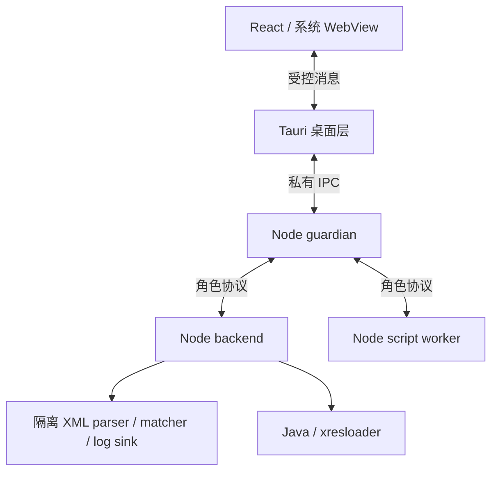

# xresconv-gui 执行计划

**请确保深度思考调研后再执行，禁止猜测。按需更新 AI agent 提示词、Skills 和相关文档，及时更新完成进度。**

## 0. 执行入口与分册

本文件只保留目标、稳定边界、功能编号和当前进度。接口/平台/测试细节由 [docs/plan 索引](docs/plan/README.md) 路由；已完成任务的实施过程与原始记录保留在 [records](docs/plan/records/README.md)。下一项工作直接读取 [发行后续任务](docs/plan/08-release-follow-up.md)。

测试必须有超时及所属进程清理；临时产物放 `build/<task>/`。真实转换可复用相邻 xresloader 的 JAR/sample，但多 JAR 时须显式选择，不能猜测。

## 1. 当前状态、目标与边界

更新日期：2026-10-04。

- **实现、桌面自动化与完整介质构建已完成**：候选 `d61d639` 的 ci/Portable 和正式 12 产物/边车均通过；Windows/Linux/macOS x64/macOS arm64 桌面各 13 项通过，macOS 自动交互 R11 见 [CI 验收记录](docs/plan/records/MACOS-E2E-2026-10-04.md)，当前完整构建 R12 见 [最终核对](docs/plan/records/COMPLETION-2026-10-04.md)。
- **dev.0 第一轮验证、dev.1 发布已完成**。dev.1 标签为 `5909542`，公开资产仍为旧 14 产物集合；已下载的 Windows/macOS x64 bootstrap 包内提交为 `651ea5e`。标签、公开介质和当前候选分别取证，见 [发布核对](docs/plan/records/ACCEPTANCE-2026-10-04.md)。
- P0–P7 的实施及已完成后续任务进入 records；尚待实机验收的范围只在 [08 册](docs/plan/08-release-follow-up.md) 维护。用户已移除证书签名验收，本轮不写 Release，Linux 用 WSL/Debian，ARM64 交叉包运行免验；范围调整与执行结果见最终核对。

目标：Tauri 2 桌面层 + 系统 WebView + 独立 Node.js 业务进程；保留 XML、CLI、转换、公开脚本接口和必要 Node 模块能力。脚本故障不得白屏、杀主进程或永久卡住任务；Windows/Linux 发行提供 bootstrap/offline 两种运行时策略，macOS 统一使用系统 WKWebView。

本仓库不变更 xresconv-conf / xresloader 协议；Java/JAR 由用户提供。GUI 离线包覆盖 Node/WebView 运行依赖，不附带或升级用户 JDK/JAR。

## 2. 基线与已定决策

### 2.1 旧版基线

旧 v2.6.0 的源码观察、脚本约定、输出 golden、体积/性能和 BD 差异见 [P0 记录](docs/plan/records/README.md)；不再在活动计划重复旧文件/依赖清单。基线不得被新版测试输出自动改写。

### 2.2 D1–D5

| ID | 当前决定 |
| --- | --- |
| D1 | 新发行仅 64 位；Windows ia32 / Linux armv7l 用户保留 v2.6.0 作为终点版本 |
| D2 | 运行环境覆盖 Ubuntu 22.04/24.04、Debian 12/13、Fedora 最近两个正式版本，GNOME/KDE、X11/Wayland；Linux 发行改为无 distro 段的 tar.zst 与 offline AppImage，构建基线 Ubuntu 22.04 |
| D3 | 仅兼容文档化脚本接口；DOM/jQuery/Electron/未公开 Fancytree 内部不在承诺范围，检测到须给诊断与迁移指引 |
| D4 | 可信脚本 + 故障隔离；允许本地文件/模块/进程，不声称防恶意沙箱 |
| D5 | macOS 13.5+，系统 WKWebView；系统不足引导升级，无独立 WKWebView 离线安装器 |

决策依据见 [P0-06](docs/plan/records/P0-06.md) 和 [当前发行约定](docs/plan/05-packaging-release.md)。

### 2.3 D6：业务统一 Node.js

配置、领域、调度、日志和 guardian 使用 TypeScript/Node.js。Rust 仅保留 Tauri 必要构建、窗口、系统接口、进程启动与消息转发；最终用户无需 Rust。额外 Node 进程的启动、内存和整个进程树成本必须计入验收。依据见 [来源索引](docs/ai/source-index.md)。

## 3. 技术栈与升级

### 3.1 选定方案

React 19 / TypeScript / Vite；React Aria Components、Zustand、TanStack Virtual；CSS tokens/组件样式。Node backend、guardian、script-host、compat-service 分离；JSON Schema → TS/Ajv 为唯一业务契约源。业务质量入口为 Biome/tsc/Vitest，桌面检查为 Playwright、WDIO（Windows/Linux 外部驱动，macOS 显式 debug 测试 feature 的嵌入驱动），Rust 仅检查桌面层。

### 3.2 版本规则

当前锁定值以 `package.json` / `yarn.lock` / `Cargo.lock` 为准，运行时目标以 `packaging/targets.json` 为准（当前 Node 24）。Yarn 4 是唯一 JS 包管理器。发行冻结前复查官方稳定版本、engines/peer/MSRV、目标平台与兼容性验证结果；升级按批次验证，不在构建中自动升级业务依赖。版本来源与旧调研快照见 [来源索引](docs/ai/source-index.md)，不把历史 “latest” 当当前结论。

## 4. 架构与职责

### 4.1 进程和目录

```mermaid
flowchart TD
    UI[React / 系统 WebView] <-->|受控消息| Host[Tauri 桌面层]
    Host <-->|私有 IPC| Guard[Node guardian]
    Guard <-->|角色协议| Backend[Node backend]
    Guard <-->|角色协议| Script[Node script worker]
    Backend --> Helpers[隔离 XML parser / matcher / log sink]
    Backend --> Java[Java / xresloader]
```

`apps/desktop/` 为 UI；`src-tauri/` 为桌面层；`packages/{backend,guardian,contracts,ipc,script-host,compat-service,packaging}/` 为 Node 工作区；`tests/` 为测试数据与 runner；`packaging/` 为目标与 manifest schema。

### 4.2 数据与 IPC

backend 拥有配置 revision、选择、计划和运行状态；UI 只持快照与局部输入。请求/事件绑定 ID、代际和单调序号；迟到消息不得覆盖新会话。通道有界、角色授权、运行时校验，不暴露任意 Tauri 命令。细节见 [02 册](docs/plan/02-contracts-script-host.md)。

### 4.3 业务流

加载候选配置 → 原子提交 → 冻结计划 → before → 转换 → after → 本次运行结果（只确认一次）；失败/取消必须收尾，副作用不自动重放。计划冻结时点、批次完成和日志边界见 [03 册](docs/plan/03-domain-conversion.md)。

## 5. 功能保留与 UI

| 功能 ID | 必须保留的行为 | 新实现与验收重点 |
| --- | --- | --- |
| F01 | XML 加载、相对路径、include、循环/重复 include 检测 | Node/TypeScript 严格 XML 解析；按 BD-07 修正旧 HTML 容错/转义缺陷，其余路径与覆盖规则对照基线 |
| F02 | tree/category、条目名称/描述、scheme/default_scheme、options、tag/class | 独立领域模型；重复键/数组/缺失属性/空值均有测试 |
| F03 | 勾选、父子级联、全选/全不选、展开/折叠、键盘空格/双击 | React 树与三态选择，禁止条目继续禁止，焦点不随虚拟化丢失 |
| F04 | scheme/sheet 自定义选择器，精确/glob/regex 匹配，默认选中 | 保留 JS RegExp/minimatch 语义，含无效规则的旧回退行为 |
| F05 | reload/select_all/unselect_all/script 自定义按钮动作链 | 保留顺序、共享按钮 data、错误中断及重载后重绑定 |
| F06 | Java 参数、工作目录、JAR、协议文件/数据目录多值、数据版本 | 跨平台参数编码，原生文件选择，执行前诊断 |
| F07 | bin/lua/msgpack/json/xml/javascript/ue-json/ue-csv、自定义输出矩阵 | 保留 rename、output_dir、tag/class 限定及未知格式的处理 |
| F08 | 并发转换、日志输出、运行结果、取消 | Node 业务状态机与独立 guardian；后端 reset RPC 保留运行清理能力，界面不提供旧版窗口重建按钮 |
| F09 | 五类脚本入口及事件 name/checked/mutable/timeout | 原语义兼容、明确故障处理、配置层级可诊断 |
| F10 | 日志颜色、级别、模块名、日志事件改写、外部 log4js 配置 | 结构化日志、可访问样式、受限富文本与磁盘完整日志 |
| F11 | 启动参数和调试 | 保留 `--input`、`--debug-mode`、`--custom-selector/--custom-button`、`--log-configure` |
| F12 | Windows/Linux/macOS、多分辨率、版本与 Java 环境检查 | 正式支持矩阵内逐项验证，原生窗口行为与开发者工具可用 |

布局、组件、状态/日志窗口、键盘与可访问性约定见 [04 册](docs/plan/04-ui.md)。旧窗口重建“重置”按钮已移除；配置重读用“重载配置”，运行停止用“取消”，后端 reset RPC 保留。

## 6. 脚本兼容与隔离

### 6.1 宿主边界

GUI 无 Node integration；可信脚本在独立 worker 中复用单份随包 Node，动态 require 锚点/缓存/环境按冻结约定验证，不在用户机 npm install。

### 6.2 五类入口

set_name、按钮 script、before、after、on_append_log 的字段、data 生命周期、resolve/reject、日志顺序及异常可见性以 [02 册](docs/plan/02-contracts-script-host.md) 和 [脚本测试约定](tests/fixtures/scripts/contract.md) 为准。

### 6.3 对象与回调

稳定 ID/节点镜像保留公开别名和同步语义，不传 React/DOM 对象。弹框回调只执行一次；失效 revision/generation 不得提交修改或回调。

### 6.4 故障与权限

guardian 的外部截止不依赖 worker 事件循环；取消/超时/关闭/宿主崩溃须核验所属子树退出。内存、队列和日志有界，清理未确认必须报告。平台恶意逃逸能力不由普通进程组保证。

## 7. 配置、转换与日志

### 7.1 配置

严格 UTF-8/XML、实体/CDATA/include/路径语义及事务提交见 [03 册](docs/plan/03-domain-conversion.md)。XML 解析已迁入受 ProcessScope 监督的独立 Node helper，具有外部截止、取消、关闭回收与节点/脚本文本独立预算；100k 候选跨进程回归通过，完成记录见 [执行记录](docs/plan/records/EXECUTION-2026-10-03.md)。

### 7.2 Java

参数数组启动，不经 shell。stdin 使用真实 JAR parser 的编码规则，不能表示的输入明确拒绝或走已验证 argv fallback。有限批次写完关闭 stdin，以进程退出和管道收尾判定批次完成；stdout/stderr 块只作为日志，不伪造单项成功数。

### 7.3 日志

原始日志 → 有序 hook → 安全模型 → UI/独立磁盘 sink；hook/appender 故障隔离、递归保护、有界降级、轮转/flush 与诊断均见 [03 册](docs/plan/03-domain-conversion.md)。用户输出不作为主动 HTML 执行。

## 8. 运行时与发行矩阵

`packaging/targets.json` 定义 12 个可构建目标；正式发行选择 10 个目标、12 个产物，macOS 不重复发布 offline DMG。当前精确 CI 集合已验证；dev.0 发布为 9 产物，dev.1 公开资产仍保留旧 14 产物集合。构建、发布资产和实机验收分别登记。

- Windows x64/ARM64：bootstrap/offline 均为 7z；bootstrap 附 Evergreen 引导器，offline 内嵌 Fixed Version，系统 Evergreen 优先。
- macOS x64/arm64：只发布 bootstrap DMG，统一使用系统 WKWebView；Portable 构建验证另产未签名 .app.zip。
- Linux x86_64/aarch64：bootstrap 系统 WebKitGTK tar.zst；offline 自含 AppImage + tar.zst。

**dev.0 已发布 Windows 包仍是 bootstrap ZIP / offline tar.zst。** 7z 是当前源码/下一轮发行约定，不能追记成已发布格式。最低版本、语言策略、逐文件校验和人工环境矩阵见 [05 册](docs/plan/05-packaging-release.md)。

## 9. CI 与发布

`ci.yml` 执行 Node/Rust、三引擎浏览器及三平台桌面测试；`portable-build.yml` 校验 macOS/Linux 双架构 8 个产物；`release.yml` 精确校验 12 产物，只有 v3 tag 才可能写 draft。上传前后核对既有资产摘要；公开版本一致时只读结束，不一致时失败。当前 CI 验证结果见 [验收记录](docs/plan/records/MACOS-E2E-2026-10-04.md)，发布身份防护见 [前次收尾](docs/plan/records/ACCEPTANCE-2026-10-04.md)。

PR/普通构建不发布；正式写 release 仅聚合 job 授权。不覆盖已发布版本；下一轮候选必须绑定最终提交、运行时版本、介质哈希和适用验收，不沿用另一构建的报告。

## 10. 阶段记录与环境后续项

P0–P7 的实施和 R1–R4、R7–R11 的完成过程按阶段保存在 [records 索引](docs/plan/records/README.md)，不再在主计划重复完成表。模块分册保留现行接口/平台/测试约定；最终验收的范围、前置条件和完成判据只维护于 [08 册](docs/plan/08-release-follow-up.md)。

## 11. 测试与验收

### 11.1 分层

单元/契约、组件、三引擎浏览器、真实桌面、真实 JAR 和干净 VM 各有边界；浏览器/mock/交叉编译不替代实际平台运行。

### 11.2–11.4 固定编号

C01–C15、R01–R12、I01–I14 的类别约定和 CF/SC/EX/UI/PK 具体步骤集中到 [06 册](docs/plan/06-testing-acceptance.md)，编号保留不变。

### 11.5 性能与质量要求

同口径 Windows x64 bootstrap 较旧版至少减小 50%；关键交互 p95 <100ms；同 JAR/负载吞吐 ≥旧版 90%；100 次循环无累计孤儿/句柄泄漏。Windows 本机测试记录见 [P6-05](docs/plan/records/P6-05.md)，不得外推其他平台。offline 单列运行时成本；冷/热启动、进程树内存和异常样本如实报告。

### 11.6 当前命令

已有质量/构建命令以 `package.json` 和 [06 册](docs/plan/06-testing-acceptance.md) 为准。未实现 `test:script-host`、`test:installers`、`package:verify` 根脚本，不作为可执行入口；缺 JAR/驱动/VM 必须明确报告，不能以零用例成功替代。

## 12. 交付核对

本轮交付记录集中在 [records](docs/plan/records/README.md)，包含 XML 隔离、x64 最终包、ARM64 交叉包、发布身份防护及三平台桌面自动化。最终验收按 [08 册](docs/plan/08-release-follow-up.md) 的用户确认范围执行，后续候选绑定新的提交与介质摘要。
