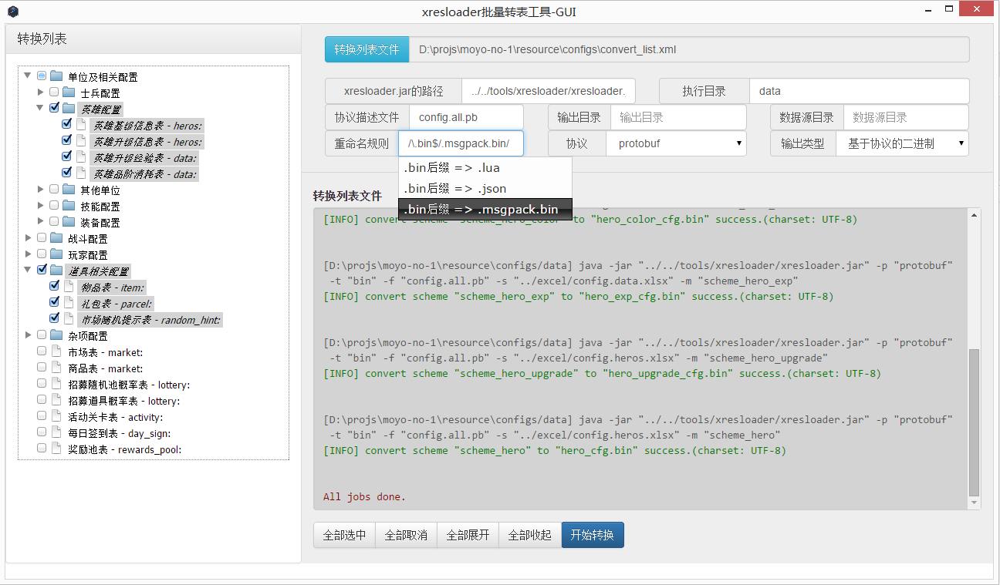

xresconv-gui
==========

这是一个符合 [xresconv-conf](https://github.com/xresloader/xresconv-conf) 规范的GUI转表工具，并且使用 [xresloader](https://github.com/xresloader/xresloader) 作为数据导出工具后端。

本项目基于 [NW.js](https://github.com/nwjs/nw.js) 项目，所以支持nw.js支持得所有平台（Linux、Mac OS和Windows）

使用说明
------

1. 使用[NW.js](https://github.com/nwjs/nw.js)  参数传入src目录即可。
2. build_package.sh 用于打包版本，使用前请先修改NWJS_ROOT和nw可执行文件名（Unix like系统没有.exe后缀）
3. build_with_nwjs-build.sh 用于使用[NW.js](https://github.com/nwjs/nw.js)官方的打包工具打包，并支持打包多个平台的版本
> 使用前请修改***--target***参数,用于指定打包的版本，使用方式可以通过 *tools/nwjs-build.sh --help* 查看
> 
> [NW.js](https://github.com/nwjs/nw.js)官方的打包工具不会打包 package.nw nw.pak icudtl.dat 这几个文件和 locales 文件夹，需要手动复制这几个文件和目录到压缩包内。

使用截图
------

