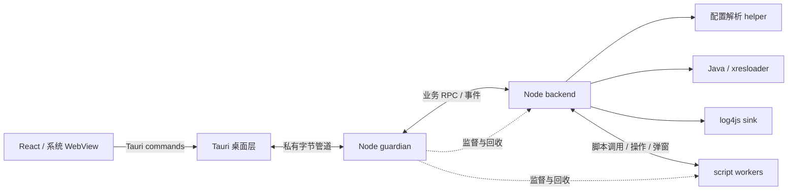

# 架构

Tauri 桌面层管理窗口、系统接口、进程启动与消息转发。独立 Node.js 业务进程处理配置、选择和转换，用户脚本及复杂扩展在受监督的独立进程执行。

发行启动先由已嵌入的前端显示资源准备界面，Rust 校验 `app-resources.zip` 并准备系统应用缓存。资源就绪后才挂载业务界面、启动 guardian；升级时完整清理旧资源后解压，运行实例通过共享锁保护其缓存。行为与失败边界见[应用资源缓存](resource-cache.md)。

## 职责与数据所有权

后端拥有配置、树、会话设置、运行状态与日志序列。前端持有快照及编辑草稿，脚本持有带版本的树镜像，通过合法操作提交修改。IPC 不共享对象引用；需要保持的条目与节点别名在 worker 内重建。

配置加载先在 helper 完成读取和解析，再进行脚本命名和初始化，成功后原子替换会话。失败或取消保留已提交版本。运行开始时固定条目集合，转换前事件结束后构造命令；条目字段修改对本次命令可见，选择变化影响后续事件和下次运行。

会话、运行、调用、代际和树版本标识用于关联响应、拒绝过期回调及防止旧操作作用到新会话。运行取消停止派发，等待脚本、Java、管道与所属进程收尾。内部 `reset` 是后端会话能力，界面以加载、重载和取消组织操作。

## 进程与通信

桌面层与 guardian 使用私有 stdin/stdout 字节通道。guardian stdout 专用于控制，诊断走 stderr；Java 和脚本输出来自各自子管道。字节帧为 4 字节大端长度加 UTF-8 JSON，收端在分配与解析前限制长度，详见[接口](interfaces.md)。

父进程绑定子进程角色，角色不能由子进程自报决定。业务错误形成 RPC 错误结果，毒帧、失联及监督故障形成通道或健康故障。发送完成只表示写入完成，业务完成需等待关联结果。

Windows `ProcessScope` 使用 Job Object 和 `KILL_ON_JOB_CLOSE`，保留进程句柄防止 PID 重用；`taskkill` 是降级回退。POSIX 使用独立进程组。清理必须确认所属子树结束，不能仅以 kill 返回值判定。

## 原生约束

Windows 发行程序使用 GUI subsystem，启动 guardian 设置 `CREATE_NO_WINDOW`，受监督子进程设置 `windowsHide`。只统计 `conhost.exe` 不能证明没有可见控制台。

被 Rust 单元测试引用的模块应通过注入闭包输出事件，避免依赖 tauri/wry 运行时类型。测试程序没有桌面应用的 SxS manifest，保留相关 Drop glue 可能导入 comctl32 v6 专有符号，使进程加载失败并返回 `0xc0000139`。

可能阻塞的原生健康与 RPC 操作使用 async command 加 `spawn_blocking`，保持窗口线程响应。

## 安全边界

用户脚本可信，可访问本地模块与进程。VM 与进程监督用于故障隔离，不能防止恶意脚本、POSIX 自行脱离进程组等行为。界面权限和 CSP 显式配置，UI 不获得任意 shell 能力。

嵌入 WebDriver 可执行页面 JS，仅允许 debug + `e2e` 构建；release + `e2e` 编译拒绝。测试能力与发行介质分别构建，原生系统对话框需要相应环境验证。
