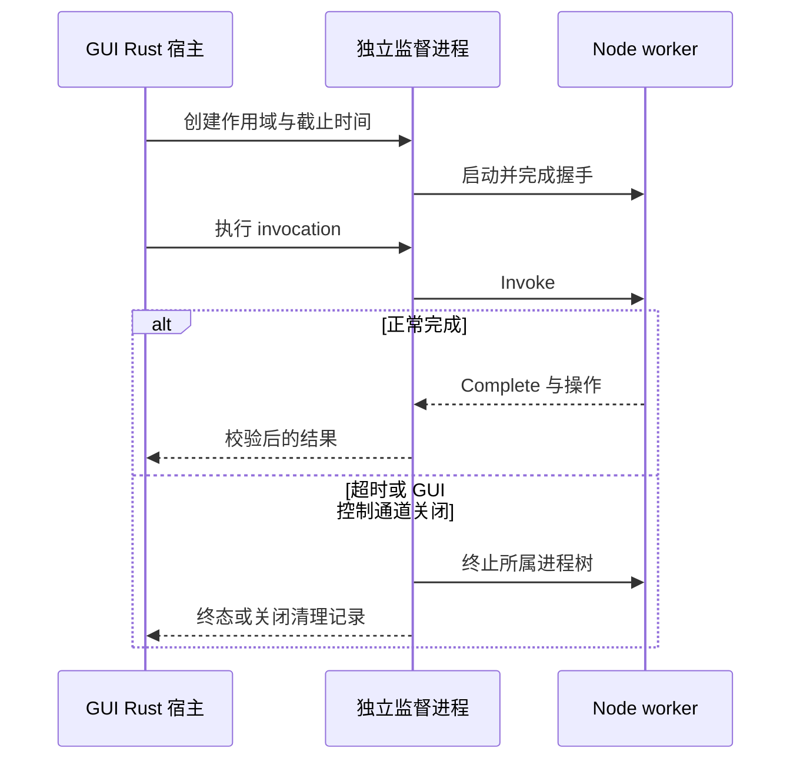

# 02 接口、用户脚本与进程监督

[执行索引](README.md) · [上一册](01-baseline-toolchain.md) · [下一册](03-domain-conversion.md)

对应 P2，同时定义 P1/P3/P4 共用的拟定接口。接口名和阈值是实现合同候选，需通过原型与兼容样例后冻结；目前没有实现。

## 领域标识与数据所有权

| 对象 | 权威所有者 | 最少字段/规则 |
| --- | --- | --- |
| ConfigSnapshot | Rust 配置层 | revision、entryFile、sourceFiles、globals、items、tree、hooks、buttons；提交后不可原地改写 |
| WorkspaceSession | Rust 会话层 | sessionId、revision、selectionVersion、selectedItemIds、editableOverrides |
| ConversionPlan | Rust 计划层 | planId、revision、selectionVersion、jobs、matrix、workingDirectory；执行前冻结 |
| RunContext | Rust 调度层 | runId、legacyRunSeq、planId、phase、counts、startedAt、cancelReason |
| ScriptInvocation | 监督层 | invocationId、sessionId、generation、entryKind、deadline、state |
| ButtonState / require cache | Node 会话 worker | 任意 JS 值保留在进程内；不强制转换成 JSON |
| NodeMirror | Node 兼容层 | 稳定节点 ID、旧 key/id 类型、父子关系、item 别名及已支持方法 |
| LogRecord | Rust 日志层 | logId、runId、sequence、stream、raw、rendered、hookOutcome |

协议 ID 使用不透明字符串，旧脚本可见的 `id`/`key`/`run_seq` 类型另作映射。时间截止使用监督进程的单调时钟；IPC 不把宿主和子进程各自的单调时间值直接相减。JSON 中不传超出 JS 安全整数范围的数字。

## UI 到 Rust 的命令表

命令不是泛用文件系统或 shell API。Rust 对参数、会话、revision 和状态重复验证；前端检查不能替代后端授权。

| 拟定命令 | 输入 | 返回与效果 |
| --- | --- | --- |
| `session_snapshot` | sessionId、可选 lastEventSeq | 当前完整快照，或可证明连续的增量 |
| `configuration_open` | 选文件得到的路径/CLI 路径、expectedRevision | 候选加载任务 ID；成功后原子提交新 revision |
| `configuration_reload` | sessionId、expectedRevision | 重读原入口，失败保留已提交快照 |
| `selection_apply` | revision、selectionVersion、operation、目标 ID | 新选择版本和差量；不接受 DOM 节点 |
| `settings_apply` | revision、允许编辑的业务字段 | 校验后更新运行参数，不修改原 XML 文件 |
| `conversion_preview` | revision、selectionVersion | 冻结候选 plan、参数摘要和可执行/阻塞原因 |
| `conversion_start` | planId、客户端请求 ID | runId；同请求重复投递不得启动两次 |
| `conversion_cancel` | runId、reason | 进入 Cancelling；终态事件在实际清理后发送 |
| `custom_action_start` | revision、buttonId、requestId | 动作链 ID；不接收任意 JS 源码字符串 |
| `dialog_respond` | callbackToken、generation、选择 | 恰好一次回调；过期 token 返回明确错误 |
| `logs_read` | runId、cursor、limit | 有界分页及下一游标；原始/展示日志可区分 |

事件至少包括配置提交/失败、选择变化、运行阶段/终态、日志批次、弹框请求、worker 失效和环境诊断。UI 断连后先拿快照再订阅/补齐事件，使用水位序号消除订阅竞态；有缺口则重同步，不能盲目重复应用差量。

## Rust 与 Node 的私有协议

### 传输和握手

P2-01 原型比较继承双向管道与平台私有本地 IPC，冻结一个支持三平台的实现。Windows 命名管道使用限当前用户/会话的 ACL；Unix socket 位于私有权限目录，关闭后清理。控制通道独立于 stdout/stderr，随机地址和握手不是对同用户恶意进程的强隔离证明。

拟定帧为 4 字节大端长度 + UTF-8 JSON。先检查长度再分配内存，再校验 schema；测试半帧、连续多帧、截断、未知类型和零长度。初始单帧上限 1 MiB，大配置按分页/块传送，不通过无限调大上限解决 100k 节点问题。最终阈值必须在压力测试后固定并记录。

握手顺序：监督层启动 worker → worker 报 Node 版本、宿主版本、协议主/次版本、支持能力 → 父端校验 manifest → 初始化 session/revision → Ready。未 Ready 不派发业务请求；握手超时关闭进程树，报告启动失败。

消息 envelope：`protocolVersion`、`kind`、`requestId`、`sessionId`、`revision`、`runId?`、`invocationId?`、`generation`、`payload`。错误包含稳定 `code`、用户消息、可选诊断和关联 ID；不能将任意 Error 循环对象直接序列化。

| 消息类别 | 要求 |
| --- | --- |
| Invoke / Complete / Fail | 只对活动 invocation 生效，重复完成忽略并记录诊断 |
| MirrorSnapshot / MirrorDelta | 先验证版本与允许操作，再按 sequence 应用；不可修改任意对象原型 |
| DialogRequest / DialogResult | 回调保存在 worker，IPC 仅传 ID 和可序列化参数 |
| Log / HookResult | 独立流控，日志内容不能伪造控制帧 |
| Cancel / Shutdown | 幂等；超时后由监督层强制终止，不等 worker 自己配合 |
| Health / Fault | 心跳仅作诊断；不能靠 worker 心跳来实现唯一截止时间 |

大数据初始化分块完成前不暴露半份 mirror。操作确认按 invocation 和序号去重；节点操作冲突返回 `REVISION_CONFLICT`，不能把旧脚本操作套到同名的新节点。

### 资源与环境

Node 路径由已校验的发行 manifest 和应用资源目录确定；绝不从 PATH 临时选择。启动命令使用 argv 数组。规范化 `cwd`、工作/配置/资源路径，记录实际模块解析锚点。

清理可能注入加载行为的 `NODE_OPTIONS`、`NODE_PATH` 等变量，并建立显式环境转发契约；Java/工具依赖的 PATH、JAVA_HOME 和用户脚本所需业务变量分别测试。禁止悄悄删除用户确实依赖的变量，也不得把开发机全部密钥环境复制到日志。此环境契约属于 P0/P2 兼容核验项。

## 五类脚本的精确合同

| 入口 | 当前已核实行为 | 新宿主必须验证 |
| --- | --- | --- |
| set_name | 每 item 新 VM、新 `data={}`；含 item_data、日志和弹框；**未注入 require、resolve/reject**；无 VM timeout | 不擅自增加 Node 权限；正常 item 修改提交；异常前部分修改与超时无法取回修改的处理分别记录 |
| before / after | 每次事件新 data；注入 require、resolve/reject、选择对象和 run_seq；顺序 Promise 链 | before 失败不转换；after 失败有后处理终态；保留计划在 before 之前构造的时点 |
| button script | data 来自按钮对象，同按钮多个 action/多次调用共享；按钮上下文 global_options 与运行事件来源不同 | 同按钮引用一致、不同按钮不串状态；字段类型不能按 README 擅自统一 |
| on_append_log | 转换建立 append_log_context 后才执行；同条日志的多个 hook 共用 VM 和 log_object；带递归 guard | 调用范围、顺序、修改可见性、错误后剩余 hook 的行为和原始日志可追踪 |

`require` 指向旧宿主的加载环境，不天然相对 XML 文件。必须对 `./relative-module`、内置模块、包 exports、动态包名、require.cache、原生模块分别建例。可在 Node 用显式加载锚点建立兼容层，但是否完全匹配旧发行目录，要以安装产物中的测试为准。

同步返回与异步完成分开：`set_name` 和日志 hook 的同步执行返回表示该次计算结束；before/after/button 仍由 resolve/reject 完成，不能把“脚本返回了 Promise”自动当旧协议成功。多次 resolve/reject 只改变状态一次；非法返回值不拖垮控制通道。

### worker 分组与状态

拟定配置加载 worker、会话脚本 worker、日志 hook worker、可信匹配/日志服务相互分离；随包只分发一份 Node 二进制。会话 worker 承载按钮及 before/after，共享该会话 require cache，按钮 data 由 buttonId 索引。每次调用仍创建独立 VM 上下文。

不同调用的异步回调可以交错；不得未经基线验证把所有按钮强制串行化。相同 worker 的同步死循环会使该隔离域失效，受影响的全部调用明确失败，但 GUI、Java 监督和其他会话必须继续可收尾。

**跨角色 module singleton 是兼容风险**：旧日志 hook 与按钮可能通过 require.cache 分享模块状态，分进程后无法自动保留。P2-04 必须检测真实样本；需要时设计显式共享状态服务或经验证的分组替代方案。未解决就阻止 G2，不能称为透明兼容，也不能将任意 JS 闭包复制过 IPC。

调用完成不等于立即销毁上下文。定时器、弹框回调和用户创建的后台子进程可能仍被旧脚本使用；需追踪为会话资源，直至明确结束、重置、重新加载或关闭。截止时间到达且 invocation 未结束时杀对应 worker；已经完成的合法后台行为仍受会话资源限额和会话关闭清理约束。

### 节点镜像与回调

兼容表至少逐项测试 `key/title/data/parent/children`、`isSelected`、`setSelected`、`toggleSelected`、`setExpanded`、`setTitle`、`visit`、`getParent` 和真实样本额外方法；这是一份待实现清单，不是已支持声明。准确参数、返回值、遍历中止约定以旧 Fancytree 实测为准。

在 worker 内重建 `selected_items[i].ft_node` 与 node.data.item 的对象别名；同步读写先作用于镜像，批量回传明确的领域操作。旧代码还把缺省 scheme 数组直接赋给多个 item，不能用逐 item 深拷贝悄悄打断这些共享引用。P0 记录实际引用关系，传输采用数据表与引用 ID，在 worker 内复原；跨 hook 的 selected_items/global_options 身份和修改可见性也要测试。修改任意未知字段可能只能保存在 worker，能否影响后续转换必须由兼容样例决定，不可静默丢弃。

弹框 yes/no 后 on_close 的顺序要保留。旧回调的 `this` 与 DOM 事件 arguments 无法直接跨进程；实际使用这些值时进入 D3 适配清单。ESC、关闭按钮、窗口销毁和重复点击分别测试。脚本失效后移除其弹框，迟到点击不再执行回调。

## 监督进程与清理

监督责任必须能在 GUI 异常退出后继续执行。拟用最小 Rust guardian；可以复用同一签名可执行文件的内部模式减少重复负载，但须验证 macOS 资源路径、签名和不创建窗口。不预先承诺一定不增加独立二进制。

监督进程仅从继承的控制句柄/受控私有通道接受启动描述，业务脚本不能提交任意系统 PID 作为 kill 目标。登记原生进程句柄或包含启动标识的所有权信息，避免 PID 重用误杀无关进程。父端死亡以句柄/管道关闭及必要的系统机制检测，不只轮询 PID 存在。

| 平台 | 原型要求 | 证明边界 |
| --- | --- | --- |
| Windows | 创建即纳入 Job Object，避免先运行再附加的派生逃逸窗口；限制句柄继承和 breakaway | Kill-on-close、内存/进程数限制、嵌套 job/权限失败须实测 |
| Linux | guardian + 所属进程组；可用时 cgroup v2 管理资源和派生进程 | 无 delegated cgroup 时记录退化；setsid/double-fork 不得靠普通组声称全部可控 |
| macOS | guardian + 所属进程组、可验证资源限制、父端失联清理 | 同用户恶意逃逸或任意资源严格上限尚非保证；不照搬 Linux cgroup 方案 |

取消流程：停止新派发 → 撤销回调/操作权限 → 请求正常退出 → 宽限截止后强制终止 → 等待实际退出并排空/关闭管道 → 发布终态。`kill_on_drop` 可作防御，但不能代替进程树所有权和 wait/reap。[Tokio 子进程语义](https://docs.rs/tokio/latest/tokio/process/struct.Command.html)、[Windows Job Objects](https://learn.microsoft.com/en-us/windows/win32/procthread/job-objects)

脚本有文件/外部命令副作用时不自动重试。worker 崩溃不能恢复任意闭包和模块状态；展示受影响会话及运行结果需核验的信息。任意 child_process/native addon 与防恶意系统访问之间的限制按 D4 落实；Node VM/Permission Model 不提供所需的完整恶意代码边界。[Node VM](https://nodejs.org/api/vm.html)、[Node 权限模型](https://nodejs.org/api/permissions.html)

## P2 任务清单

| 任务 | 前置 | 拟实现位置/动作 | 验收与回退 |
| --- | --- | --- | --- |
| P2-01 | G1 | protocol、script-host：握手、帧、版本、分块、非法输入 | SC01；协议不成立先修合同，不让 UI 依赖临时格式 |
| P2-02 | P2-01 | process-supervisor：三平台 guardian/作用域原型 | SC07/SC08；宿主被杀仍可清理，失败阻止隔离完成声明 |
| P2-03 | P2-01 | script-host：五入口、字段类型、data、回调 | SC02/SC03；逐字段与旧行为比对 |
| P2-04 | P2-03 | require 锚点、cache、worker 分组、环境策略 | SC04；跨 hook 缓存样例不兼容即 G2 阻塞 |
| P2-05 | P2-03 | NodeMirror、别名、同步方法、有序操作 | SC05；不使用 React/DOM/jQuery 实现镜像 |
| P2-06 | P2-03、P2-05 | 弹框回调注册表与失效逻辑 | SC06；回调次数/顺序正确，无过期调用 |
| P2-07 | P2-02 至 P2-06 | watchdog、资源限制、异步异常和强制退出 | SC07/SC08；按平台报告可保证范围 |
| P2-08 | P2-04 | 独立日志 hook 与可信 log4js/matcher 服务 | SC09/EX04；复杂 regex 不阻塞日志服务，必要时再分隔离域 |
| P2-09 | P2-07 | 取消/重置/关闭/崩溃的统一收尾及无重放 | SC10/EX03；真实退出后才报清理成功 |
| P2-10 | P2-04 | 发布目录动态模块与原生扩展验证 | SC04/PK07；无 npm 网络、无全局 Node 仍运行 |
| P2-11 | P2-05 至 P2-10 | 真实脚本差分与 BD 差异清单 | 不用自造简单脚本替代真实样例；不兼容有具体定位 |
| P2-12 | P2-11 | G2 报告与接口冻结 | SC 全部必需案例通过，或明确阻塞，旧架构仍可回退 |

Tauri 前端只启用所需窗口/命令能力，不授予任意 shell spawn；自定义命令仍必须自行校验状态和对象权限。测试能力使用显式名单，避免自动合并进发行能力。[Tauri Capabilities](https://v2.tauri.app/security/capabilities/)
