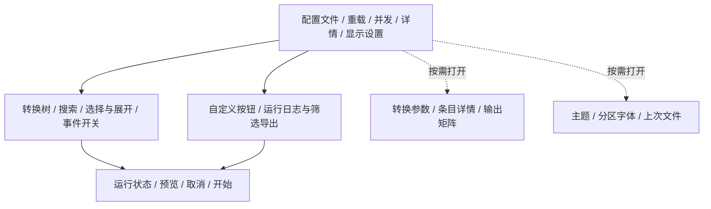

# 04 UI、交互与前端迁移

[执行索引](README.md) · [上一册](03-domain-conversion.md) · [下一册](05-packaging-release.md)

对应 P4。采用主计划确定的 React、TypeScript、Vite、React Aria Components、Zustand、共享 CSS tokens 与组件样式；这是桌面本地 SPA，不引入 SSR 或常驻前端服务器。

截至 P4-07 的一致性约束：加载成功后才更换配置路径；加载互斥，旧会话的排队操作/响应不能覆盖新配置或故障状态；树版本跨 reload 单调推进；活动运行必须完成日志收尾后才接纳下一次 run。设置输入/输出为独立快照，矩阵重估释放旧限制；预览仅报告同条目同 `(type, outputDir, rename)` 的重复任务。运行控制（P4-06）：run 允许自 ready/终态，cancel 仅活动运行且重复幂等；旧版重建窗口的“重置”按钮已移除，后端 reset RPC 仍用于运行清理测试。运行终态文案区分实际阶段与已发生副作用（before/计划构建失败未启动转换、after 失败如实说明输出已生成、stdin 批次失败不伪造条目级明细），事件缺失时退化为通用文案。日志（P4-07）：UI 有界窗口（2000）按 seq 与 getLogs/事件流幂等对齐，beforeSeq 向后分页；筛选只影响显示与复制/导出；富文本仅 ANSI SGR 固定色表（无 HTML 通道），导出经原生 save 对话框 + 壳层唯一写盘命令。长期 guardian 健康视图使用监督状态，不套用 one-shot NodeHealth。回归见 [增量审查](records/REVIEW-P2-P5-2026-09-24.md)。

## 页面和组件边界

| 区域/拟组件 | 展示与操作 | 数据来源 | 关键验收 |
| --- | --- | --- | --- |
| AppShell / EnvironmentDiagnostics | 环境诊断（版本/启动参数/健康/Java）写入运行日志；无独立状态条 | 壳桥接 + backend checkJava | Java 缺失仍能打开 GUI；诊断在日志可查、不占主面板 |
| ConversionTree / TreeToolbar | 分类、三态勾选、禁用、展开、全选/全不选、搜索 | 树快照、选择版本、UI 展开状态 | 勾选和焦点分离，父子级联与旧版一致 |
| ItemDetails | 名称、说明、来源、scheme、tag/class | 当前聚焦 item | 聚焦变化不偷偷改变转换选择 |
| ConversionSettings | work_dir、JAR、协议文件、数据目录、版本、参数 | 配置 + 受控 override | 多值、空值、路径校验不被单行表单压扁 |
| OutputMatrixEditor | 格式、rename、output_dir、tag/class 限定 | 领域矩阵快照 | 多输出组合、未知类型、禁用理由可见 |
| HookControls | before/after/log 事件启用、描述、mutable | hook 定义与可编辑状态 | immutable 开关不可改；被禁用事件不执行 |
| CustomActionBar | 选择器及 reload/select_all/script 等动作 | 配置按钮定义 | 原 action 顺序与名称、样式语义保留 |
| RunControls / RunSummary | 预览、执行、取消、成功/失败/后处理状态 | 后端 RunContext | 只显示有证据的进度和结果，不乐观报完成 |
| LogPanel / DialogHost | 虚拟日志、筛选/导出、用户脚本弹框 | 日志游标及 callbackToken | 回调顺序、焦点恢复、安全富文本和原日志可查 |

当前布局（2026-09-27；验收见 [本轮审查](records/REVIEW-2026-09-27.md)）：

- 主工作区优先给转换树和日志；顶部文件栏、底部运行栏保持可达。窄窗口重新排布，详情弹窗独立滚动，操作栏固定在弹窗内。
- 转换列表标题与搜索框共用一行，批量选择和展开操作留在下一行；窄面板中搜索框可收缩，优先把高度留给条目列表。
- 统一背景层级、边框、焦点、按钮、错误和空状态；浅色、深色、跟随系统共用 tokens。SVG 图标不依赖网络资源。
- 树按实际字体计算虚拟行高；标题省略、说明保留 tooltip；单击切换，双击只提交一次。RAC 自定义 className 替换默认类，复选框/主题指示器需显式样式。
- 三态显示使用 `partsel && !selected` 判断半选；级联跳过 unselectable，父级聚合也忽略屏蔽项。全被屏蔽的目录保持直选状态（D3 的兼容边界，见旧审查记录与树回归）。
- 日志按 localId 稳定定位，所有行实测高度；滚动/换行、换字体后重测。加载/运行清理旧窗口时保留请求开始后到达的新日志；迟到的初始化/分页结果不得回填旧会话。
- 加载、重载、矩阵设置与 guardian 重启按请求代际隔离；快速 run_end 不得被 run RPC 返回清掉。自动重试只接受明确的 BACKEND_NOT_READY，超时/通道故障不能重放写操作。
- 连续矩阵编辑在前一笔完成后按最新值生成整数组；在途时禁止增删移位、预览和开始。换配置/guardian 退出丢弃旧队列并清理门禁。
- 首次启动也读取 CLI `--input`；主题、字体、上次文件串行合并写入 exe 旁 `display-settings.json`。字体输入完成后按回车或移开焦点再应用，字号范围 6–48。
- 预览摘要、可证明的重复转换任务及前 50 条命令写入日志。仅同一条目按相同 `(type, outputDir, rename)` 生成多个任务时提示检查输出矩阵，不猜测 xresloader 最终输出文件名。
- 条目详情、输出矩阵、事件开关按需展开；没有自定义按钮或命名事件时不占位。脚本确认框保留 yes/no/on_close 回调和队列语义。

- **默认字体栈（2026-09-26 用户指定，未设置字体时生效）**：UI=更纱黑体 UI SC→Sarasa UI SC→等距更纱黑体 SC→Sarasa Mono SC/CL→Noto Sans Mono(→CJK SC)→Maple Mono Normal NF CN→微软雅黑→系统默认；树=Maple Mono Normal/NF NF CN→更纱黑体 SC/Sarasa Gothic SC→等距更纱黑体 SC→Sarasa Mono SC/CL→Noto Sans Mono CJK SC→Noto Sans Mono→微软雅黑→系统默认；日志=Maple Mono Normal NL/NL NF CN→Maple Mono NL CN→等距更纱黑体 SC→Sarasa Mono SC/CL→Noto Sans Mono(→CJK SC)→Maple Mono Normal/NF NF CN→微软雅黑→系统默认等宽。浏览器按序自动选用本机已有字体（不下载）；用户设置字体时经 inline `--font-<area>-family` 覆盖整栈。

除旧版重建窗口的“重置”按钮外，适用的原入口保留。新增搜索、筛选和取消属于辅助操作，不改变“全选”的原含义；默认全选针对整个有效配置，若增加“仅选搜索结果”必须独立命名。日志筛选不影响落盘日志和脚本 hook。

## 状态分层

- Node.js backend：配置 revision、真实选择、参数 override、转换 plan/run 和事件开关；guardian 提供实际进程状态与清理结果。
- Tauri 壳：窗口、文件对话框、限定权限桥接及后端连接状态，不维护第二份领域状态。
- Zustand：后端快照缓存、事件水位，以及面板宽度、主题、搜索词、焦点、滚动位置等 UI 状态。
- 组件本地：尚未提交的表单输入、校验提示和控件展开状态。

前端从 adapter 经 Tauri 桥接获取 Node.js 数据；组件不得自行 `spawn`、读 XML 或拼 Java 命令。表单提交必须确认后端版本，版本冲突先重同步，不能覆盖用户更新。选择操作可采用带 requestId 的临时显示，但失败时必须回退并解释；业务启动只读后端已确认状态。

React StrictMode 下重复挂载不能建立重复事件订阅或启动任务。所有监听有释放句柄；异步回复使用 session/revision/runId 校验。不要在 useEffect 中以“状态变为 ready”为触发自动执行转换。

backend 失联时，壳与 UI 仍可显示故障、查询 guardian 清理状态并关闭窗口；guardian 失联时由壳显示自身可确认的状态，不能依赖失效 backend 返回错误。重新启动服务后先恢复或明确结束旧会话，不自动重放转换；旧缓存标记失效，不能继续显示运行成功。

## 完整交互路径

1. 启动后查询快照和环境；处理旧 CLI 参数或显示打开配置入口。
2. 打开/重载时展示进度与可取消状态，仍保留上次有效配置；错误定位到文件/字段。
3. 配置提交后还原允许保留的 UI 状态，执行已定义的默认选择规则，显示可转换数量与限制。
4. 用户编辑参数和输出格式，后端生成预览；指出 JAR 缺失、路径不可表达、输出冲突等阻塞。
5. 开始后显示 before、Java 批次、after 和收尾的实际阶段；按钮可用性由领域状态决定。
6. 取消后等待后端清理；失败仍保留日志和已有产物信息。关闭窗口时明确当前运行的停止策略。
7. 自定义脚本弹框保持 yes/no/on_close 语义；被终止 worker 的弹框自动失效，不能点击旧回调。

## 树、可访问性和虚拟化

先实现旧三态选择算法与组件适配，再启用树虚拟化。React Aria 的默认 selection 不等于 Fancytree `selectMode: 3`；父节点包含禁用叶子时的聚合值、toggle 和 getSelectedNodes 结果必须单独对照。

树优先验证 React Aria 自身树/虚拟化能力；TanStack Virtual 用于日志。若组合影响焦点、读屏或节点身份，先修适配或调整组合，不回引 Fancytree。组件源码与官方用例作为能力依据，运行效果仍由 UI03 验证。[React Aria Tree 源码](https://github.com/adobe/react-spectrum/blob/main/packages/react-aria-components/src/Tree.tsx)、[官方用例](https://github.com/adobe/react-spectrum/blob/main/packages/react-aria-components/stories/Tree.stories.tsx)

必测键盘：Tab/Shift+Tab、上下/左右、Home/End、Space 切换、Enter 动作、Escape 弹框、双击旧行为。不能用列表项索引作为节点 key。虚拟节点卸载后选中数据仍保留；切换焦点到未渲染节点先滚动再聚焦。

高 DPI、125%/150%/200% 缩放、中文长文本、不同系统字体、明暗主题、窗口缩小与多显示器移动都要测试。100k 节点不直接向 DOM 填充全部节点；后端快照分块与前端增量构建也计入响应预算。

## 样式、富文本与权限

CSS 自定义属性定义颜色/间距/字号/层级；尽量使用最低 WebView 已验证的能力。Vite 的 JS target 与 CSS 兼容不是同一个开关，需分别列最低浏览器特性并检查。运行依赖、字体和图标随包，本地 UI 不依赖 CDN。

旧按钮 `style`、日志 `alert-*` 映射到本地语义样式；未知值给兼容提示和可读默认，不悄悄隐藏按钮。富文本由白名单转换成 React 节点或经审计的清洗层；不要直接把脚本内容交给 `dangerouslySetInnerHTML`。必要的允许标签、颜色和链接用样例固定。

正式 CSP 约束脚本、资源与连接来源；任意用户 JS 只在 Node worker 中执行。外部链接经 URL 协议验证后由限定 opener 打开。普通浏览器预览 adapter 不含真实系统权限。[Tauri CSP](https://v2.tauri.app/security/csp/)

## P4 任务清单

| 任务 | 依赖 | 拟实现位置/动作 | 完成断言 |
| --- | --- | --- | --- |
| P4-01 | G1、接口合同 | `apps/desktop/src/app`、tokens、页面骨架 | UI01；所有 F 功能能映射到明确区域 |
| P4-02 | P1-06、P3 状态接口 | `adapters/tauri`、store、订阅释放和重同步 | UI02/SC11；backend/guardian 故障可见，断连/迟到事件/重复挂载无重复任务 |
| P4-03 | P3-04、P4-02 | 树与选择适配、键盘基础行为 | CF04/UI03；选中集合、禁用与三态对照通过 |
| P4-04 | P3-05、P4-02 | 表单、详情、输出矩阵与预览 | UI04；字段/多值/阻塞可见，版本冲突不覆盖 |
| P4-05 | P2-06、P4-02 | 按钮动作、hook 开关、DialogHost | SC06/UI05；不把回调简化成普通 toast |
| P4-06 | P3-08、P4-02 | RunControls、阶段与取消；后端 reset RPC 保留 | EX03/UI06；后处理失败和未知条目结果表达准确 |
| P4-07 | P3-09、P4-02 | 日志分页、筛选、复制/导出、富文本 | EX04/UI07；无 XSS、无业务日志静默丢失 |
| P4-08 | P4-03 至 P4-07 | 虚拟化、主题、DPI、读屏和三引擎测试 | UI03/UI08；性能与可访问性共同通过 |
| P4-09 | P4-08 | 新依赖/产物扫描、真实桌面 E2E、G4 报告 | 无 jQuery/Bootstrap/Fancytree/Popper 运行依赖；旧实现仅供对照 |

旧 Electron 入口已删除，回滚使用 v2.6.0 tag；不在 React 内嵌旧 jQuery 页面。视觉调整不应改变配置字段和脚本的业务语义。
