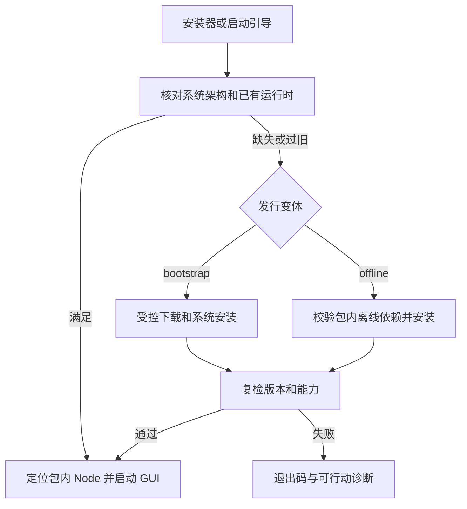

# 05 双版本安装、运行时与 CI 发布

[执行索引](README.md) · [上一册](04-ui.md) · [下一册](06-testing-acceptance.md)

对应 P5 和 CI 任务。安装原型从 G1 后提前验证；完整发行必须等待 G4/G6。平台范围已定（[P0-06](records/P0-06.md)）：仅 64 位（D1），Linux 首批 Ubuntu 22.04/24.04、Debian 12/13、Fedora 最近两个正式版本（D2）。

## 产物清单和大小口径

每个支持目标生成 `bootstrap` 和 `offline`。命名模式为 `xresconv-gui-<version>-<os>-<distro?>-<arch>-<variant>.<ext>`，另带 SHA-256、签名/公证信息、SBOM、许可和测试报告索引。产物矩阵先写清单再构建，汇总 job 检查集合完全相等，不用通配符“找到多少发多少”。

P5-01 已有 `packaging/targets.json` 与 `packaging/schema/runtime-manifest.schema.json`。清单与矩阵生成入口都校验目标集合及 OS/arch/triple 一致性；安装路径必须是无 `.`/`..` 段的正斜杠相对路径；疑似秘密不能回显到诊断。回归见 [增量审查](records/REVIEW-P2-P5-2026-09-24.md)。产物侧 `runtime-manifest.json` 字段至少包括：

```text
schemaVersion / appVersion / sourceCommit / targetTriple
os / osVersionRange / distro / arch / variant
webviewStrategy / minimumWebview / runtimePayloads
nodeVersion / nodeHash / moduleTreeHash / nativeAddonAbi
files(path,size,sha256,origin,license) / signingEvidence
buildToolchain / repositorySnapshot / verificationReport
```

manifest 在安装完成后能与实际文件校验；其自身的可信性来自签名发行/已验证安装器，而不是仅含哈希便宣称可信。禁止在 manifest 中写开发机绝对路径或秘密。

大小报告分别记录 Tauri 薄壳/前端、Node 二进制、backend/guardian/worker JS、运行 npm 模块、必要原生适配、资源、引导器、离线运行时、安装器开销和整体压缩/展开大小。Node 二进制只带一份，多个进程共享它，不为每个角色再打包一份 Node；许可不裁剪。生产包排除测试插件、fixtures、编译缓存和开发依赖，动态 require 需要的包文件不能按静态引用随意删。

## 运行时检查与安装状态机



安装结果内部状态拟为 `Ready/NeedsInstall/NeedsElevation/NeedsRestart/Unsupported/Failed`，保留系统安装器原始退出码。需要重启不能直接当可启动成功；再次执行检查须幂等。已满足时无下载/重装/降级。

检测同时覆盖首次安装和安装后运行时被移除/损坏。Linux 桌面入口及 CLI 启动经不依赖 GTK/WebKit 的引导器；启动参数、cwd、退出码、信号和带空格路径不得丢失。Windows 使用原生检查/诊断路径，不能依赖创建 WebView 后再报 WebView 缺失。macOS 在安装前检查系统版本，不能指望一个最低系统不兼容的二进制自我修复。

所有变体包含固定 Node、编译后的 backend/guardian/worker JS 与运行 npm 模块。系统 Node 不作为必要条件；Java/JAR 保持外置。在线引导版只允许为已登记的平台依赖联网，不能在首次运行临时 npm install。guardian 使用相同 Node 执行文件，通过固定启动模式与最小环境启动各角色；资源定位不依赖开发机工作目录。生命周期原生适配若为必需，先通过 P2 平台原型并纳入 ABI、签名、许可及离线清单；不额外构建 Rust 业务守护程序。

## Windows

公共 Tauri 配置配两个覆盖文件：`tauri.windows.bootstrap.conf.json` 使用 `embedBootstrapper`；`tauri.windows.offline.conf.json` 使用 `offlineInstaller`。这是拟定文件名，实际字段结构以锁定 CLI schema 校验。[官方 Windows 安装器](https://v2.tauri.app/distribute/windows-installer/)

1. 分别准备 x64/ARM64 Node、资源与目标 triple；ia32 已由 D1 决策删除，不进入矩阵。
2. 确定最低 WebView2 能力，检测已有 runtime 的版本、架构和安装范围；已存在但不合格不能直接跳过。
3. 主产物用 NSIS；验证当前用户安装、需要提升权限的机器级安装、企业策略拒绝及恢复。
4. 两覆盖配置只改变运行时准备方式和文件名；应用二进制、模块树和业务功能哈希一致。
5. 验证包内引导/离线安装器签名与架构；不重签或篡改微软运行时。应用与自身安装器按项目签名流程处理。
6. 在无 WebView2 的干净快照中测 bootstrap 联网/断网、offline 完全断网；有 runtime 快照测复用和过旧升级。

不能把开发机缓存的 WebView2 或已安装 Edge 当作离线包完整性的证明。运行时升级后的系统状态由系统维护，本应用卸载不移除共享 WebView2。

## macOS

两个命名变体使用相同签名 app payload，manifest 明确 `webviewStrategy=system-only`。WKWebView 随系统，不生成虚构的独立离线安装器；旧系统引导升级 OS，离线无法补装时明确拒绝。[Tauri WebView 版本](https://v2.tauri.app/reference/webview-versions/)

1. 原生 x64/arm64 分别构建并测试；最低系统取 Node/Tauri/前端特性与部署目标交集。
2. 定位 app Resources、Node、模块和 guardian；从 Finder、终端、中文目录和只读安装目录均启动。
3. 针对 Node/V8 及原生模块验证所需 entitlements，只增加经过证据确认的项，不用全面关闭保护来绕过签名失败。
4. 按嵌套代码到 app/安装介质的顺序验证签名，完成 notarization 和适用产物的 stapling。
5. 在新 VM 无缓存且断网的首次打开场景测 Gatekeeper、Node/guardian 和真实脚本；测试安装到 Applications 后启动。
6. 同版本两变体清单声明相同负载及差异原因，不能暗示 offline 能修复不受支持的 OS。

签名/公证操作发生在实施阶段的受控发行环境，不由文档任务操作证书或上传产物。

## Linux

按 D2 已定的发行版（Ubuntu 22.04/24.04、Debian 12/13、Fedora 最近两个正式版本）出包。优先 DEB；RPM 随 Fedora 目标一并构建/验收。

在线变体包含应用包、独立预检引导器及 manifest；离线变体**优先采用单一自含包**（随包携带 WebKitGTK/GTK 及传递依赖，按架构一份，覆盖全部已定发行版），其集成风险在 P5-06 原型验证；原型不可行时回退到按发行版的完整依赖闭包和本地仓库校验材料。预检引导器必须在最小受支持桌面环境启动，不能动态链接缺失的 GTK/WebKit。

### 离线依赖生产流程（自含包优先，闭包为回退）

0. 自含路径：在支持矩阵最老基线上构建，将 WebKitGTK/GTK 及传递依赖随包组装并记录版本/来源/哈希；干净 VM（GNOME/KDE、X11/Wayland）验证 GPU/字体/IME/媒体/portal 集成；任一发行版不可行即对该目标回退闭包路径并记录证据。
1. （回退路径）固定 OS 镜像摘要、发行版代号、架构、包源与仓库快照；记录该镜像已保证的桌面基线。
2. 从应用 ELF/打包依赖推导运行需求，包括 WebKitGTK 4.1、GTK、TLS/图形/媒体等实际依赖；不能仅复制 libwebkit 一个包。
3. 在干净依赖解析环境求传递闭包，区分已有基线包与需随包提供的包；保存包版本、来源、原始签名/仓库元数据和哈希。
4. 生成隔离本地仓库及索引，以项目验证链保护重建的元数据；不能假定失去上游 Release 关联的包集合仍自动具备仓库签名信任。
5. 在两类 VM 测试：最小受支持桌面、已更新桌面。先 dry-run 依赖求解，冲突/需要降级或卸载时终止并解释。
6. 关闭网络和外部仓库访问，仅从本地包源安装缺失项；不永久改用户源，不关闭签名校验。
7. 检测安装后 WebKit/GTK/Node 和应用启动；记录网络捕获、包管理事务及最终依赖版本。

包管理器锁、取消授权、只读介质、磁盘不足、仓库元数据失效、依赖冲突分别有恢复说明。依赖安装不承诺系统级完全原子回滚；失败时报告已完成步骤，保留可修复状态，不盲目卸载可能被其他应用使用的包。

构建选最老的合适基线，验证 glibc/链接符号；较旧 WebKit 不一定能运行最新前端全部特性，需做能力/版本 gate。X11 和 Wayland 都在支持范围内验证。AppImage 是自含 offline 形态的候选实现之一；如采用，另计体积和运行时更新方式。[Tauri Debian](https://v2.tauri.app/distribute/debian/)、[Tauri RPM](https://v2.tauri.app/distribute/rpm/)

## P5 任务清单

| 任务 | 前置 | 拟实现产物 | 验收 |
| --- | --- | --- | --- |
| P5-01 | G1 | targets/manifest schema、命名和矩阵生成器 | 重复/缺失/未知目标均失败，PK01；矩阵与 D1/D2 决策一致 |
| P5-02 | P2-10、P5-01 | 单份 Node 获取校验、backend/guardian/worker JS、production modules 与必要适配组装 | PK07；不复制开发机 node_modules 全集，不重复嵌入 Node |
| P5-03 | P5-01 | Windows 原生检查、双配置/NSIS | PK02/PK03，首次安装与修复路径通过 |
| P5-04 | P5-01 | macOS 两变体、资源、最低系统检查（D5：系统 WKWebView + 引导升级） | PK04，不伪装可独立安装 WKWebView |
| P5-05 | P5-01 | Linux preflight、入口、在线 DEB/RPM（D2 已定发行版） | PK05；缺 WebKit 前仍可显示诊断和安装流程 |
| P5-06 | P5-05 | 离线变体：优先自含包原型（按架构），不可行回退 distro/arch 依赖闭包 | PK06；无网络、无缓存、无降级 |
| P5-07 | P5-02 至 P5-06 | 签名、公证、SBOM、license/hash 清单 | PK08；安装介质与实际 app/sidecar 都验证 |
| P5-08 | P5-07 | 升级、修复、卸载、重启恢复逻辑 | PK09；用户数据和共享 runtime 保留 |
| P5-09 | G4、P5-08 | 大小分解与正式产物扫描 | PK01/PK07；无测试端口、开发权限或旧 UI 依赖 |
| P5-10 | P5-09、CI 完整矩阵 | G5 安装证据 | 每个正式支持目标两变体有实际机器验收，不用交叉编译替代 |

## CI 工作流拆分和权限

Action 版本以主计划表及实施时官方稳定发行核验为准，实际 workflow 固定完整 commit SHA 并注释版本；当前所有三个 workflow 都必须覆盖，不能只更新 release。

| 拟 job/任务 | 输入与职责 | 权限/出口 |
| --- | --- | --- |
| CI-01 validate-toolchain | 固定 Node/Corepack/Yarn；原生壳 job 固定 Rust；检查版本报告、锁文件、Action SHA/runner | 默认只读；版本漂移或不兼容失败 |
| CI-02 quality | Node job 执行 docs/lint/typecheck/schema/unit 与 `--immutable`；壳 job 独立执行 Cargo `--locked` 检查 | Node 业务与契约生成不依赖 Cargo；无签名密钥，测试失败返回非零 |
| CI-03 desktop | Windows/macOS/Linux 原生测试 feature 构建 + E2E | 每个平台保留日志/截图/退出/清理证据 |
| CI-04 build-variants | 全目标 production 构建、组装、签名和产物检查 | 可信发行触发才接触签名；PR 用不签名构建验证 |
| CI-05 installer-tests | 干净 VM/原生机验证两变体及断网依赖 | 外部验收产物绑定 digest，手工测试也须提供记录 |
| CI-06 release-aggregate | 核对预期矩阵、哈希、验收，再创建单个 draft release | 唯一写 release 的 job；不覆盖现有版本 |
| CI-07 stale-and-maintenance | stale 升级并保持当前 90 天/标签语义；依赖检查 PR | 最小 issues/PR 权限；维护任务不改发行产物 |

执行顺序：工具链 → 质量 → 原生应用/平台包 → 安装验收 → 汇总。安装依赖解析任务可独立缓存，但 cache key 包含 distro/arch/仓库快照。测试 feature 与 production 使用不同构建产物路径，避免 E2E 插件进入发布包。

必须修正的现有流程问题：setup-node npm cache 与 Yarn 不匹配；全局不固定 Yarn；各矩阵 job 同时上传 release；仅凭最后一条 PowerShell 命令掩盖前面失败；`overwrite: true` 覆盖发行文件。修正时保留 draft、LFS 和正式触发语义，调整处写明原因。

若 GitHub hosted runner 无目标 OS/架构或无法提供干净安装状态，可使用受控测试机/VM 导入证据；没有资源就是对应发布 gate 阻塞，不自动减少矩阵。运行应用 E2E 的版本、签名包版本及 SHA 必须能关联，不能拿另一构建的测试报告代替。

签名后不得再 strip/压缩修改可执行文件；以签名后的最终安装介质计算发行 hash 和大小。为降低体积启用 LTO/去调试符号时保留单独符号产物，并测试崩溃定位，不使用未经验证的可执行压缩器绕过系统签名。
