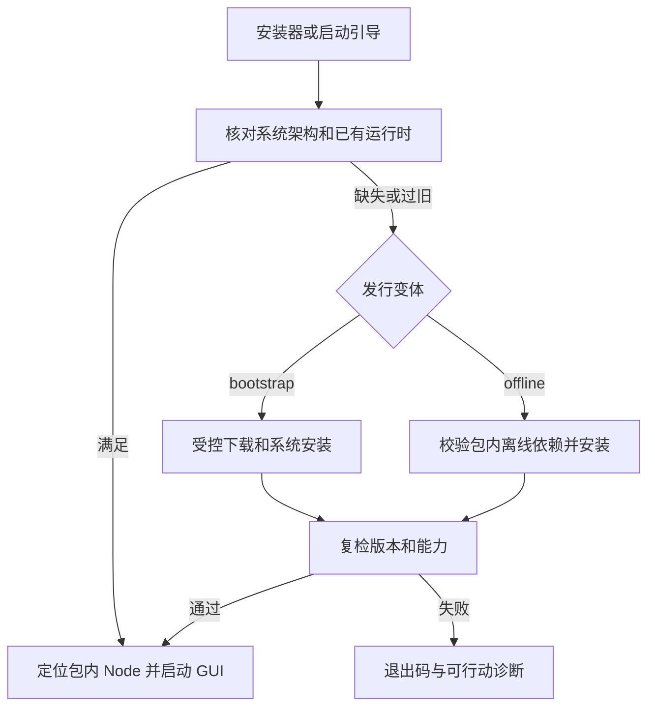

# 05 双版本安装、运行时与 CI 发布

[执行索引](README.md) · [上一册](04-ui.md) · [下一册](06-testing-acceptance.md)

对应 P5 和 CI 任务。安装原型从 G1 后提前验证；完整发行必须等待 G4/G6。平台范围已定（[P0-06](records/P0-06.md)）：仅 64 位（D1），Linux 首批 Ubuntu 22.04/24.04、Debian 12/13、Fedora 最近两个正式版本（D2）。

## 产物清单和大小口径

每个支持目标生成 `bootstrap` 和 `offline`。命名模式为 `xresconv-gui-<version>-<os>-<distro?>-<arch>-<variant>.<ext>`，另带 SHA-256、签名/公证信息、SBOM、许可和测试报告索引。产物矩阵先写清单再构建，汇总 job 检查集合完全相等，不用通配符“找到多少发多少”。

P5-01 已有 `packaging/targets.json` 与 `packaging/schema/runtime-manifest.schema.json`。清单与矩阵生成入口都校验目标集合及 OS/arch/triple 一致性；安装路径必须是无 `.`/`..` 段的正斜杠相对路径；疑似密钥不能回显到诊断。回归见 [增量审查](records/REVIEW-P2-P5-2026-09-24.md)。P5-02 已有 `packages/packaging/src/assemble.ts`：单份 Node 版本/哈希/ABI 校验、三角色 esbuild bundle、生产 npm 闭包裁剪、contracts schema 落位、moduleTreeHash 与 manifest 生成（含 lint），guardian/backend bin 按发行布局自定位接力锚点；PK07 本机全链冒烟与遗留见 [P5-02 记录](records/P5-02.md)。产物侧 `runtime-manifest.json` 字段至少包括：

```text
schemaVersion / appVersion / sourceCommit / targetTriple
os / osVersionRange / distro / arch / variant
webviewStrategy / minimumWebview / runtimePayloads
nodeVersion / nodeHash / moduleTreeHash / nativeAddonAbi
files(path,size,sha256,origin,license) / signingEvidence
buildToolchain / repositorySnapshot / verificationReport
```

manifest 在安装完成后能与实际文件校验；其自身的可信性来自签名发行/已验证安装器，而不是仅含哈希便宣称可信。禁止在 manifest 中写开发机绝对路径或密钥。

大小报告分别记录 Tauri 薄壳/前端、Node 二进制、backend/guardian/worker JS、运行 npm 模块、必要原生适配、资源、引导器、离线运行时、安装器开销和整体压缩/展开大小。Node 二进制只带一份，多个进程共享它，不为每个角色再打包一份 Node；许可不裁剪。生产包排除测试插件、fixtures、编译缓存和开发依赖，动态 require 需要的包文件不能按静态引用随意删。

## 运行时检查与安装状态机


```mermaid
flowchart TD
    Start[安装器或启动引导] --> Detect[核对系统架构和已有运行时]
    Detect -->|满足| Ready[定位包内 Node 并启动 GUI]
    Detect -->|缺失或过旧| Variant{发行变体}
    Variant -->|bootstrap| Online[受控下载和系统安装]
    Variant -->|offline| Local[校验包内离线依赖并安装]
    Online --> Verify[复检版本和能力]
    Local --> Verify
    Verify -->|通过| Ready
    Verify -->|失败| Diagnose[退出码与可行动诊断]
```

安装结果内部状态拟为 `Ready/NeedsInstall/NeedsElevation/NeedsRestart/Unsupported/Failed`，保留系统安装器原始退出码。需要重启不能直接当可启动成功；再次执行检查须幂等。已满足时无下载/重装/降级。

检测同时覆盖首次安装和安装后运行时被移除/损坏。Linux 桌面入口及 CLI 启动经不依赖 GTK/WebKit 的引导器；启动参数、cwd、退出码、信号和带空格路径不得丢失。Windows 使用原生检查/诊断路径，不能依赖创建 WebView 后再报 WebView 缺失。macOS 在安装前检查系统版本，不能指望一个最低系统不兼容的二进制自我修复。

所有变体包含固定 Node、编译后的 backend/guardian/worker JS 与运行 npm 模块。系统 Node 不作为必要条件；Java/JAR 保持外置。在线引导版只允许为已登记的平台依赖联网，不能在首次运行临时 npm install。guardian 使用相同 Node 执行文件，通过固定启动模式与最小环境启动各角色；资源定位不依赖开发机工作目录。生命周期原生适配若为必需，先通过 P2 平台原型并纳入 ABI、签名、许可及离线清单；不额外构建 Rust 业务守护程序。

## Windows

公共 Tauri 配置配两个覆盖文件：`tauri.windows.bootstrap.conf.json` 使用 `embedBootstrapper`；`tauri.windows.offline.conf.json` 使用 `offlineInstaller`。这是拟定文件名，实际字段结构以锁定 CLI schema 校验。[官方 Windows 安装器](https://v2.tauri.app/distribute/windows-installer/)

1. 分别准备 x64/ARM64 Node、资源与目标 triple；ia32 已由 D1 决策删除，不进入矩阵。
2. 确定最低 WebView2 能力，检测已有 runtime 的版本、架构和安装范围；已存在但不合格不能直接跳过。
3. 主产物用 NSIS；验证当前用户安装、需要提升权限的机器级安装、企业策略拒绝及恢复。
4. 两覆盖配置只改变运行时准备方式和文件名；应用二进制、模块树和业务功能哈希一致。
5. 验证包内引导/离线安装器签名与架构；不重签或篡改微软运行时。应用与自身安装器按项目签名流程处理。
6. 在无 WebView2 的干净快照中测 bootstrap 联网/断网、offline 完全断网；有 runtime 快照测复用和过旧升级。

不能把开发机缓存的 WebView2 或已安装 Edge 当作离线包完整性的证明。运行时升级后的系统状态由系统维护，本应用卸载不移除共享 WebView2。

## macOS

两个命名变体使用相同签名 app payload，manifest 明确 `webviewStrategy=system-only`。WKWebView 随系统，不生成虚构的独立离线安装器；旧系统引导升级 OS，离线无法补装时明确拒绝。[Tauri WebView 版本](https://v2.tauri.app/reference/webview-versions/)

1. 原生 x64/arm64 分别构建并测试；最低系统取 Node/Tauri/前端特性与部署目标交集。
2. 定位 app Resources、Node、模块和 guardian；从 Finder、终端、中文目录和只读安装目录均启动。
3. 针对 Node/V8 及原生模块验证所需 entitlements，只增加经过证据确认的项，不用全面关闭保护来绕过签名失败。
4. 按嵌套代码到 app/安装介质的顺序验证签名，完成 notarization 和适用产物的 stapling。
5. 在新 VM 无缓存且断网的首次打开场景测 Gatekeeper、Node/guardian 和真实脚本；测试安装到 Applications 后启动。
6. 同版本两变体清单声明相同负载及差异原因，不能暗示 offline 能修复不受支持的 OS。

签名/公证操作发生在实施阶段的受控发行环境，不由文档任务操作证书或上传产物。

## Linux

按 D2 已定的发行版（Ubuntu 22.04/24.04、Debian 12/13、Fedora 最近两个正式版本）出包。优先 DEB；RPM 随 Fedora 目标一并构建/验收。

在线变体包含应用包、独立预检引导器及 manifest；离线变体**优先采用单一自含包**（随包携带 WebKitGTK/GTK 及传递依赖，按架构一份，覆盖全部已定发行版），其集成风险在 P5-06 原型验证；原型不可行时回退到按发行版的完整依赖闭包和本地仓库校验材料。预检引导器必须在最小受支持桌面环境启动，不能动态链接缺失的 GTK/WebKit。

### 离线依赖生产流程（自含包优先，闭包为回退）

0. 自含路径：在支持矩阵最老基线上构建，将 WebKitGTK/GTK 及传递依赖随包组装并记录版本/来源/哈希；干净 VM（GNOME/KDE、X11/Wayland）验证 GPU/字体/IME/媒体/portal 集成；任一发行版不可行即对该目标回退闭包路径并记录证据。
1. （回退路径）固定 OS 镜像摘要、发行版代号、架构、包源与仓库快照；记录该镜像已保证的桌面基线。
2. 从应用 ELF/打包依赖推导运行需求，包括 WebKitGTK 4.1、GTK、TLS/图形/媒体等实际依赖；不能仅复制 libwebkit 一个包。
3. 在干净依赖解析环境求传递闭包，区分已有基线包与需随包提供的包；保存包版本、来源、原始签名/仓库元数据和哈希。
4. 生成隔离本地仓库及索引，以项目验证链保护重建的元数据；不能假定失去上游 Release 关联的包集合仍自动具备仓库签名信任。
5. 在两类 VM 测试：最小受支持桌面、已更新桌面。先 dry-run 依赖求解，冲突/需要降级或卸载时终止并解释。
6. 关闭网络和外部仓库访问，仅从本地包源安装缺失项；不永久改用户源，不关闭签名校验。
7. 检测安装后 WebKit/GTK/Node 和应用启动；记录网络捕获、包管理事务及最终依赖版本。

包管理器锁、取消授权、只读介质、磁盘不足、仓库元数据失效、依赖冲突分别有恢复说明。依赖安装不承诺系统级完全原子回滚；失败时报告已完成步骤，保留可修复状态，不盲目卸载可能被其他应用使用的包。

构建选最老的合适基线，验证 glibc/链接符号；较旧 WebKit 不一定能运行最新前端全部特性，需做能力/版本 gate。X11 和 Wayland 都在支持范围内验证。AppImage 是自含 offline 形态的候选实现之一；如采用，另计体积和运行时更新方式。[Tauri Debian](https://v2.tauri.app/distribute/debian/)、[Tauri RPM](https://v2.tauri.app/distribute/rpm/)

## P5 任务清单

| 任务 | 前置 | 拟实现产物 | 验收 |
| --- | --- | --- | --- |
| P5-01 | G1 | targets/manifest schema、命名和矩阵生成器 | 重复/缺失/未知目标均失败，PK01；矩阵与 D1/D2 决策一致 |
| P5-02 | P2-10、P5-01 | 单份 Node 获取校验、backend/guardian/worker JS、production modules 与必要适配组装 | PK07；不复制开发机 node_modules 全集，不重复嵌入 Node |
| P5-03 | P5-01 | Windows 原生检查、双配置/NSIS | PK02/PK03，首次安装与修复路径通过 |
| P5-04 | P5-01 | macOS 两变体、资源、最低系统检查（D5：系统 WKWebView + 引导升级） | PK04，不伪装可独立安装 WKWebView |
| P5-05 | P5-01 | Linux preflight、入口、在线 DEB/RPM（D2 已定发行版） | PK05；缺 WebKit 前仍可显示诊断和安装流程 |
| P5-06 | P5-05 | 离线变体：优先自含包原型（按架构），不可行回退 distro/arch 依赖闭包 | PK06；无网络、无缓存、无降级 |
| P5-07 | P5-02 至 P5-06 | 签名、公证、SBOM、license/hash 清单 | PK08；安装介质与实际 app/sidecar 都验证 |
| P5-08 | P5-07 | 升级、修复、卸载、重启恢复逻辑 | PK09；用户数据和共享 runtime 保留 |
| P5-09 | G4、P5-08 | 大小分解与正式产物扫描 | PK01/PK07；无测试端口、开发权限或旧 UI 依赖 |
| P5-10 | P5-09、CI 完整矩阵 | G5 安装证据 | 每个正式支持目标两变体有实际机器验收，不用交叉编译替代 |

## CI 工作流拆分和权限

Action 版本以主计划表及实施时官方稳定发行核验为准，实际 workflow 固定完整 commit SHA 并注释版本；当前所有三个 workflow 都必须覆盖，不能只更新 release。

| 拟 job/任务 | 输入与职责 | 权限/出口 |
| --- | --- | --- |
| CI-01 validate-toolchain | 固定 Node/Corepack/Yarn；原生壳 job 固定 Rust；检查版本报告、锁文件、Action SHA/runner | 默认只读；版本漂移或不兼容失败 |
| CI-02 quality | Node job 执行 docs/lint/typecheck/schema/unit 与 `--immutable`；壳 job 独立执行 Cargo `--locked` 检查 | Node 业务与契约生成不依赖 Cargo；无签名密钥，测试失败返回非零 |
| CI-03 desktop | Windows/macOS/Linux 原生测试 feature 构建 + E2E | 每个平台保留日志/截图/退出/清理证据 |
| CI-04 build-variants | 全目标 production 构建、组装、签名和产物检查 | 可信发行触发才接触签名；PR 用不签名构建验证 |
| CI-05 installer-tests | 干净 VM/原生机验证两变体及断网依赖 | 外部验收产物绑定 digest，手工测试也须提供记录 |
| CI-06 release-aggregate | 核对预期矩阵、哈希、验收，再创建单个 draft release | 唯一写 release 的 job；不覆盖现有版本 |
| CI-07 stale-and-maintenance | stale 升级并保持当前 90 天/标签语义；依赖检查 PR | 最小 issues/PR 权限；维护任务不改发行产物 |

执行顺序：工具链 → 质量 → 原生应用/平台包 → 安装验收 → 汇总。安装依赖解析任务可独立缓存，但 cache key 包含 distro/arch/仓库快照。测试 feature 与 production 使用不同构建产物路径，避免 E2E 插件进入发布包。

已落实的流程约束：不用 setup-node npm cache，Yarn 随 packageManager 固定；只有聚合 job 写 draft release；失败不得被最后一条命令掩盖；不覆盖已有发行。保留 LFS 与正式触发语义。

若 GitHub hosted runner 无目标 OS/架构或无法提供干净安装状态，可使用受控测试机/VM 导入证据；没有资源就是对应发布 gate 阻塞，不自动减少矩阵。运行应用 E2E 的版本、签名包版本及 SHA 必须能关联，不能拿另一构建的测试报告代替。

签名后不得再 strip/压缩修改可执行文件；以签名后的最终安装介质计算发行 hash 和大小。为降低体积启用 LTO/去调试符号时保留单独符号产物，并测试崩溃定位，不使用未经验证的可执行压缩器绕过系统签名。

## 本轮发行修订（2026-09-27）

三个平台入口复用 `packages/packaging/src/package-cli.ts`：原生 OS/架构和 Linux 发行版必须匹配目标；tag 必须与 Tauri 版本相同。每个变体分别组装，`--skip-assemble` 仅允许单变体且逐项验证 manifest 身份、文件大小与哈希。定位产物按目标格式和本次构建时间，拒绝旧文件、零个或多个候选。

组装包括 backend 的 matcher/log-sink 独立 worker；生产日志默认接入内置 log4js 配置。npm 闭包保留嵌套目录和各版本的传递依赖。staged 探针检查模块的真实解析路径，禁止测试意外使用仓库祖先目录的依赖。SPDX 包按名称和版本区分，包含 Node 版本和必填字段。

`release.yml` 的 macOS x64/arm64 使用对应原生 runner；Linux 离线包仅在 Ubuntu 22.04 基线生成，避免两个 job 上传同名文件。聚合按完整 targets 矩阵检查唯一文件名、配对校验文件及实际 SHA-256。组装默认 `verificationReport.result=fail`，安装验收必须另行提供证据。

现有工作流仍缺 Windows ARM、Linux ARM 及 Debian/Fedora 全部目标，聚合会拒绝不完整矩阵；本轮 Windows 双变体已实构；未触发 CI、执行安装/签名/公证或发布。Linux 预检参数/安装命令已修复，Linux shell 回归待 Linux CI，本机 Windows 不模拟通过。详情见 [审查记录](records/REVIEW-2026-09-27.md)。

## Portable 构建验证（2026-09-27，P5-11）

用户指示：无苹果开发者证书，各平台打包**仅需 Portable 包**，不需要安装包。据此落地跨平台构建流程验证，不改变上文的安装器矩阵合同（draft release 聚合继续 fail-closed 拒绝不完整矩阵）：

- **Portable 形态定义**（`packages/packaging/src/matrix.ts`）：
  - macOS = 未签名 `.app`（bundle target `app`；无签名身份时 tauri-bundler v2.11.5 `keychain()`=Ok(None)，跳过签名与公证），打包期 `ditto -c -k --sequesterRsrc --keepParent` 压缩为 `xresconv-gui-<version>-macos-<arch>-<variant>.app.zip`；
  - Linux offline AppImage 本身自含即 portable，命名与安装器矩阵一致；
  - Windows NSIS 与 Linux bootstrap deb/rpm 是安装器，**无 portable 形态**——Windows portable 的 manifest webview 语义需要另行修订本册合同与 targets.json，不擅自发明。
- **验证范围**（`portableArtifactNames`，精确 4 项）：macOS x64/arm64 + Linux x86_64/aarch64，一律取 offline 命名（macOS 两变体负载相同，targets.json 仅 `variant` 字段不同；Linux portable 只有 offline 自含形态）。macOS x64 用 `macos-15-intel`、arm64 用 `macos-15` 原生 runner；Linux 双架构均在 Ubuntu 22.04 最老基线（x86_64 用 `ubuntu-22.04`、aarch64 用 `ubuntu-22.04-arm` 原生 runner，无交叉编译）。
- **工作流** `.github/workflows/portable-build.yml`：构建 → `scripts/verify-portable.ts` 逐产物验证（解包 → manifest 身份与本次构建/目标完全一致 → 全量逐文件 SHA-256 → 包内 Node `--version` 原生探针；Linux 另验 AppRun 与 WebKitGTK 自含闭包，macOS 另验 Info.plist 最低系统 13.5）→ 聚合 job 只做产物集合 + 边车哈希核验（CI-06 语义，无 release 写权限）。AppImage aarch64 由 tauri-bundler 按 `Arch::AArch64` 选取 `linuxdeploy-aarch64.AppImage`/`AppRun-aarch64`，bundler 自设 `APPIMAGE_EXTRACT_AND_RUN=1`，无需 FUSE；ARM 镜像需安装 `xdg-utils`（`bundleXdgOpen` 默认 true）。
- **Linux 发行负载落位 = `/usr/share/xresconv-gui`（P5-11 定稿）**：linuxdeploy `deployDependenciesForExistingFiles` 会递归扫描 AppDir `usr/lib` 下全部 ELF 并 patchelf 改 rpath + strip，随包负载若经 `resources` 映射落位 `usr/lib/<productName>`，`koffi.node` 与 `runtime/node` 必被改写、manifest 逐文件哈希失配（CI/WSL 实证；`NO_STRIP=1` 只免 strip 不免 patchelf）。因此 Linux 三格式（deb/rpm/AppImage）经 `bundle.linux.{deb,rpm,appimage}.files` 把发行布局（runtime/app/runtime-manifest.json/preflight.sh）落位 `/usr/share/xresconv-gui`——不能落 `/opt`：AppImage 打包仅把 `data/usr/` 子树拷入 AppDir（tauri-bundler v2.11.5 `linuxdeploy.rs` 源码约束），`/usr/share` 是三格式统一、位于扫描盲区的唯一单跳落位，壳侧候选相应探测 `../share/<productName>`（`guardian.rs`；P5-05 的 `/usr/lib` 布局与"启动冒烟"结论由本节取代）。
- **与本册合同的关系**：portable 验证只证明"构建过程 + 负载完整性 + 包内自定位"，不构成 I01–I14 安装验收，也不替代签名（P5-07）；manifest 的 `verificationReport.result` 保持 `fail`。若最终发行决定转向 portable-only（放弃安装器矩阵），须先修订本册与 targets.json 的 webview 策略语义再改 release.yml。

### Linux"解压即运行"tar.gz（2026-09-27 增补，用户决策）

用户增补指示：Linux 需要解压直接运行的包（不要 deb/AppImage/rpm 这类特殊格式）；系统 WebKit 尽量复用桌面发行版附带的；tar.gz 与 AppImage 并存。落地：

- **两种运行时策略并存**（`portableFormats`）：
  - `xresconv-gui-<version>-linux-<arch>-bootstrap.tar.gz`（≈49MB）——裸 exe + `runtime/`+`app/`+`runtime-manifest.json`+`preflight.sh` 平铺（exe 同级布局，壳候选第一优先级，平台无关代码路径）；运行时复用系统 WebKitGTK 4.1（≥ minimumWebview 2.38），缺库时 `preflight.sh` 给按发行版安装指引。验证含 ldd 探针（exe 必须解析到系统 webkit）与 preflight 就绪路径。
  - `xresconv-gui-<version>-linux-<arch>-offline.tar.gz`（≈160MB）——自含 AppImage `--appimage-extract` 解包后重压（复用 linuxdeploy 闭包，不在脚本侧重造依赖收集）；解压后 `./xresconv-gui/AppRun`（或 `usr/bin/xresconv-gui`，路径自定位均命中 `../share/<productName>`）。
  - `xresconv-gui-<version>-linux-<arch>-offline.AppImage` 保留并存。
- **命名规则**：portable 产物一律不带 distro 段（发行版无关产物）；bootstrap tar.gz 的构建基线记录在包内 `manifest.distro`（构建于 ubuntu-22.04 最老基线行），文件名不携带。
- **聚合范围**扩为精确 8 项（macOS app.zip ×2 + Linux bootstrap tar.gz ×2 + offline tar.gz ×2 + offline AppImage ×2）；`portableArtifactName` 对非法目标/格式组合 fail-closed。
- **不做单包运行时自动切换**（复用系统 WebKit 否则用闭包）：动态链接无法在运行时干净地"优先系统、缺则回退闭包"（RUNPATH 先于默认路径解析），两个显式包比一个含运行时探测逻辑的包更稳。

## Release portable 归档定稿（2026-09-28，用户决策；取代上两节的发行形态）

用户决策：Release 打包上传内容调整为——**Linux 不再输出 deb/rpm 等发行版专属包，一律 tar.zst（zstd 压缩）解压即运行；Windows 不创建安装包，一律 zip 解压后直接双击运行**（允许打包所需资源文件）。macOS 维持 DMG。本节为当前权威合同；上文"Portable 构建验证（P5-11）"与"Linux 解压即运行 tar.gz"两节中与之冲突的表述（tar.gz 压缩格式、"安装器矩阵 fail-closed"、"Windows 无 portable 形态"）由本节取代。

### targets.json 与矩阵（22 → 10 行，一行一产物）

- **Windows**：`bootstrap`（`webview2-evergreen`，依赖系统 Evergreen 运行时）与 `offline`（`webview2-fixed-runtime`，捆绑 Fixed Version 运行时）双变体 ×2 架构（同日增补落地，见下节）。产物 `xresconv-gui-<version>-windows-<arch>-bootstrap.zip` 与 `-offline.tar.zst`（offline 压缩优化见「Windows offline 压缩优化」节）。
- **Linux**：`bootstrap`/`offline` ×2 架构共 4 行，**全部无 distro 字段**（产物发行版无关）；构建基线收敛为 Ubuntu 22.04 最老基线（`LINUX_BUILD_BASELINE`，`package-cli` 校验宿主一致，glibc 2.35 地板）。产物：bootstrap `…bootstrap.tar.zst`、offline `…offline.AppImage` + `…offline.tar.zst`（AppImage 并存为 2026-09-27 既有决策）。
- **macOS**：x64/arm64 × bootstrap/offline 4 行不变，产物仍为 DMG 安装器（`formatFor` 仅存 dmg；windows/linux 调用 throw `NO_INSTALLER_FORMAT`）。
- `buildMatrix` 改为一行一**产物**（linux offline 一行 target 出两行产物）；manifest schema 删除 `distro` 字段、`webviewStrategy` 枚举更新、`webview2-offline-installer` payload 移除。

### Windows offline：Fixed Version 运行时内嵌（2026-09-28 同日增补，用户授权调研决策）

调研结论（来源索引同日条目）：Fixed Version 无官方下载 API（WebView2Feedback#3372），但官方下载页 HTML **静态内嵌**最新两大版本 × 三架构的 cab 直链（curl 实证，无需 JS 渲染）——`parseFixedRuntimeLinks` 抓页解析（/ 转义还原、同架构取最高版本），页面结构变化即解析失败 → 构建 fail-closed。cab（x64 ≈294MB）下载缓存 `build/webview2-fixedruntime/`（MSCF 魔数 + 体积下限校验），`expand -F:*` 解压（官方指定方式），zip 内固定目录 `webview2-runtime/`（去版本号）。备选方案（Evergreen Standalone Installer 附加资产 / 自仓缓存）因"需先安装才可运行"或"版本冻结需人工滚动"被否。

运行时链路（2026-09-28 追问修订：**系统优先、包内兜底**）：壳预检先查系统 Evergreen 注册表——可用（≥ minimumWebview）则直接用系统 runtime（与其他 WebView2 应用共享磁盘/内存、自动安全更新，多数 Win10/11 机器路径）；缺失/过旧且包内有 `webview2-runtime/msedgewebview2.exe` 时才 `WEBVIEW2_BROWSER_EXECUTABLE_FOLDER` 指向该目录（loader env var 优先级最高、提权宿主下也生效——wry#1782；相邻目录不被 loader 自动发现）并幂等补 Win10 Fixed≥120 要求的 AppContainer 读执行 ACL（S-1-15-2-2 / S-1-15-2-1，官方 icacls 等价的 DACL 实现；失败仅告警不阻塞，Win11 无此要求）。体积敏感用户可删 `webview2-runtime/` 把 offline zip 降级为 bootstrap 语义。决策发生在 WebView 创建之前（进程级 loader 参数），可干净二选一——05 册否决 Linux"单包运行时自动切换"的 RUNPATH（链接期嵌入）理由不适用于 Windows。固定 runtime 不自动更新，安全补丁随发行滚动（兜底路径固有代价，官方文档明示）；决策表见 `src-tauri/src/webview_preflight.rs` 测试。

### Windows 归档内容与 WebView2 策略

zip 顶层目录 `xresconv-gui/`：`xresconv-gui.exe`（`tauri build --no-bundle` 裸产物）+ `WebView2Loader.dll`（cargo 产物携带时）+ `runtime/`+`app/`+`runtime-manifest.json`（发行布局）+ `MicrosoftEdgeWebview2Setup.exe`（官方 Evergreen bootstrapper sidecar，`go.microsoft.com/fwlink/p/?LinkId=2124703` 稳定短链，构建期下载缓存至 `build/webview2-bootstrapper/`，MZ 头+体积下限校验）。bootstrap 压缩用 `pwsh Compress-Archive`（DEFLATE，双击解压，Windows 宿主必达）；offline 内嵌 Fixed Version 运行时（`webview2-runtime/`）改用 `tar --zstd` 压缩为 tar.zst（见下「Windows offline 压缩优化」节）。运行时策略：系统已装 Evergreen（Win10 1809+/Win11 绝大多数）直接双击；未装/过旧时壳 `webview_preflight`（P5-03 注册表探测）弹原生提示指引运行包内 bootstrapper，退出码 2。offline 布局壳预检指向包内固定 runtime，完全离线。

### Windows offline 压缩优化：zip → tar.zst（2026-09-28 同日增补，用户授权调研决策）

问题：offline 内嵌 Fixed Version 运行时（解压 ~668MiB，其中 Locales ~128MiB），`Compress-Archive` 的 DEFLATE 对已压缩的 WebView2 二进制收益低，成品 344MiB 过大。

调研（本机实测，语料 = 真实发行布局 + Fixed Version 运行时共 767MiB，见 source-index 同日条目）：

| 方法 | 体积 | 耗时 | vs DEFLATE zip |
| --- | --- | --- | --- |
| DEFLATE（Compress-Archive，原方案） | 344MiB | — | 基线 |
| tar.zst（zstd L19，多线程） | 260MiB | ~49s | −24.5% |
| tar.zst（zstd L22 ultra --long） | 245MiB | ~284s | −28.8% |
| .7z（LZMA2 -mx9） | 231MiB | ~103s | −33.0% |

决策：**offline 改用 tar.zst（zstd L19 多线程）**。选 tar.zst 而非 .7z 的关键理由——Windows 自带 `tar`（bsdtar/libarchive 含 zstd），离线/隔离机器用内置 `tar --zstd -xf` 即可解压，无需安装第三方工具；且与 Linux 归档一致。L19 而非 L22 是速度/体积权衡（多约 5.8× 耗时仅省 6%）。bootstrap（~42MiB）保持 zip 双击解压（DEFLATE 对小负载够用，全 Windows 版本原生双击）。压缩命令用 Windows 内置 `tar --options zstd:compression-level=19,zstd:threads=0 --zstd`（`threads=0` 用满全核，无需额外二进制；本机端到端实测 262.6MiB / 57s，解压结构核验通过）。`tarZstPortableWindowsLayout` 与 `zipPortableWindowsLayout` 共用 `stageWindowsPortableTop` 组装顶层目录。

### 压缩格式与 CI

- Linux 归档统一 `tar --zstd`（GNU tar 调 PATH 上 zstd；CI `apt-get install zstd`，本机 Git Bash zstd 1.5.7 实测通过）；产物扩展名 `.tar.zst`。Windows offline 用内置 bsdtar `tar --zstd`（libarchive 含 zstd，`--options` 设 L19+全核），同扩展名。
- `release.yml`：Windows job（x64 bootstrap→zip、offline→tar.zst）；Linux job 收敛单 ubuntu-22.04（`--variant=all` 产 3 产物）；macOS 不变；aggregate `verify-release.ts --target` 8 键 → 9 产物 + 9 边车。`--portable` 标志仅对 macOS 生效（app.zip portable 管线），Windows/Linux 产物与该标志无关。
- `portable-build.yml`：Linux 产物改 tar.zst、去 `--distro` 传参（入口保留作期望基线校验）；聚合 8 项集合不变（仅 tar.gz→tar.zst）。
