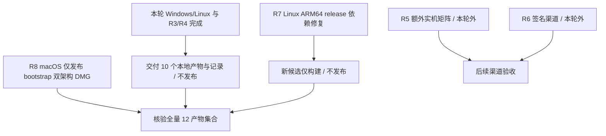

# 08 第一轮发布后的执行任务

[执行索引](README.md) · [发行约定](05-packaging-release.md) · [测试约定](06-testing-acceptance.md)

更新日期：2026-10-04。第一轮发布与用户验证已完成；后续工作依据当前源码与最终产物推进。活动状态只维护本册，主计划保留摘要；P0–P7 实施细节和历史限制见 [records](records/README.md)。

本轮执行边界（用户 2026-10-03 补充）：不创建或发布 Release；Linux 使用本地 WSL/Debian 验证；ARM64 交叉编译并打包，运行验证免验。证书签名及需要额外实机的人工矩阵不阻塞本轮代码、测试与本地产物交付，也不标为已经验证。

## 本轮完成

| 任务 | 状态 | 完成证据 |
| --- | --- | --- |
| R1 发布与计划核对 | done | [发布核对记录](records/RELEASE-2026-10-03.md)：dev.0 标签/提交/9 产物及边车、成功 release/ci/portable jobs；当前 HEAD 的 ci/portable 通过；记录用户第一轮验证结论 |
| 计划精简与约定同步 | done | 主计划缩为入口、功能编号与阶段摘要；01–07 册移除已完成任务流水表及被取代安装器方案；C/R/I 编号迁入 06；来源与证据保留 |
| R2 Windows/Linux x64 最终介质 | done（本机范围） | Windows 双 7z、Linux 三产物逐文件验证；Windows 与 Debian 的 bootstrap/offline 桌面各 13 项通过；运行时和 digest 见 [执行记录](records/EXECUTION-2026-10-03.md) |
| R3 XML 解析隔离与细分预算 | done | Windows 739 / Linux 731 项通过；浏览器 24、Rust 19/Clippy、两平台真实 JAR 八格式差分通过；隔离/截止/取消/关闭/预算/100k 与加载订阅异常均有回归，设计移入执行记录 |
| R4 ARM64 交叉打包 | done（运行免验） | Windows 双 7z、Linux bootstrap tar.zst 与 offline AppImage/tar.zst 均已生成；本地 8 目标 / 10 产物及 10 边车集合/hash 通过；ARM64 应用与包内 Node 未运行 |
| R2 macOS 当前候选介质 | done（原生构建范围） | `9967c38` 的 release 四个 macOS DMG 构建/上传成功；全量 release 聚合被 Linux ARM64 失败阻断，macOS 实机/签名仍另验；见 [CI 修复记录](records/CI-FIX-2026-10-03.md) |

用户未提供第一轮测试的逐平台/用例日志，因此这里只登记“用户确认第一轮完成”，不推断 Windows ARM64、离线 VM、macOS 实机或签名已通过。

## 执行顺序与任务约定

后续源码/运行时改变须重新绑定输入与产物，重跑受影响 gate。R5/R6 保留为后续渠道范围；ARM64 运行免验是用户决定，不计作运行通过。

| 任务 | 当前状态 | 前置与范围 | 完成条件 |
| --- | --- | --- | --- |
| R7 修复候选 CI 集成重验 | doing（本地完成，远端待新候选） | xdg-utils 修复已提交至 `651ea5e`；该提交 ci 第三次通过，但本轮 R8/R9 仍为未提交工作树 | 新候选仅构建入口通过完整 12 产物聚合；ci/portable 按新配置通过，核对 Yarn/Rust 缓存保存与后续命中；不发布、不重跑旧 tag 代替新候选 |
| R8 macOS 发布去重 | done（源码与回归范围） | 两变体均使用系统 WKWebView；用户授权取消重复 offline 发布包 | 发布仅 bootstrap 双架构，精确聚合为 12 产物；本地/Portable 入口兼容，额外 offline DMG 拒绝回归通过；见 [本轮记录](records/CI-E2E-2026-10-03.md) |
| R9 desktop-e2e 与缓存 | done（本地范围） | `651ea5e` 的标题竞态、Yarn 取消异常及缓存配置缺口有日志/源码证据 | Yarn 4.18.1、页面有界等待、Yarn/Rust 缓存及 tauri-driver 2.1.0；754 单测、Windows/Linux 各 13 桌面项及隔离全局镜像的禁网安装通过；远端缓存服务命中归 R7 |
| R5 额外实机矩阵 | deferred（用户限定的本轮范围之外） | 干净 VM、额外 macOS/Windows/Linux 设备、完整桌面环境矩阵 | 下表保留后续验收口径；不阻塞本轮本地收尾，不冒充已关闭全矩阵 G5/G6；ARM64 运行本轮免验 |
| R6 签名渠道 | deferred（需受控证书环境） | 当前无苹果开发者证书，沿用未签名开发预发布；确需签名渠道时安排维护者 | 应用/Node/原生模块/介质的签名、公证/stapling 与断网 Gatekeeper 通过；重新计算最终 digest，不沿用签名前介质 |

## R2 执行清单与验证入口

1. 记录源码提交/dirty tree、Node/Fixed Version/归档工具版本；冻结后不悄悄更新运行时。
2. Windows 原生 x64 与显式 `--cross --arch=arm64` 各打双 7z；Linux 在 WSL 中的 Ubuntu 22.04 基线构建，再在 Debian 验证。ARM AppImage 打包按 Tauri 官方限制使用模拟器，Rust 程序保持交叉编译；不运行 ARM64 桌面验收。
3. 核对 `runtime-manifest.json` 身份及每个文件的存在/大小/SHA-256；并行检查两变体公共业务负载与 Node/模块能力，单独登记不同运行时 payload。
4. Windows：`7z t` 与解压往返；已有合格 Evergreen、缺失/过旧时 Fixed 回退；窗口 API 检查后台控制台、关闭/取消后的所属子树。缺 runtime 的干净 VM 分支归 R5，不能用当前开发机缓存替代。
5. `verify:portable` 现支持 Windows 7z、macOS .app.zip、Linux tar.zst/AppImage；Windows 交叉包可用 `--static-only` 静态核验。CLI 不验证 DMG；macOS 仍要求原生构建环境。
6. 聚合目录固定为 `build/release-artifacts/`；`RELEASE_VERSION` 与候选版本一致。`node scripts/verify-release.ts --target=…` 校验当前实际构建子集；不传 `--target` 按全量 12 产物校验。构建/解包/校验/桌面运行均限时并收尾。

风险：dev.0 的 ZIP/tar.zst 证据不能覆盖新 7z；成功 CI 测试构建也不能覆盖最终介质。验证失败保留首轮输出，回退对应改动或使用已发布 dev.0 / 稳定 v2.6.0；不覆盖旧 release。

## R5 人工验收表

| 环境 | 必须保留的检查 | 用例 |
| --- | --- | --- |
| Windows 最低支持版本/10/11、x64/ARM64 | 解压工具、中文/空格/只读目录；合格/过旧/无 Evergreen；bootstrap 联网/断网；offline 无缓存断网；Fixed ACL、语言回退、后台控制台及进程清理 | PK02/PK03/PK07/PK09、SC08/SC11、I01–I10/I13/I14 |
| macOS 13.5 与当前受支持系统、x64/arm64 | Finder/终端/Applications 自定位；低于最低系统拒绝；真实 WKWebView/文件对话框/CLI/脚本；未签名包行为明确记录；签名渠道另执行 R6 | PK04/PK07/PK09、UI01–UI08、I09/I10/I13/I14 |
| Linux D2 发行版、双架构、GNOME/KDE、X11/Wayland | bootstrap 缺库预检；offline 最小桌面/无缓存断网；GPU/字体/IME/portal；POSIX 强杀/后台子树；原生文件对话框 | PK05/PK06/PK07/PK09、SC08/SC11、I02–I10/I12–I14 |
| 各目标稳定性/性能 | 同负载真实 JAR；冷/热启动分开；原生高 DPI/触控；100 次循环与整个进程树资源；对照 P0/P6 口径 | C15、EX05、UI03/UI08、P6-03/P6-05 |

Windows/Linux 已取消应用安装器：升级/修复/卸载项按“解压到新目录、替换/重解压、删除应用目录”执行，保留用户配置与共享运行时；不新增 NSIS/DEB/RPM 工作。任何能力不适用必须有平台理由，测试机缺失仍列 todo。

## 每项完成时同步

更新本册状态与 [records 索引](records/README.md)，记录提交/介质 digest、实际命令/数量/退出码和未验边界。涉及接口/预算/平台/运行时变化，同时更新 02/03/05/06 权威约定、用户说明与 [来源索引](../ai/source-index.md)；只有稳定 Agent 约束改变时才修改 AGENTS/Skills。

当前复核与文档变更可按 git diff 回退；阶段原始记录保持历史语境，不将当时失败/未验状态改成今天的成功。
