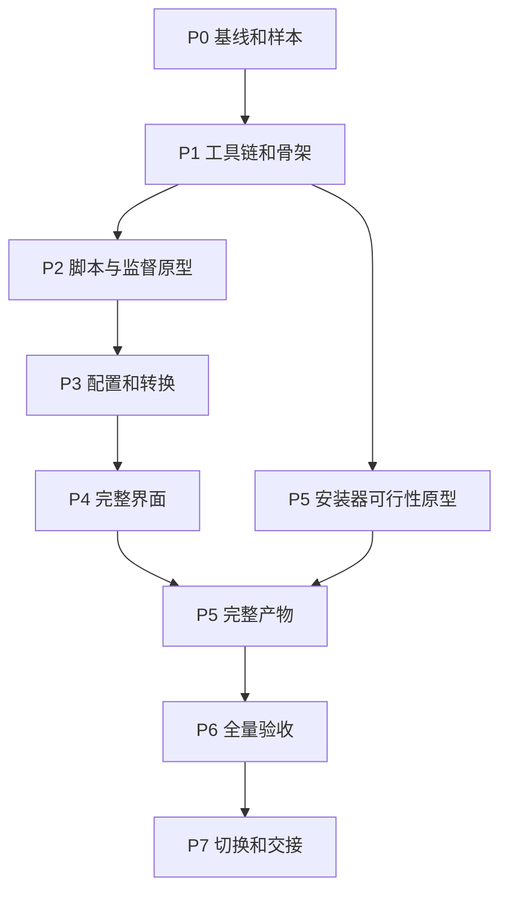

# 重构执行计划索引

[主计划](../../Plan.md) · [文档索引](../README.md)

状态：**设计细化完成，全部实现任务待执行**。更新日期：2026-09-23。此次没有安装项目依赖、修改业务代码、构建安装器或运行实施测试。

## 阅读顺序与唯一维护位置

| 文件 | 权威内容 | 阶段 |
| --- | --- | --- |
| [主计划](../../Plan.md) | 目标、版本快照、D1–D5、F01–F12、C/R/I 验收大类 | 全阶段 |
| [01 基线与工具链](01-baseline-toolchain.md) | 基线取证、依赖批次、工程目录、质量入口 | P0/P1 |
| [02 接口与脚本宿主](02-contracts-script-host.md) | 消息、数据、脚本生命周期和监督合同 | P2 |
| [03 配置与转换内核](03-domain-conversion.md) | 配置事务、参数编码、调度、日志和取消 | P3 |
| [04 UI 与交互](04-ui.md) | 页面组件、状态、操作流程和可访问性 | P4 |
| [05 安装与 CI 发布](05-packaging-release.md) | 系统依赖、变体、Actions、签名和产物 | P5 |
| [06 测试与验收](06-testing-acceptance.md) | fixture、测试步骤、断言、执行频率与报告 | P6 及各阶段 |
| [07 切换与交接](07-cutover.md) | 旧代码删除、文档迁移、回退和最终交付 | P7 |

按所在模块阅读分册，再查测试分册中关联用例。主计划的 C/R/I 是测试类别，分册中的 CF/SC/EX/UI/PK 是具体用例；二者不能互相代替。

## 任务执行规则

每个 `P?-??` 或 `CI-??` 是一个可独立审阅的工作单元，表格给出前置条件、产物与验收，分册说明回退范围和限制。默认状态全部为 `todo`。开始实施时在对应任务的工作记录中补充负责人和证据，不在多个文件复制同一份进度。

任务记录采用以下字段；这些文件在实施时生成，本次不创建空报告：

```text
task_id / status(todo|doing|blocked|done) / owner
source_commit / dirty_tree_digest / input_versions
changed_files / linked_requirements / linked_test_cases
commands / cwd / os_arch / case_count / exit_codes
evidence_paths / remaining_limits / rollback_point
```

完成一个任务的顺序：核对合同和输入 → 编写能暴露问题的测试 → 记录失败原因 → 最小实现 → 针对性验证 → 更新证据和文档 → 任务审查。文档任务只做文档检查；不得为凑流程制造无意义失败测试。

命令入口、接口名和目录名若标注“拟新增”，不得在尚未实现时当成可执行命令。发现合同不可实现，先修改合同并说明影响；不能通过删测试、忽略 peer 冲突、减平台或丢脚本能力使任务变绿。

## 依赖和可以提前验证的工作



安装器的干净机器原型应在 P1 后立即开始，尽早发现系统 WebView、签名、CPU 架构和离线闭包问题；产品化包仍依赖功能完成。UI 可提前完成视觉稿和组件原型，正式交互必须使用已冻结的接口。这里描述依赖关系，不授权创建子代理或同时修改共享文件。

建议审阅批次：基线合同；工具链；脚本/监督；配置；转换；UI；Windows 安装；macOS 安装；Linux 安装；CI；验收；删除旧架构。批次可再拆小，不要求一次提交整个阶段，也不在当前任务创建提交。

## 决策、默认策略与阻塞范围

| 决策 | 应收集的证据 | 在何时落实 | 未决定时可继续 |
| --- | --- | --- | --- |
| D1：32 位目标 | 最新 Node/Tauri/原生模块可用性、构建与维护成本、实际用户需求 | P0 登记，P5 正式矩阵前确定 | 64 位公共逻辑和原型，不能宣布取消 32 位 |
| D2：Linux 发行版 | 版本/架构、桌面环境、依赖来源、干净 VM、离线包体积 | P5 Linux 开始产品化前 | Windows/macOS 与通用安装协议 |
| D3：旧脚本对象依赖 | 脱敏脚本、所用节点方法、require 路径、跨 hook 模块缓存 | P2 出口前 | 接口和故障原型，不能宣布全部兼容 |
| D4：权限威胁模型 | 可信脚本能力范围、恶意访问是否在验收内、平台限制 | P2 资源与权限验收前 | 普通故障隔离，不能声称恶意代码强沙箱 |
| D5：macOS 安装语义 | 系统 WKWebView 限制、最低系统、离线 Gatekeeper 证据 | P5 macOS 出口前 | 两变体共用 payload 的原型 |

系统 WebView 优先复用；Node 使用包内固定版本是本方案的兼容性设计，不复用 PATH 中随机版本。两变体均含 Node。Java/JAR 继续外置；支持的 JAR 集合须记录测试版本，不承诺未经验证的任意版本。

## 必须单列的行为差异

以下不是已经获得验收的兼容结果。P0 建立旧版证据、P2/P3 定稿、P6 逐项复核。保留业务能力不等于复制已知崩溃和错误成功判定。

| 编号 | 拟变更 | 保留的能力与新增约束 |
| --- | --- | --- |
| BD-01 | VM 内执行改为独立进程，增加外部硬截止时间 | JS/Node 接口保留；超时导致对应 worker 会话失效，主流程必须收尾 |
| BD-02 | 日志 hook 从同步渲染调用改为有序异步处理 | 同条日志的修改顺序、递归保护和样式保留；同步时序/模块单例依赖必须检查 |
| BD-03 | Java 日志 data 事件不再代表调度确认 | 转换集合、参数、并发能力保留；精确单项完成只显示可证明的数据 |
| BD-04 | 富文本和链接经过清洗 | 正常格式和链接保留；主动脚本、事件属性和危险 URL 禁止进入 WebView |
| BD-05 | 加载配置改为完整候选快照提交 | include、覆盖和配置格式保留；失败不留下半份配置 |
| BD-06 | 超时、信号退出、重复完成统一收尾 | before/after 业务顺序保留；不得把故障当成功或重复累计失败 |

对象突变、include 顺序、跨进程模块缓存等若存在额外差异，新增记录并链接复现用例。需要用户改变现有脚本或放弃平台时，先呈现具体脚本/平台和替代方案，不能默认接受迁移成本。

## 阶段总门槛

| 门槛 | 必需证据 | 不可代替它的结果 |
| --- | --- | --- |
| G0 基线 | 工作树标识、旧行为样例、平台候选、大小/性能原始记录 | 只阅读 README |
| G1 骨架 | 锁定依赖、三平台构建/启动、契约往返 | 只生成脚手架 |
| G2 脚本 | 真实脚本对照、故障隔离、状态与清理证据 | JS 能编译、VM timeout 测试 |
| G3 内核 | XML/计划对照、假子进程协议、真实 JAR 结果 | 只有 mock 或退出码为零 |
| G4 UI | F01–F12、真实 WebView、键盘及大数据 | 浏览器截图或页面能打开 |
| G5 安装 | 全矩阵两变体、缺运行时、断网、签名 | 开发机上裸程序能运行 |
| G6 验收 | 完整矩阵、性能、大小、未解释差异为零 | 平均覆盖率或部分 OS 通过 |
| G7 交接 | 旧架构移除、文档、回退和完整 draft 产物 | 新包能下载 |

风险和工期以任务出口而非预估天数控制。P0/P2/P5 原型后再估算人力和日期；目前没有足够数据承诺固定工期或实际体积降幅。
