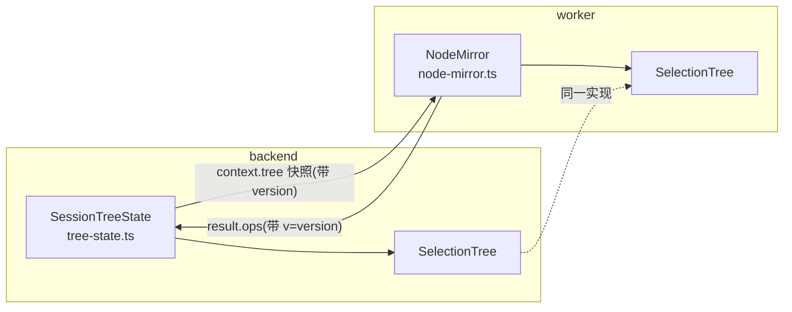

# P2-05 NodeMirror：脚本可见的节点镜像、别名恒等与有序 ops 回流

- task_id: P2-05
- status: done
- owner: main agent
- source_commit: 工作树（接续 P2-03/P3-06）
- input_versions: Node v24.21.0、Yarn 4.18.0、vitest 5.0.1、typescript 7.0.2、jquery.fancytree 2.38.5（`node_modules/jquery.fancytree/dist/jquery.fancytree-all.js`，语义逐行锚点）
- commands: 见文末"验证命令与退出码"
- cwd: D:\workspace\github\xresloader\xresconv-gui
- os_arch: win32/x64
- evidence_paths: `packages/compat-service/src/tree-model.ts`、`packages/script-host/src/node-mirror.ts`、`packages/script-host/src/diff.ts`、`packages/script-host/src/executor.ts`、`packages/backend/src/service/tree-state.ts`、`packages/backend/src/service/session.ts`、`packages/backend/src/service/run.ts`、`packages/backend/src/service/load-config.ts`、`packages/backend/test/service/tree-state.test.ts`、`packages/backend/test/service/tree-mirror-session.test.ts`、`packages/backend/test/fixtures/service/run-mirror.xml`、`packages/compat-service/test/tree-model.test.ts`、`packages/script-host/test/node-mirror.test.ts`、`tests/fixtures/scripts/contract.md` §6、本文件
- rollback_point: 全部为新增文件或切片内修改；git 工作树可逐文件恢复

## 目标与范围

消除 BD-S9/BD-O7：事件/按钮/append_log 脚本上下文里的 `selected_nodes`/`selected_items`
从"只读 JSON 快照"升级为可用的 Fancytree 节点镜像（NodeMirror）——脚本可调用
`setSelected`/`toggleSelected` 等公开方法，改动以有序 ops 回流 backend 的会话树状态
（SessionTreeState），后续 hook 立即看到新选择。

## 架构（三层，单一实现禁止分叉）



- `compat-service/src/tree-model.ts`：`SelectionTree` —— fancytree selectMode:3
  选择/展开语义的纯数据重实现，worker 镜像与 backend 会话树共享同一文件。
  逐行锚点：nodeSetSelected（ft-all.js:5743）、nodeToggleSelected（5941）、
  fixSelection3AfterClick（1041）、fixSelection3FromEndNodes（1061）、
  _changeSelectStatusAttrs（991）、visit（2497）、getSelectedNodes（1397）。
  未配置即不实现的分支：unselectableStatus/unselectableIgnore/radiogroup/lazy
  （main.js 从未配置）。
- `script-host/src/node-mirror.ts`：Proxy 镜像，脚本触达面 = P0-08 §8 证据清单。
- `backend/src/service/tree-state.ts`：`SessionTreeState` —— 权威状态、快照生成
  （item 载荷翻译回旧版 snake_case 形状）、ops 盖章应用、矩阵资格。

## 线上合同（tests/fixtures/scripts/contract.md §6）

- `context.tree = {version, nodes}`；item 节点 key=`item.id`（number，加载期文档序
  从 1 赋值，main.js:1612），category key=`cat:<id|name>`，根 `root_<n>`。
- 别名恒等：`item.ft_node === node`、`node.data.item === item`、`node.key === item.id`；
  folder 节点无 `data`（main.js:1447-1454）。
- 支持面：setSelected/toggleSelected/isSelected/setExpanded/isExpanded/isPartsel/
  getParent/getChildren/getRootNode/isRootNode/isFolder/visit/getSelectedNodes、
  `data.option.auto_select` 读写、item 字段直写（退出期 diff → set_fields）。
- ops：`set_node_states{changes}`（级联已计算的盖章集）/`set_node_expanded`/
  `set_fields{target:"item_data",item_id,fields}`（排除 ft_node、id）/
  `set_node_option`/`diagnostic`；每条带 `v`=快照版本，**版本失配整批拒绝**
  （陈旧镜像的迟到写入不生效）。
- **P4-03 扩展（UI 选择 ops，同一 applyScriptOps 入口与版本闸）**：
  `select_node{key,selected?}`（selected 缺省=toggle，显式 bool=set；级联在
  SelectionTree 内完成，UI 不分叉实现；unselectable 直调 no-op）、
  `select_all`/`select_none`（旧版按钮语义：visit 全树 setSelected）。
  AppliedOpsReport 增加 `version`（应用后当前版本，失配时也回传供重同步）与
  `stateChanges`（select_* 的级联变更全集，UI 增量同步用；worker 盖章路径不回填）。
- ops 应用时机：所有 outcome（含 rejected/error）都应用（BD-S3 部分修改语义，
  对齐旧版活引用）；append_log 只应用 set_log_fields 与诊断（只读镜像无树 ops）。

## 新增 BD 条目

- **BD-S15** `node.render()` 为 no-op：渲染是 UI 职责，worker 无 DOM；旧版脚本调用
  render 不报错（真实 DOM 刷新），新版静默吞掉以保持脚本不炸。
- **BD-S16** on_append_log 只读镜像：树快照在 run 开始固化一次（append_log_context
  窗口语义，main.js:2299），修改方法 no-op + `D3_READ_ONLY` 诊断。旧版此处是活
  Fancytree（可改选择）——日志回调里改选择属失控副作用，有意收紧。
- **BD-S17** 逐 op JSON 消毒：单条不可序列化的 op（脚本挂循环引用字段等）降级为
  `OP_SERIALIZE_FAILED` 诊断 op，不再整体判 `SCRIPT_RESULT_INVALID`。
- **矩阵资格建模**（main.js:1034-1110）：旧版 enable/disable 两分支的触发条件是
  "多输出项在输出类型下拉中是否被选中"（UI 状态），不是矩阵内容。
  `SessionTreeState.applyMatrixEligibility(matrix, multiSelected)` 显式建模该参数；
  加载期由内容推导（main.js:1333-1340）。注意 withRule ⇒ 内容必为 multi，
  故加载期只可能走 disable 分支。check_matrix_rule 的 tags 分支在旧版引用未定义
  变量 `output.tags`（ReferenceError，BD-M1），新版按 matrix_rule.tags 正确匹配。
- **显式 selection 同步**：`session.runConversion(selection)` 的显式选择先经
  `replaceSelection` 同步进树状态（树是唯一事实来源），再冻结为数组快照；
  item 对象按引用共享（before 链字段改写对计划可见，旧版活引用语义）。
  runConversion 不再 structuredClone config/selection。

## 排除面诊断（D3 落实）

- 排除方法（addChildren/removeChildren/load 等结构/懒加载/动画接口）：调用抛错
  （message 含 "not part of the supported"）+ 一次 `D3_EXCLUDED` 诊断 op（按方法名去重）。
- DOM 属性（li/span 等）：读 undefined + 诊断；未知属性静默 undefined（不算命中）。
- 核心字段直写（node.selected=...）：忽略 + `D3_DIRECT_NODE_WRITE`。
- 诊断 op 由 session 路由进日志管线（module "SCRIPT"，warning）；append_log 链内
  的诊断 bypass hook 链（防递归，同 WorkerDiag 处理）。

## 关键验证

- `tree-model.test.ts`（18 例）：selectMode:3 级联/toggle 的 partsel+lastIntent
  nuance/unselectable 直调 no-op 但级联穿透/visit 早退与 skip/getSelectedNodes
  stopOnParents/构造期聚合。
- `node-mirror.test.ts`（14 例）：别名恒等、folder 无 data、根 key、有序 ops 与
  版本、unselectable 无 op、set_fields 排除 ft_node/id、D3 三档诊断、只读镜像、
  render no-op、toJSON 安全。
- `tree-state.test.ts`（9 例）：快照旧版载荷形状（snake_case、无 ft_node）、缺 id
  抛错、ops 应用与版本失配整批拒绝、set_fields 翻译与 id/ft_node 免疫、矩阵资格
  禁用/恢复（auto_select 记忆）。
- `tree-mirror-session.test.ts`（真 worker 进程端到端）：hook1 经镜像改 desc +
  取消勾选 → ops 回流 → hook2 看到空选择（"SECOND items=0 nodes=0"）；计划按 run
  开始冻结（taskCount=1）；desc 改写落到共享 TreeItem；缺省 selection 从树派生
  （空选择 → 0 任务不 spawn java）。

## 验证命令与退出码

```text
cd packages/compat-service && corepack yarn typecheck && corepack yarn test  # 43 passed
cd packages/script-host   && corepack yarn typecheck && corepack yarn test  # 34 passed
cd packages/backend       && corepack yarn typecheck && corepack yarn test  # 123 passed
cd packages/contracts     && corepack yarn generate && corepack yarn test   # 12 passed
corepack yarn lint                                                          # 0 告警
```

全部 0 退出码。backend 计数含既有 113 + 新增 10。

## 事故与修正（自我改进）

- **Node strip-only 不支持参数属性**：`SessionTreeState` 初版用
  `constructor(readonly config)`，vitest 下通过但 `node --experimental-strip-types`
  直跑（log-pipeline 测试的子进程路径）直接 SyntaxError。已改为显式字段声明，
  并全仓 grep 确认无其他参数属性。教训：backend/script-host 源码必须保持
  erasable-only，类型检查后还要过一遍真实 node 加载路径。
- **矩阵资格触发条件误判**：初版把 enable 分支建模为"withRule && !multiMode"
  （由内容推导），但该组合在旧版逻辑下不可达（withRule ⇒ 内容 multi）。重读
  main.js:1034-1110 后改为显式 `multiSelected` 参数（UI 下拉状态），并补
  auto_select 记忆恢复测试。

## 遗留与后续

- 按钮动作链编排（reload/select_all/unselect_all/script 按钮）尚未在 backend 存在
  （F05；select_all 两处实现有旧版差异，实现时保留）；镜像已具备支撑能力。
- `default_selected` 选择器加载后自动执行（main.js:1892-1896）归按钮编排任务。
- P2-06 弹框回调注册表、P2-07 资源限额等 worker 侧加固不受本切片影响。
- UI（P4）消费 `getTreeSnapshot()`/`applyScriptOps()`/`applyMatrixEligibility()`
  渲染三态树； React Aria 默认 selection ≠ selectMode 3，必须复用 SelectionTree。
