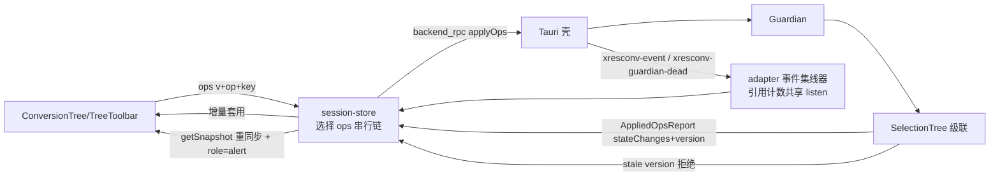

# P4-03 转换树与三态选择（前端树 + 后端 UI ops）

- task_id: P4-03
- status: done
- owner: subagent（main agent 委派；本切片为前端部分，后端 ops 扩展为同一切片的前置）
- source_commit: 工作树（接续 P4-02 壳通道与 P3-10）
- input_versions: Node v24.21.0、Yarn 4.18.0、React 19.3.0、react-aria-components 1.21.1、zustand 5.0.15、@tauri-apps/api 2.11.1、vitest 5.0.1
- commands: 见文末"验证命令与退出码"
- cwd: D:\workspace\github\xresloader\xresconv-gui
- os_arch: win32/x64
- evidence_paths: `apps/desktop/src/adapters/backend.ts`、`apps/desktop/src/app/session-store.ts`、`apps/desktop/src/app/use-backend-events.ts`、`apps/desktop/src/app/ConversionTree.tsx`、`apps/desktop/src/app/TreeToolbar.tsx`、`apps/desktop/src/app/ItemDetails.tsx`、`apps/desktop/src/app/AppShell.tsx`、`apps/desktop/src/app/EnvironmentStatus.tsx`、`apps/desktop/src/app/feature-map.ts`、`apps/desktop/src/styles.css`、`apps/desktop/test/session-store.test.ts`（11 例）、`apps/desktop/test/conversion-tree.test.tsx`（13 例）、`apps/desktop/test/feature-map.test.ts`（+1 例）、`apps/desktop/test/App.test.tsx`（mock 补 isTauri + store 重置）、本文件
- rollback_point: 切片改动集中在 apps/desktop 与 docs，可逐文件恢复；未触碰 packages/ 与 src-tauri/

## 切片范围

[04-ui.md](../04-ui.md) P4-03 = 树与选择适配、键盘基础行为（CF04/UI03 的前端对照面）。本切片含两部分：

1. **后端 ops 扩展**（main agent 完成并冻结，本记录引用其结果）：`SessionTreeState.applyScriptOps` 新增 UI 选择 ops——`select_node {key, selected?}`（selected 缺省 = toggle，旧版 Space/双击语义；unselectable 直调 no-op 不报错、changes 为空）、`select_all` / `select_none`（旧版按钮语义，visit 全树 setSelected，unselectable 逐项 no-op）。级联（selectMode:3）在 backend 的 SelectionTree 内完成，UI 不分叉实现。版本闸：`op.v` 必须等于当前 `tree.version`，失配整批拒绝；`AppliedOpsReport.stateChanges` 为级联变更全集（应用顺序），供前端增量更新。
2. **前端树**（本记录主体）：adapter → store → 组件 → 键盘 → 测试。

## 设计



- **adapter（src/adapters/backend.ts）**：`backendRpc(method, params?, timeoutMs?)` 透传冻结方法集；`getBackendSnapshot()` 幂等只读、在途去重；`onBackendEvent/onGuardianDead` 经事件集线器每事件名一条底层 `listen`，引用计数共享——StrictMode 的 setup→cleanup→setup 同步重放期间 listen Promise 未结算，第二订阅复用同一集线器，整次双挂载只产生一次真实 listen，最后一个订阅者释放即 unlisten。非 Tauri 预览（`isTauri()===false`）事件订阅降级为空操作。
- **store（src/app/session-store.ts）**：后端快照缓存（snapshot/connection/lastError/configPath）、事件水位（eventCount + 最近 state_change，日志详情属 P4-07）、UI 状态（searchTerm/expandedKeys/focusedKey）。选择 ops 串行执行（避免自造 stale 拒绝），await 后按 stateChanges 不可变增量套用（未命中分支保持引用）并推进版本；版本失配 → 自动 getSnapshot 重同步 + lastError 可见提示（不悄悄吞）；unselectable 节点本地 no-op（对齐 backend/fancytree 语义）。loadConfig/reload 重置 UI 展开集合（取快照 expanded），refreshSnapshot 保留 UI 状态并校验聚焦节点存活性。无任何 useEffect 以 ready 为触发自动执行转换。
- **ConversionTree**：React Aria `Tree`（selectionMode="none"——RAC 默认 selection 不等于 selectMode:3，勾选语义全部走 backend ops）+ 每节点受控 `Checkbox`（isSelected=selected、isIndeterminate=partsel、isDisabled=unselectable）；节点 key 用快照 key（item=number、category 为 `cat:` 前缀字符串），绝不用索引。空树/未加载保留 P4-01 空态（role=tree + aria-busy 占位）。
- **键盘与焦点**：上下/左右/Home/End 由 React Aria 自带；Space 切换焦点节点勾选、双击切换为旧版行为。注意 RAC `filterDOMProps` 不透传 onFocus/onKeyDown（实测，见"实现勘误"），焦点跟踪与 Space 处理以原生 focusin/keydown 监听挂在组件 wrapper 上，经行元素 `data-key`（RAC useSelectableItem 无条件渲染）还原节点身份；焦点在复选框/展开按钮上时 Space 由控件原生处理，不双触发。unselectable 节点可聚焦不可勾选。
- **TreeToolbar**：全选/全不选接 store.selectAll/selectNone（有配置才可用）；搜索仅过滤显示（title 大小写不敏感子串、保留祖先链、命中数 `匹配 N 项`、搜索态强制展开可见 folder 且不回写展开集合），不改变真实选择（04-ui：搜索属辅助操作，不改变"全选"原含义）。
- **ItemDetails**：只读显示聚焦节点 名称/描述/来源/scheme/tag/class（编辑属 P4-04）；聚焦变化绝不影响选择（测试断言聚焦后零 applyOps 且选择位不变）。
- **EnvironmentStatus**："选择 XML 配置…"→ store.loadConfig（路径即登记供重载，失败经 lastError 可见）；"重载配置"→ 健康探测 + store.reload。
- **feature-map.ts**：FeatureMapping 增加 `status: "skeleton" | "wired"` 字段；F02/F03 翻为 wired（测试断言）。

## CF04/UI03 验收映射

CF04/UI03 完整验收（10k/100k 树、滚动卸载再返回、读屏、p95 测量）依赖虚拟化与真实 WebView，属 P4-08；本切片完成其 jsdom 可验证部分：

| 验收点（06-testing-acceptance.md） | 本切片证据 | 状态 |
| --- | --- | --- |
| CF04 父子混选/禁用叶子/空分类三态对照 | 夹具含 selected/partsel/unselectable/空分类；断言 checked/indeterminate（input.indeterminate + data-indeterminate）/disabled | 通过（组件级；级联正确性由 backend tree-state 套件承担） |
| CF04 展开/折叠 | chevron 受控展开集合为本地 UI 状态，初始取快照 expanded；折叠后子节点卸载、再展开选择不丢（选择存于 store 快照非 DOM） | 通过（展开折叠部分） |
| UI03 鼠标/空格/方向键/双击 | 点击复选框、Space（焦点行）、双击行均触发 toggle 且 payload 形状 `{v, op:"select_node", key}` 受断言；方向键导航为 RAC 自带（jsdom 可聚焦验证） | 通过（jsdom 部分） |
| UI03 搜索隐藏选中节点 | 搜索仅过滤显示，断言选择位不变、零 ops | 通过 |
| UI03 全选含义稳定 | select_all/select_none 整树 op 与版本闸推进（v=1→2）受断言 | 通过 |
| 版本冲突不覆盖（04-ui §状态分层） | stale version 拒绝 → getSnapshot 重同步 + role=alert 可见提示 | 通过 |
| StrictMode 无重复订阅 | 双挂载 listen 每事件名恰好一次；卸载即 unlisten | 通过 |
| 10k/100k、滚动卸载、读屏、DPI、p95 | jsdom 不可验证（无真实布局/虚拟滚动/读屏） | **待 P4-08** |

## 实现勘误（RAC 1.21.1 实测）

- RAC Tree 角色为 `treegrid`（grid 模式树语义），行 role=`row` 带 aria-expanded/aria-level/aria-posinset；测试按此查询。
- `filterDOMProps({global:true})` 的全局事件白名单**不含** onFocus/onKeyDown（仅指针/鼠标/滚轮等），TreeItem 上的这两个 prop 会被静默剥掉；onDoubleClick 在白名单内。焦点/空格改用 wrapper 原生监听。
- RAC Checkbox 的半选以 `input.indeterminate` 属性 + 外层 `data-indeterminate` 表达，native input 不写 aria-checked="mixed"。
- `Expandable.expandedKeys` 仅接受 `Iterable<Key>`（无 "all" 字面量）；搜索态强制展开用"可见 folder key 集合"计算值。

## 验证命令与退出码

```text
cd apps/desktop && corepack yarn test    # 4 文件 36 passed（App 8 + feature-map 4 + session-store 11 + conversion-tree 13）
corepack yarn typecheck                  # 全 workspace 0 error
npx.cmd biome check apps/desktop          # 0 error（根 lint 中 apps/desktop 全绿）
cd packages/backend && corepack yarn test        # 167 passed（抽跑；含本切片后端 ops 用例）
cd packages/guardian && corepack yarn test       # 80 passed（抽跑）
cd packages/compat-service && corepack yarn test # 43 passed
cd packages/script-host && corepack yarn test    # 41 passed
cd packages/contracts && corepack yarn test      # 23 passed
npx.cmd --yes markdownlint-cli@latest docs/plan/records/P4-03.md docs/plan/records/README.md docs/ai/source-index.md  # 0 告警
```

注意：根 `corepack yarn lint` 的 biome 步骤当前因 `packages/packaging/`（另一并行切片新增、本切片边界外不得修改）存在 format/organizeImports/useIterableCallbackReturn 共 6 处违规而失败；与本切片无关，apps/desktop 单独 biome check 全绿。

## 遗留

- 虚拟化（10k/100k、滚动卸载再返回）、真实 WebView 的 DPI/主题/读屏、性能预算测量：P4-08。
- 日志面板/事件缓冲展示（P4-07）；DialogHost 弹框与 hook 开关（P4-05）；运行控制（P4-06）。
- 自定义选择器按钮与 default_selected 加载接线属 P4-05（F04/F05 仍为 skeleton）。
- 快照经壳通道 1MiB 帧上限传输，超大配置分块策略未处理（沿用 P4-02 记录遗留）。
- 选择 ops 失败时无乐观回退（本就后端确认后才更新）；部分拒绝（非版本原因）以 lastError 汇总展示。
