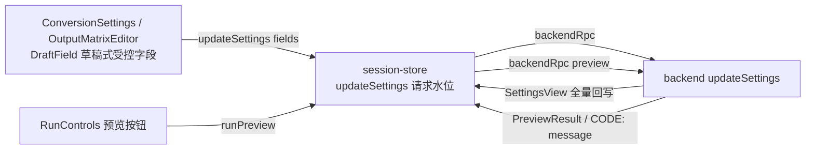

# P4-04b 转换参数表单、输出矩阵编辑器与预览视图（P4-04 前端切片）

- task_id: P4-04b
- status: done
- owner: subagent 实现至代码级（被用户中断）；main agent 审查、修复 lint、复跑全部门禁并补写本记录
- source_commit: 工作树（接续 518be9a / P4-04a 与 [增量审查](REVIEW-P2-P5-2026-09-24.md)）
- input_versions: Node v24.21.0、Yarn 4.18.0、vitest 5.0.1、react-aria-components 1.21.1
- commands: 见文末"验证命令与实测计数"
- cwd: D:\workspace\projs\github\xresloader\xresconv-gui
- os_arch: win32/x64
- evidence_paths: `packages/backend/src/service/{session.ts,rpc-app.ts}`、`packages/contracts/schema/backend-rpc.json`、`packages/contracts/src/generated/backend-rpc.ts`、`packages/contracts/test/schema-freeze.test.ts`、`packages/backend/test/service/rpc-app.test.ts`、`apps/desktop/src/adapters/backend.ts`、`apps/desktop/src/app/{session-store.ts,ConversionSettings.tsx,OutputMatrixEditor.tsx,RunControls.tsx,DraftField.tsx}`、`apps/desktop/src/styles.css`、`apps/desktop/test/{settings-form.test.tsx,output-matrix.test.tsx,run-controls-preview.test.tsx}`（新）、`apps/desktop/test/{session-store.test.ts,conversion-tree.test.tsx,review-async.test.ts}`（夹具补 settings 字段）、本文件
- rollback_point: 切片内新增/修改文件均可逐文件恢复；契约文本变更按 P2-12 冻结规则 2 登记（见文末）

范围说明：本记录是 [04-ui.md](../04-ui.md) P4-04（表单、详情、输出矩阵与预览）的**前端切片**，承接 P4-04a 已完成的 updateSettings/preview RPC；另含一个后端小扩展——会话级 `parallelism`（旧版并发数下拉，main.js:2574-2639）此前无任何 RPC 入口。ItemDetails 只读视图此前已完成，不在本切片。RunControls 仅接入"预览"，开始/取消/重置归 P4-06 保持禁用。

## 设计



- **DraftField（新组件）**：聚焦进入草稿、blur（单行含 Enter）提交；未聚焦直接显示后端 effective 值——reload/换配置/后端拒绝后自动回写，不残留旧表单值（04-ui §状态分层"显示值以后端返回为准"）。多值字段（protoFile/dataSrcDir）用 textarea 一行一个 ↔ string[]（P4-04a 已明确不复活旧版 JSON 串编码，B7）。
- **会话级 parallelism（后端扩展）**：`ConversionSession.setParallelism` 取整并压到 [1,16]（与构造器共用 normalizeParallelism，非有限抛 RangeError），`runConversion` 每次取当前值；`SettingsView` 增加 `parallelism`；updateSettings 白名单分流——`parallelism`（number，非有限 → INVALID_PARAMS）不进 ConversionOverrides，与其余字段同发时两者都生效；未加载/加载中/运行中门禁不变（INVALID_STATE）。旧版运行中可改但只影响下一次 conv_start，新版收紧为运行中拒绝（记录为有意差异）。
- **并发数 >6 本地确认**（main.js:2611-2639）：React Aria Modal/Dialog 本地确认框，确认才提交、取消回退显示值；不走脚本弹框通道（alert_warning 脚本回调属 P4-05 DialogHost）。
- **未知值不静默丢弃**：协议下拉内置仅 protobuf（旧 index.html 原文），配置/覆盖值不在列表时追加"未知协议： X"选项并选中（main.js:1247-1261）；格式下拉八种内置 + 未知值追加"未知格式： X"（main.js:1404-1418）。
- **输出矩阵**：模式判定与 backend `isMatrixMode` 同规则（>1 条或唯一规则带 tags/classes，main.js:1333-1338；前端 3 行本地副本，注释注明单一事实源）。单类型模式编辑全局 type/rename/outputDir；"添加输出规则"以当前有效值生成第二条进入矩阵模式；矩阵模式逐规则编辑 type/rename/outputDir/tags/classes 并整体提交 `updateSettings({matrix})`；删到 ≤1 条无限定自然回单类型模式；"清空矩阵"提交 `matrix: []`（P4-04a：空数组 = 回单类型模式）。
- **预览（UI04）**：store 新增 `preview` 状态（idle/loading/ok/error）与 `runPreview()`；loadConfig/reload 成功重置为 idle（旧预览随配置失效）。面板展示 workDir/xresloaderPath/taskCount/selectionCount、任务 display 列表（有界 200 条 + 总数）与 (outputDir, rename) 冲突分组（P4-04a 后端已分组）；错误保留 `CODE: message`，XRESLOADER_NOT_FOUND 附可行动提示。
- **世代纪律**：updateSettings/runPreview 均带 sessionEpoch + 请求序号防乱序覆盖（与 loadConfig/reload 同模式）； StrictMode 不放大 RPC（backendRpc 变更类方法本就不去重，编辑提交低频）。

## 验收映射（04-ui.md P4-04 行 + 06 册 UI04 逐条）

| 要求 | 证据 | 状态 |
| --- | --- | --- |
| 字段/多值/阻塞可见（P4-04 完成断言"字段/多值/阻塞可见，版本冲突不覆盖"） | ConversionSettings/OutputMatrixEditor 受控实现；settings-form.test.tsx 10 例、output-matrix.test.tsx 6 例 | 通过 |
| UI04 多值目录 | "多值字段往返：protoFile 多行 ↔ string[]（去空行），提交后受控回写" | 通过 |
| UI04 空字段 | "空字段语义：清空 workDir 提交空串（后端回退入口目录）" | 通过 |
| UI04 未知协议/格式 | "未知协议保留为追加选项并选中"、"未知格式不静默丢弃" | 通过 |
| UI04 版本冲突不覆盖 | "世代：加载新配置后旧表单值不残留，preview 重置"；store 请求水位丢弃旧响应 | 通过 |
| UI04 输出冲突预览 | run-controls-preview.test.tsx 6 例：成功展示、冲突分组列出、XRESLOADER_NOT_FOUND 提示、有界 200 条、在途/运行中禁用 | 通过 |
| UI04 不可执行时不能启动 | 开始/取消/重置保持禁用（P4-06）；预览在运行中禁用；"未加载配置时预览禁用" | 通过 |
| parallelism 后端 | rpc-app.test.ts "updateSettings：parallelism 生效并进快照…"（含夹取 100→16、不进 overrides、与 overrides 同发）；错类型/运行中 INVALID_PARAMS/INVALID_STATE | 通过 |
| 契约：params 描述补 parallelism；generate 幂等；冻结守卫同步 | backend-rpc.json；schema-freeze.test.ts 头注登记；generate 两次运行逐字节一致；contracts 23 例 | 通过 |
| 测试只增不减 | 见文末计数（本机口径 479 → 504 passed） | 通过 |

## 契约扩展登记（P2-12 冻结规则 2）

| schema | 变化 | SHA-256 |
| --- | --- | --- |
| backend-rpc.json | params description 补 `updateSettings {fields} incl. parallelism (number, 1..16, session-level, not part of overrides)`（纯文本变更，无枚举/结构变化） | abdcf818ea77a2c4c6f797a73d36bac08caca5b3b38d423213f749735a7c26bb |

protocol_version 保持 1；本表哈希作废 P4-04a 登记的 fa8494df…，以本表为准。schema-freeze.test.ts 头注已同步登记。

## 验证命令与实测计数（main agent 收编复跑，2026-09-25 win32/x64）

```text
corepack yarn lint         # biome 187 files：0 error / 0 warning（收编修复 2 处 noArrayIndexKey——
                           # 位置语义有序列表以 biome-ignore 登记理由；1 处未用 import）
corepack yarn typecheck    # 全 workspace 0 error
corepack yarn test:unit    # 504 passed + 10 条件跳过（8 包全绿）：
                           #   backend 179(+2 跳过)、compat 43、contracts 23、desktop 64、
                           #   guardian 81(+8 跳过)、ipc 10、packaging 63、script-host 41
cd packages/contracts && corepack yarn generate   # 两次运行逐字节一致（幂等）
cd packages/contracts && corepack yarn test       # 23 passed（冻结守卫含）
```

口径说明：审查记录的"489 例通过"取自含真实 JAR 的评审机；本机仓库位于 `D:\workspace\projs\...`，guardian `java-runner.test.ts`（8 例）与 backend `smoke-jar.test.ts`（2 例）硬编码 JAR 绝对路径 `D:/workspace/github/xresloader/...` 不存在而条件跳过（P3-05/P3-07 已声明该跳过条件），本机基线实为 479 passed。本切片净增 25 例（desktop 42→64；backend 178→179 含 parallelism 例；其余各包不变），无跳过失败测试。

## 遗留

- **真实 JAR 条件测试的可移植性**：java-runner/smoke-jar 的 JAR/样本路径为硬编码绝对路径（评审机 `D:/workspace/github/...`），仓库换路径即静默整组跳过。建议独立小修改为环境变量/相对解析并显式报告跳过原因（属既有缺口，非本切片引入）。
- preview 冲突分组不求值 rename 模式（承 P4-04a 遗留，UI 联调期可选增强）；preview 只读当前选择快照。
- 旧版 parallelism 运行中可改（仅影响下一次 conv_start）；新版收紧为运行中 INVALID_STATE——有意差异，如需放宽属独立决策。
- RunControls 的开始/取消/重置保持禁用（P4-06）；脚本弹框 DialogHost、hook 开关、自定义按钮属 P4-05。
- Linux/macOS 复验随 CI 矩阵（本机 win32/x64 实测）。
