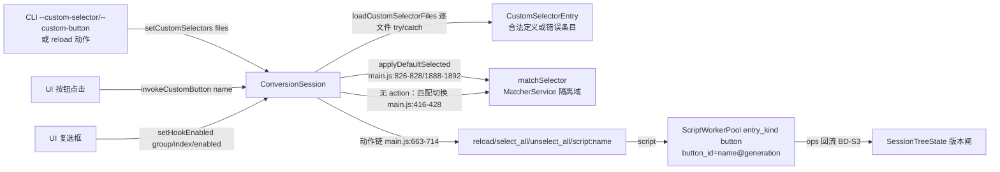

# P4-05a 自定义选择器/按钮与事件 hook 开关（P4-05 后端切片）

- task_id: P4-05a
- status: done
- owner: main agent（前半段代码由被用户中断的 subagent 遗留，本会话审查修正并完成）
- source_commit: 工作树（接续 518be9a / P4-04b）
- input_versions: Node v24.21.0、Yarn 4.18.0、vitest 5.0.1、biome 2.5.14
- commands: 见文末"验证命令与实测计数"
- cwd: D:\workspace\projs\github\xresloader\xresconv-gui
- os_arch: win32/x64
- evidence_paths: `packages/backend/src/service/{custom-selector.ts,session.ts,rpc-app.ts}`、`packages/backend/src/index.ts`、`packages/contracts/{schema/backend-rpc.json,samples/backend-rpc.valid.json,src/generated/backend-rpc.ts,test/schema-freeze.test.ts}`、`packages/backend/test/service/{custom-selector.test.ts,rpc-app-custom.test.ts}`（新）、`packages/backend/test/fixtures/service/{custom-button.xml,custom-selectors.json,custom-selectors-single.json,custom-selectors-errors.json,custom-selectors-bad.json}`（新）、`biome.json`（排除故意非法的 JSON 夹具）、本文件
- rollback_point: 切片内新增/修改文件均可逐文件恢复；契约扩展按 P2-12 冻结规则 2 登记（见文末）

范围说明：本记录是 [04-ui.md](../04-ui.md) P4-05（按钮动作、hook 开关、DialogHost）的**后端切片**——自定义选择器/按钮的加载、匹配、动作链与事件 hook 开关的会话/RPC 实现；DialogHost 属前端渲染，归 P4-05b。SC06 弹框应答的 worker/注册表侧在 P2-06 已完成，本切片不涉及。

## 设计



- **加载与校验（custom-selector.ts）**：顶层数组或单对象展平（setup.js:70-78）；逐文件 try/catch，失败成错误条目入列不中断其余（setup.js:87-105）；字符串项直接作错误条目、无 name、by_schemes+by_sheets+action 全空 → "规则无效"（main.js:752-767）。错误文本只含路径与解析错误，不回显文件内容（PK01 口径）。
- **BD-O19（缺陷修复，新发现）**：旧版非数组 action 走 else 分支 `actions.push(action_type)`（main.js:805-807），引用了 if 分支 for-of 的块级变量，实际压入 `undefined`——字符串形式的 action 在旧版永远等效无动作。新版归一化为单元素数组。既有样本（docs/custom-selector.json）均为数组形式，行为不变。
- **BD-O20（B3 缺陷修复）**：旧版剥离 `script:` 名引号用 `substr(0, len-2)`（main.js:708-710），保留前引号又砍尾两字符，带引号脚本名永远失配；新版 `slice(1,-1)` 正确剥离成对引号，不带引号行为不变。
- **匹配与勾选**：`matchSelector` 走 SelectionRuleService 隔离域（MatcherService 懒创建并 `start()` 握手——**修复点**：MatcherService 要求显式 start 等待就绪，直接 matchBatch 会在 spawnDeadline 后失败；review-matcher.test.ts 已有该纪律的守卫测试）；匹配结果翻译为 `select_node` ops 批量回流树状态，**盖当前版本过版本闸**（会话内生 ops 生成到应用间无交错）。旧版动作名 `unselect_all` 映射到树 ops 词汇 `select_none`。匹配切换语义：匹配集中有未选中 → 全选，否则全取消（main.js:416-428）。default_selected 在 setCustomSelectors 与每次 loadConfig 成功后各重放一次（force=true，main.js:826-828、1888-1892）。
- **按钮脚本**：worker `entry_kind: "button"`；`button_id = "${name}@${generation}"`——reload 动作重读文件使 generation 递增，旧 button_id 的 data（worker 进程内按 button_id 存活）自动失效，对齐旧版清缓存重建按钮（main.js:670-676）。context：work_dir/configure_file/xresloader_path 取当前有效值、global_options 为**数组形态**（P0-08 §2.3 分歧 3：按钮是数组，before/after 才是映射）、tree 快照；无 run_seq。BD-S3：所有 outcome（resolved/rejected/error）都应用 ops。脚本未找到返回 `script X not found.`（旧版原文）。
- **动作链**：按序执行，失败记 error（module "CUSTOM SELECTOR"）并中止后续（main.js:816-818）；未知/非字符串动作 no-op。链失败是业务结果 `{ok:false, error}`，不是 RPC 错误。
- **hook 开关（F09）**：`setHookEnabled(group, index, enabled)`——group ∈ before/after/append_log；仅命名且 mutable 的 hook 可切换（匿名无 toggle / immutable / 越界 → INVALID_PARAMS）；**无运行状态门禁**——旧版复选框全程可改，hook.enabled 在执行链构建时读取（运行中切换对当前 run 后续链可见，与旧版一致）。
- **RPC 面**：三方法进 backend-rpc 契约枚举；`BackendSnapshot.customSelectors`（未设置为 null）；`BackendRpcAppOptions.matcherFactory` 透传（测试可注入 fake）。`invokeCustomButton` 未知名经快照视图预校验 → INVALID_PARAMS；会话/matcher 结构性失败原样上抛由 bin 兜底 INTERNAL，不误报为参数错误。
- **biome.json**：排除 `custom-selectors-bad.json`（故意非法 JSON 的加载失败夹具，biome 无法 parse；文件名单独登记排除，其余夹具照常检查）。

## 验收映射（04-ui.md P4-05 行 + 06 册 UI05 后端部分）

| 要求 | 证据 | 状态 |
| --- | --- | --- |
| P4-05"按钮动作、hook 开关"（DialogHost 归 P4-05b） | session.ts/rpc-app.ts 实现 + rpc-app-custom.test.ts 12 例 | 通过 |
| UI05 选择器默认选择 | "default_selected：先设选择器再 loadConfig 重放勾选；reload 再重放"、"loadConfig 之后再 setCustomSelectors 立即勾选" | 通过 |
| UI05 按钮链顺序正确 | "按钮脚本 data 跨点击持久；reload 动作使 data 重置"（COUNTER=1,2→1）、"动作链失败记 error 并中止后续"（counter 未执行）、"内建动作顺序执行；未知动作 no-op" | 通过 |
| UI05 hook checked/mutable | "命名且可变的 hook 切换生效并进快照（含 append_log 组）"；immutable/匿名/越界 INVALID_PARAMS | 通过 |
| 匹配切换语义（main.js:416-428） | "无 action 选择器点击 = 匹配切换"（选中 xa ↔ 取消） | 通过 |
| BD-S3 ops 应用 | "按钮脚本（resolved）的 ops 应用回会话树"（item 改名进快照） | 通过 |
| 错误条目与日志 | "未设置时快照为 null；设置后含视图与错误条目"（3 条 CUSTOM SELECTOR error） | 通过 |
| 契约：枚举 +3 方法、样本、generate 幂等、冻结守卫登记 | backend-rpc.json / backend-rpc.valid.json / schema-freeze.test.ts 头注；generate 两次逐字节一致；contracts 23 例 | 通过 |
| 测试只增不减 | 见文末计数（本机口径 504 → 531 passed） | 通过 |

## 契约扩展登记（P2-12 冻结规则 2）

| schema | 变化 | SHA-256 |
| --- | --- | --- |
| backend-rpc.json | method 枚举追加 `setHookEnabled`/`setCustomSelectors`/`invokeCustomButton`；params description 补三方法参数形状；samples 补三例 | f82e9d3240d53d588a18eec249397326de05f64b9f00a787a5a8e1d477ce0e3a |

protocol_version 保持 1；本表哈希作废 P4-04b 登记的 abdcf818…，以本表为准。schema-freeze.test.ts 头注已同步登记。

## 验证命令与实测计数（2026-09-25 win32/x64）

```text
corepack yarn lint         # biome 193 files：0 error / 0 warning；markdownlint 过
corepack yarn typecheck    # 全 workspace 0 error
corepack yarn test:unit    # 531 passed + 10 条件跳过（8 包全绿）：
                           #   backend 206(+2 跳过)、compat 43、contracts 23、desktop 64、
                           #   guardian 81(+8 跳过)、ipc 10、packaging 63、script-host 41
cd packages/contracts && corepack yarn generate   # 两次运行逐字节一致（幂等）
cd packages/contracts && corepack yarn test       # 23 passed（冻结守卫含）
```

口径说明：10 例条件跳过同 P4-04b 记录（真实 JAR 硬编码路径缺口，见该记录"遗留"）。本切片净增 27 例（backend 179→206：custom-selector.test.ts 15 例 + rpc-app-custom.test.ts 12 例；其余各包不变）。RED-GREEN：集成例先以 UNKNOWN_METHOD 全红（12 例），实现后转绿；会话内生 ops 缺版本戳/unselect_all 词汇两处实现缺陷由红测驱动修复。

## 遗留

- **P4-05b（前端）**：HookControls（hook 复选框 → setHookEnabled）、CustomActionBar（选择器/按钮渲染与点击）、DialogHost（弹框应答，SC06 UI 侧）、CLI custom-selector/custom-button 参数接线。
- 旧版 reload 动作附带 log4js 重配置属渲染侧偶然耦合，不复活（log4js 配置由会话级 sink 持有，见 session.ts runButtonAction 注）。
- 真实 JAR 条件测试路径硬编码缺口承 P4-04b 遗留（非本切片引入）。
- Linux/macOS 复验随 CI 矩阵（本机 win32/x64 实测）。
