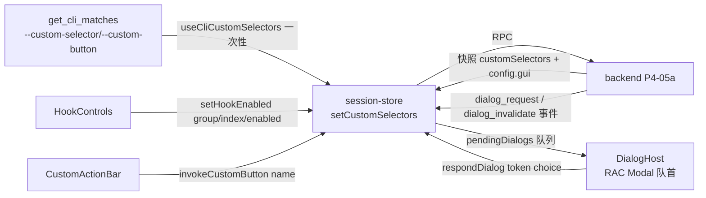

# P4-05b 事件开关、自定义按钮与弹框宿主（P4-05 前端切片）

- task_id: P4-05b
- status: done
- owner: main agent
- source_commit: 工作树（接续 P4-05a）
- input_versions: Node v24.21.0、Yarn 4.18.0、vitest 5.0.1、react-aria-components 1.21.1
- commands: 见文末"验证命令与实测计数"
- cwd: D:\workspace\projs\github\xresloader\xresconv-gui
- os_arch: win32/x64
- evidence_paths: `apps/desktop/src/adapters/backend.ts`、`apps/desktop/src/app/{session-store.ts,HookControls.tsx,CustomActionBar.tsx,DialogHost.tsx,use-cli-custom-selectors.ts,AppShell.tsx}`、`apps/desktop/src/styles.css`、`apps/desktop/test/{hook-controls.test.tsx,custom-action-bar.test.tsx,dialog-host.test.tsx,cli-custom-selectors.test.tsx}`（新）、`apps/desktop/test/{session-store.test.ts,conversion-tree.test.tsx,review-async.test.ts,run-controls-preview.test.tsx,output-matrix.test.tsx,settings-form.test.tsx}`（夹具补 customSelectors 字段）、本文件
- rollback_point: 切片内新增/修改文件均可逐文件恢复；无契约变化（P4-05a 已扩展）

范围说明：本记录是 [04-ui.md](../04-ui.md) P4-05 的**前端切片**，承接 P4-05a 的 setHookEnabled/setCustomSelectors/invokeCustomButton RPC 与快照 customSelectors 字段；兑现 P4-01 骨架（HookControls/CustomActionBar/DialogHost 占位组件）与 P2-06 遗留的"UI 侧禁用已应答按钮"。

## 设计



- **HookControls（F09，main.js:1122-1188）**：快照 config.gui 三组 hook 经 adapter `guiHooksOf` 防御性窄化；**仅命名 hook 渲染复选框**（匿名无 toggle 不渲染，与旧版一致）；`mutable=false` 禁用；切换经 setHookEnabled RPC，成功就地改写快照 config.gui（不整树重同步），失败写 lastError 且快照不动。组标签固定三组（before/after/append_log）。
- **CustomActionBar（F04/F05）**：渲染快照 customSelectors 的命名条目；**错误条目不渲染按钮**（旧版仅记 CUSTOM SELECTOR 日志，main.js:753-767；P4-05a 后端加载时已记）。样式映射（main.js:718-792）：旧版 bootstrap 16 值词表白名单（大小写不敏感）映射本地语义类 `custom-btn--*`（outline 描边/实色填充两族，tokens 近似色）；缺省回退——有 action → outline-dark、无 action → outline-secondary；**B6 白名单恒真缺陷不复活**：未知值不原样进 class。按钮本地在途禁用（连点不并发放大）；点击后 refreshSnapshot 重同步（按钮 ops 在 backend 改树）；`{ok:false}` 写 lastError。
- **DialogHost（SC06/UI05）**：store 新增 `pendingDialogs` 队列——dialog_request 进队（同 token 去重）、dialog_invalidate 出队（不应答，过期回调不执行）。同一时刻只展示队首一个 RAC Modal：yes → choice "yes"、no → "no"、ok（alert_error，旧版无回调）→ null、ESC/遮罩 → null（on_close 语义，BD-06 修复不复活：ESC 必须最终化否则脚本挂起）。应答在途 `answering=true` 禁用按钮（P2-06 遗留项）；respondDialog 结算后本地出队（迟到/失效应答后端按 SC06 丢弃）。
- **CLI 接线（F11）**：`useCliCustomSelectors`（AppShell 挂载）读 get_cli_matches 的 custom-selector/custom-button（tauri multiple 参数，string|string[] 防御性归一），非空一次性 setCustomSelectors（后端允许先于 loadConfig；此后每次加载/重放 default_selected）。模块级 wired 闸防 StrictMode 双挂载重复调用——**wired 在参数解析成功且文件非空时才置位**，首轮挂载被 StrictMode 回收（cancelled）时第二轮仍能接线（该缺陷由本切片测试暴露并修复）。
- **adapter**：BackendSnapshot 补 `customSelectors` 必填字段（6 处既有测试夹具同步补 null）；新增 CustomSelectorViewLike/HookLike/HookToggleLike/GuiHooksLike/HookGroup/DialogPayloadLike 与 HOOK_GROUPS 对照表。

## 验收映射（04-ui.md P4-05 行 + 06 册 UI05/SC06 前端部分）

| 要求 | 证据 | 状态 |
| --- | --- | --- |
| UI05 hook checked/mutable"顺序与可修改性正确" | hook-controls.test.tsx 4 例：按组渲染/匿名不渲染/mutable=false 禁用/切换 RPC 参数与就地回写/失败不改写 | 通过 |
| UI05 按钮链 | custom-action-bar.test.tsx 3 例：渲染与错误条目跳过、样式白名单与回退、点击 RPC+重同步、ok:false 进 lastError（链顺序/中止语义后端侧见 P4-05a） | 通过 |
| UI05 脚本弹框（非 toast） | dialog-host.test.tsx 5 例：dialog_request 弹出、yes/no 参数、ESC/ok→null、invalidate 移队不应答、逐队展示 | 通过 |
| SC06 过期回调不执行 | "dialog_invalidate 移出队列且不发 respondDialog"；answering 禁用已应答按钮 | 通过 |
| P4-05"不把回调简化成普通 toast" | DialogHost 为 RAC Modal 队列，逐框应答后才出队 | 通过 |
| F11 CLI 参数接线 | cli-custom-selectors.test.tsx 4 例：值归一/一次性接线（StrictMode 不重复）/无文件不发 RPC/失败可见 | 通过 |
| 测试只增不减 | 见文末计数（本机口径 531 → 547 passed） | 通过 |

## 验证命令与实测计数（2026-09-25 win32/x64）

```text
corepack yarn lint         # biome 198 files：0 error / 0 warning；markdownlint 过
corepack yarn typecheck    # 全 workspace 0 error
corepack yarn test:unit    # 547 passed + 10 条件跳过（8 包全绿）：
                           #   backend 206(+2 跳过)、compat 43、contracts 23、desktop 80、
                           #   guardian 81(+8 跳过)、ipc 10、packaging 63、script-host 41
```

口径说明：本切片净增 16 例（desktop 64→80：hook-controls 4 + custom-action-bar 3 + dialog-host 5 + cli-custom-selectors 4）；既有 6 处测试夹具仅补 customSelectors 字段，无删改。App.test.tsx 的 StrictMode 桥接计数断言（get_cli_matches 恰 1 次）在新接线下保持成立（adapter 在途去重兜底）。

## 遗留

- DialogHost 逐队展示（一次一个）与旧版多框并存的表现差异：逐框应答保留各回调语义且避免焦点竞争；如需并存属独立决策。
- 按钮脚本弹框（alert_warning 在按钮脚本内）同样经 pendingDialogs 队列，无按钮专属路径（与事件弹框同一通道，旧版亦然）。
- 真实桌面的弹框实际打开/焦点验证属 P4-08 三引擎/读屏范围；E2E（tauri-driver）在 P4-09。
- 真实 JAR 条件测试路径硬编码缺口承 P4-04b 遗留（非本切片引入）。
- Linux/macOS 复验随 CI 矩阵（本机 win32/x64 实测）。
