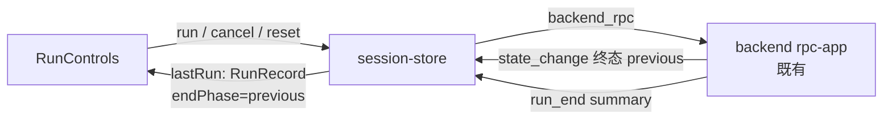

# P4-06 运行控制、阶段与取消/重置（RunControls 前端切片）

- task_id: P4-06
- status: done
- owner: main agent
- source_commit: 工作树（接续 P4-05b）
- input_versions: Node v24.21.0、Yarn 4.18.0、vitest 5.0.1、react-aria-components 1.21.1
- commands: 见文末"验证命令与实测计数"
- cwd: D:\workspace\projs\github\xresloader\xresconv-gui
- os_arch: win32/x64
- evidence_paths: `apps/desktop/src/adapters/backend.ts`（RunSummaryLike/状态集）、`apps/desktop/src/app/session-store.ts`（startRun/cancelRun/resetSession + run_end/终态事件消费）、`apps/desktop/src/app/RunControls.tsx`（接线与 UI06 文案）、`apps/desktop/src/styles.css`、`apps/desktop/test/run-controls-run.test.tsx`（新）、本文件
- rollback_point: 切片内新增/修改文件均可逐文件恢复；无契约变化（run/cancel/reset RPC 与 run_end 事件为既有冻结形状）

范围说明：本记录是 [04-ui.md](../04-ui.md) P4-06 的**前端切片**。backend `run`/`cancel`/`reset` RPC 与 EX03 语义（终态一次、取消可完成、先取消等清理再重武装）已在 P3-08/P2-09 落地（`rpc-app.ts:356-363`、`session.ts:372-448`），本切片只做 UI 接线、门禁与结果表达。旧版对照：旧 GUI"重置"按钮是窗口整体 reload（`src/main.js:54-57`、`src/index.html:172`），且**无取消按钮**——业务级 reset/cancel 是新架构已登记能力（EX03/BD-O6），非旧行为复刻。

## 设计



- **门禁由后端状态机决定**：开始转换 = 已加载 && (ready ∨ 终态)（backend `rpcRun` 允许自终态再启动，`rpc-app.ts:531-555`）；取消 = 活动运行三态（before_hooks/converting/after_hooks，与 `session.cancel()` 生效范围一致）；重置 = 活动运行 ∨ 终态（ready 下 reset 为空转故禁用）。加载中全部禁用。取消在途**不重复禁用**（EX03：重复 cancel 幂等）。
- **store 新增**：`runStarting`（run RPC 在途，双击不并发）/`cancelRequested`（已请求取消，等清理）/`resetting`/`lastRun: RunRecord`/`pendingEndPhase`。
- **RunRecord 合成**：终态 `state_change` 的 `previous` 记为 `pendingEndPhase`（事件按序先于 `run_end`，backend 侧 emit 顺序由 `runConversion` finally 保证）；`run_end` 到达时消费为 `endPhase` 并防御性窄化（畸形 summary 忽略不崩溃）。`startRun` 成功即清上次记录与取消标记；`markGuardianDead` 统一复位在途标记（epoch 失配时 finally 不执行，否则按钮永久禁用——本切片测试暴露并修复）。
- **cancelRequested 清除三路径**：终态 state_change、run_end、新 run 启动（任一先到即清，run_end 缺失也不卡"等待清理"显示）。
- **UI06 文案**（`describeRun`，endPhase 缺失退化为通用文案、不猜测阶段）：
  - before 失败 → "前置事件执行失败，未启动转换"（Java 未启动，无输出副作用）
  - converting 且 taskCount=0 → "转换计划构建失败，未启动转换"（BD-O8 存在性检查提前）
  - converting 且 taskCount>0 → "转换批次存在失败（已提交 N 个任务，失败计数 M）" + "stdin 批次协议无逐条确认，条目级成败明细未知，详见日志"（主计划 §7.2：不伪造条目级明细；failedCount 是混合计数）
  - after 失败 → "转换已完成并生成输出，但 on_after_convert 事件失败"（副作用如实呈现，不伪装成功）
  - 取消 → 按来源阶段区分（before：未启动转换；converting：任务中止、已生成的输出保留；after：输出已生成）
  - 成功 → 提交数 + 耗时；不宣称逐条校验

## 验收映射（04-ui.md P4-06 行 + 06 册 UI06 前端部分）

| 要求 | 证据 | 状态 |
| --- | --- | --- |
| UI06 "before 失败、Java 批次失败、after 失败、取消、未知条目结果"文案 | run-controls-run.test.tsx 文案矩阵 7 例（含 endPhase 缺失退化） | 通过 |
| UI06 "文案区分实际阶段和已发生副作用，不假成功" | after 失败例断言"转换已完成并生成输出"；批次失败例断言条目级未知说明 | 通过 |
| EX03 前端侧：取消可完成、终态一次 | cancelRequested 三清除路径 3 例（终态 state_change / run_end / 新 run） | 通过 |
| 按钮可用性由领域状态决定（04-ui §状态分层） | 门禁 4 例（ready/活动三态/终态/loading） | 通过 |
| run 成功后重同步快照（状态权威在 backend） | startRun 流程 2 例（重同步 before_hooks + 双击守卫） | 通过 |
| 故障可见（04-ui：backend 失联 UI 仍可用） | run 失败进 lastError；guardian 死亡复位在途标记（按钮不永久禁用） | 通过 |
| 测试只增不减 | desktop 80→102（净增 22）；既有用例无删改 | 通过 |

## 验证命令与实测计数（2026-09-25 win32/x64）

```text
corepack yarn lint         # biome 202 files：0 error / 0 warning
corepack yarn typecheck    # 全 workspace 0 error
corepack yarn test:unit    # 575 passed + 10 条件跳过（8 包全绿）：
                           #   backend 206(+2 跳过)、compat 43、contracts 23、desktop 102、
                           #   guardian 81(+8 跳过)、ipc 10、packaging 69、script-host 41
```

口径说明：本切片净增 22 例（run-controls-run.test.tsx）；packaging 69 为 4e6ebee 提交后的既有基数（P4-05b 记录时为 63），非本切片变化。基线 553 → 575。

## 遗留

- 运行中的实时进度（批次提交数、日志流）依赖 log 事件缓冲，属 P4-07 LogPanel；本切片运行期仅显示阶段状态。
- reset 触发的取消同样产生 run_end(cancelled) 记录：摘要区如实显示"已取消"，不额外区分"用户取消/重置引发"（后端无此信号；如需区分属 backend 契约扩展，另立任务）。
- 真实 WebView 三引擎/读屏/键盘走查与真实桌面 E2E 属 P4-08/P4-09；Linux/macOS 复验随 CI。
- 窗口关闭时的停止策略（04-ui 交互路径 6）在壳层已有 guardian 清理（P2-09），UI 侧关闭确认交互未实现，归 P4-08/P4-09 视 E2E 结果决定。
