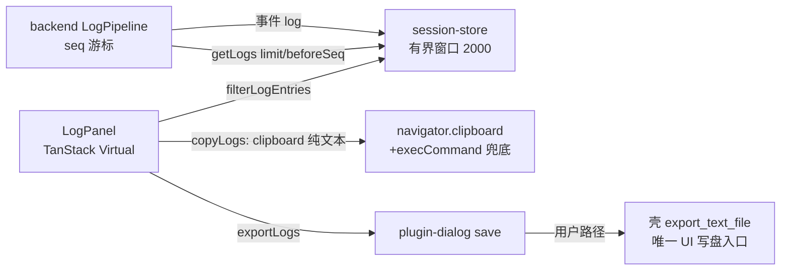

# P4-07 日志面板：分页、筛选、复制/导出与安全富文本

- task_id: P4-07
- status: done
- owner: main agent
- source_commit: 工作树（接续 P4-06）
- input_versions: Node v24.21.0、Yarn 4.18.0、vitest 5.0.1、@tanstack/react-virtual 3.14.13（新依赖）
- commands: 见文末"验证命令与实测计数"
- cwd: D:\workspace\projs\github\xresloader\xresconv-gui
- os_arch: win32/x64
- evidence_paths: `packages/backend/src/service/log-pipeline.ts`（seq/getRecent/getRecentBefore）、`packages/backend/src/service/rpc-app.ts`（getLogs）、`packages/contracts/schema/backend-rpc.json` + 重新生成类型、`src-tauri/src/lib.rs`（export_text_file）、`apps/desktop/src/app/{ansi.ts,clipboard.ts,LogPanel.tsx,session-store.ts}`、`apps/desktop/src/adapters/{backend.ts,tauri.ts}`、`apps/desktop/src/styles.css`、`apps/desktop/test/log-panel.test.tsx`（新）、本文件
- rollback_point: 契约扩展（method 枚举 +getLogs、params 描述）与实现均可逐文件恢复；@tanstack/react-virtual 依赖可从 apps/desktop/package.json+yarn.lock 移除

范围说明：04-ui.md P4-07 行（EX04/UI07 前端部分 + backend 日志游标底座）。EX04 的 log4js/UTF-8/背压部分已在 P2-08/P3-06 覆盖；本切片补齐 UI 日志窗口的全部消费路径。

## 设计



- **契约扩展（冻结规则 2）**：backend-rpc method 枚举追加 `getLogs {limit: 1..1000, beforeSeq?: 正整数}`；schema/生成类型/冻结守卫注释三处同步（P2-12 规则）。`LogEntry` 追加可选 `seq`（仅经 commit 落队的条目携带；直发溢出诊断不占 seq）。
- **backend**：`getRecent(limit)` 最新窗口、`getRecentBefore(beforeSeq, limit)` 向后分页（滚动加载历史）；rpc `getLogs` 校验参数（非法 → INVALID_PARAMS），返回 `{entries, droppedCount, capacity}`；无状态门禁（未加载配置可查，日志面独立于配置会话）。事件面与 getLogs 按 seq 逐条一致（rpc-app 测试断言）。
- **store**：`logs`（有界窗口 2000，事件追加按 seq 幂等去重、溢出淘汰最老并计 `localDroppedCount`）+ `logFilter`（UI 状态）；`initLogs`（幂等闸，失败也置 initialized 防渲染期重试风暴）、`loadOlderLogs`（beforeSeq 前插，不因加载历史主动驱逐）、`copyLogs`/`exportLogs`（作用于筛选后集合）；`markGuardianDead` 复位 `initialized/maxSeq`（新一代 backend seq 从 1 重开不被旧 maxSeq 误杀）。
- **LogPanel**：TanStack Virtual 虚拟列表（estimateSize 固定 22px，`initialRect` 种子 + 测试内补 offsetHeight——jsdom 无布局时 virtual-core outerSize=0 会算出空范围）；级别（原生 select，可访问）/文本筛选；追尾滚动（钉住底部时自动滚，上滚不打扰）；复制（`navigator.clipboard` 优先，隐藏 textarea+execCommand 兜底）；导出（plugin-dialog save → 壳 `export_text_file`，UTF-8，取消不发写）；丢弃计数可见（localDropped/backendDropped 均展示）。
- **ANSI 安全富文本（BD-04/R12/UI07）**：`parseAnsi` 对齐旧 shell_color_to_html（main.js:433-500）可见语义——SGR flag 0 全重置、1/4 加粗/下划线、30-37/40-47 固定颜色词表（CSS 命名颜色，非日志内容）、嵌套 SGR 合并、`\t`→两空格、`\r\n` 归一；渲染为 React 文本节点（无 innerHTML/dangerouslySetInnerHTML 通道），修复旧版 `.replace("<","&lt;")` 只转义首个字符的缺陷。
- **壳层**：`export_text_file` 最小命令（spawn_blocking + std::fs::write，空路径拒绝；lib.rs 单测含中文/空格路径），UI 侧可写磁盘的唯一入口；日志内容不经任何执行路径。

## 验收映射（04-ui.md P4-07 行 + 06 册 UI07 前端部分）

| 要求 | 证据 | 状态 |
| --- | --- | --- |
| UI07 日志筛选/分页/复制 | log-panel 10 例：级别/文本筛选（不改缓冲）、beforeSeq 前插、clipboard 纯文本（筛选后行）、导出取消不写 | 通过 |
| UI07 允许富文本（ANSI 颜色保留） | SGR → 固定色表 span（darkred/bold/underline）断言 | 通过 |
| UI07/R12 无 WebView 执行 | `<script>`/``/`javascript:` 载荷按字面文本渲染，无 script/img/a 元素 | 通过 |
| 无业务日志静默丢失 | 窗口淘汰计数 + backend droppedCount 可见；"完整日志见磁盘"；溢出诊断不进队列（既有 BD-O10 语义保持） | 通过 |
| 滚动加载历史（04-ui LogPanel 行"日志游标"） | getRecentBefore 单测 + 加载更早前插断言（backend 窗口尽头禁用按钮） | 通过 |
| 事件/getLogs 幂等（UI02 缺口重同步精神） | seq 去重 + guardian 死亡复位重拉（seq 重开不误杀） | 通过 |
| 测试只增不减 | backend 206→210、desktop 102→112；既有用例无删改 | 通过 |

## 验证命令与实测计数（2026-09-25 win32/x64）

```text
corepack yarn lint         # biome 205 files：0 error / 0 warning
corepack yarn typecheck    # 全 workspace 0 error
corepack yarn test:unit    # 589 passed + 10 条件跳过（8 包全绿）：
                           #   backend 210(+2 跳过)、compat 43、contracts 23、desktop 112、
                           #   guardian 81(+8 跳过)、ipc 10、packaging 69、script-host 41
corepack yarn check:shell / test:shell   # fmt/clippy 通过；9 例通过（+1 export_text_file）
```

口径说明：本切片净增 14 例（backend 4 + desktop 10）；依赖新增 @tanstack/react-virtual@3.14.13（apps/desktop，主计划 §3.1 选型）。

## 遗留

- 真实 WebView 的剪贴板可用性与导出对话框真实打开验证属 P4-08/P4-09 桌面 E2E；Linux WebKitGTK 的 navigator.clipboard 如实测不可用，兜底 execCommand 路径需在 P4-08 复核。
- 虚拟行高固定 22px：超长行换行时滚动定位有偏差（estimateSize 语义），P4-08 性能/布局走查时评估是否切换 measureElement 动态测量。
- 日志文本筛选为子串匹配（大小写不敏感），无正则/全字模式（旧版无此功能，新增能力保持最小）。
- getLogs 初始拉取失败时置 initialized 防重试风暴，需 guardian 死亡/重挂载触发重拉；连接恢复自动重拉未做（P4-02 的重同步策略在快照面，日志面随 connection 变化重挂 initLogs 已覆盖 degraded→ok 转换）。
