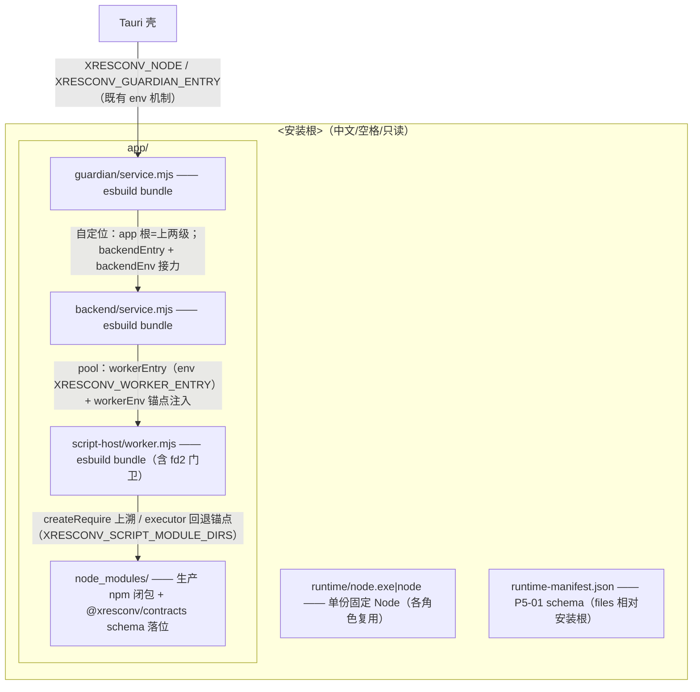

# P5-02 单份 Node 获取校验与 production 组装（PK07 本机部分）

- task_id: P5-02
- status: done
- owner: main agent
- source_commit: 工作树（接续 P4-05b）
- input_versions: Node v24.21.0（ABI 137）、Yarn 4.18.0、esbuild 0.28.2、vitest 5.0.1、typescript 7.0.2
- commands: 见文末"验证命令与退出码"
- cwd: D:\workspace\projs\github\xresloader\xresconv-gui
- os_arch: win32/x64
- evidence_paths: `packages/packaging/src/assemble.ts`（组装器）、`packages/packaging/test/assemble.test.ts`（结构层 5 例）、`packages/packaging/test/release-chain.test.ts`（全链冒烟 1 例）、`packages/guardian/bin/service.mjs`（发行自定位）、`packages/backend/bin/service.mjs`（workerEnv 注入）、`packages/packaging/src/{errors,index}.ts`、`packages/packaging/package.json`、`yarn.lock`、本文件
- rollback_point: 全部为切片内新增/小改；git 工作树可逐文件恢复

## 目标与范围

计划 05-book P5-02 行："单份 Node 获取校验、backend/guardian/worker JS、
production modules 与必要适配组装"，验收 PK07（"各角色复用单份固定
Node，JS/模块/必要适配定位正确，动态 require 可用，无网络补包；
不复制开发机 node_modules 全集，不重复嵌入 Node"）。本切片完成
**本机可验证部分**：

- `assembleRuntimeLayout`（packages/packaging）：三角色 JS esbuild 打包、
  生产 npm 闭包裁剪复制、contracts schema 落位、单份 Node 校验落位、
  runtime-manifest.json 生成（P5-01 schema + PK01 lint）。
- 发行布局接线：guardian/backend bin 按布局约定自定位并接力锚点注入。
- PK07 本机机制证据：中文/空格安装路径、整树只读、最小环境（无 npm_*）、
  单份 Node 跑全角色、脚本动态 require npm/原生包。

不在本切片（P5-03+/CI/P5-10）：nodejs.org 下载与 SHASUMS256.txt 获取
（expectedSha256 校验入口已就绪）、壳侧 exe 相对布局探测（壳已有
XRESCONV_NODE/XRESCONV_GUARDIAN_ENTRY env 机制）、真机移除全局
Node/开发工具（P5-10）、签名/SBOM/完整 license 清单（P5-07）。

## 关键调研结论（实施前/中实测，非猜测）

1. **拓扑与注入点**（实读源码）：壳 → guardian（env
   `XRESCONV_NODE`/`XRESCONV_GUARDIAN_ENTRY`，src-tauri/src/guardian.rs
   :210-216）→ `child_process.fork` backend（`execPath: process.execPath`、
   `env: {...process.env, ...backendEnv}`，backend-supervisor.ts:306-310）
   → ScriptWorkerPool spawn worker（`workerEntry ?? env.XRESCONV_WORKER_ENTRY
   ?? 默认`，script-worker.ts:191；`workerEnv` 注入点 P2-10 已建）。缺口仅
   两个 bin 入口不消费这些注入点——接线范围因此确定为两处小改。
2. **set_name 沙箱无 `require`**（load-config.ts:8 / executor.ts:328，
   main.js:1748 遗产）：首轮冒烟误用 set_name 验证 require，实测
   `ReferenceError: require is not defined`（失败按旧版语义静默记
   "GUI EVENT" 继续加载，表象为"加载成功但未改名"）。改走自定义按钮
   （`buttonBase`，executor.ts:324 含 `require: makeRequire(invoke)`）。
   按钮模型（P4-05a）：选择器 JSON 的 `action: ["script:<name>"]` 引用
   配置内 `<script name>`；视图在 setCustomSelectors 后才知名。
3. **xml-naming 教训**：fast-xml-parser 5.11.1 的依赖 xml-naming@0.3.0
   的 exports 仅声明 `import` 条件；P2-10 staging 沿用的
   `createRequire.resolve`（CJS 条件）对其报
   `ERR_PACKAGE_PATH_NOT_EXPORTED`，被"解析失败静默跳过"误判为平台
   optional 缺失 → 闭包漏包，backend 发行 bundle 起即崩（release-chain
   冒烟 RED 阶段捕获）。修复：闭包定位改为 node_modules 目录逐级探测
   （与 CJS/ESM exports 条件无关，闭包只需包目录）；**required 依赖缺失
   即 ASSEMBLY_FAILED，仅 optionalDependencies 可跳过**。
4. **contracts schema 落位机制**（P2-10 已实测，本切片沿用）：
   validators 用 `createRequire(import.meta.url).resolve(...)` 动态定位
   schema/*.json；bundle 落位 `app/<role>/` 后上溯命中
   `app/node_modules/@xresconv/contracts/schema`。

## 设计

### 发行布局（与 bin 自定位约定一致）



### 锚点接力链（无 XRESCONV_* 环境变量亦可工作）

1. guardian bundle 位于 `<root>/app/guardian/service.mjs` → app 根 = 上两级；
   `backend/service.mjs` 存在即采用（`XRESCONV_BACKEND_ENTRY` 显式优先）；
   `script-host/worker.mjs` 与 `node_modules/` 俱在则经 `backendEnv` 接力
   `XRESCONV_SCRIPT_MODULE_DIRS=<root>/app` 与 `XRESCONV_WORKER_ENTRY`。
   开发布局（`packages/guardian/bin/service.mjs`）不命中探测，默认解析不变。
2. backend 启动时将 `XRESCONV_SCRIPT_MODULE_DIRS` 显式注入 pool
   `workerEnv`（语义明确，不依赖逐层环境继承；workerEntry 由 pool 自身读
   `XRESCONV_WORKER_ENTRY`）。
3. worker 内 executor 回退锚点（P2-10 兼容层）使安装树外配置的裸包名
   `require("adm-zip")` 解析到发行闭包；BD-S1 锚定优先语义不变。

### 组装器（assembleRuntimeLayout）

- **单份 Node 获取校验**：`--version` 实测精确版本（major 必须等于
  target.nodeVersion）、可选 expectedSha256 强校验（CI 传 SHASUMS256.txt
  值）、ABI 实测（`-p process.versions.modules`）；不符即
  NODE_ACQUISITION_FAILED。落位 `runtime/node.exe|node`，全布局仅此一份。
- **esbuild 三角色**：entry 为各包 bin（worker 含 fd2 控制台门卫），
  `bundle+esm+node24`；@xresconv/* 内联，npm 生产依赖 external
  （种子 + `种子/*` 子路径）。
- **种子推导**：各 workspace 包 dependencies 滤 `workspace:*` ∪ 用户脚本
  供给包（SC04：adm-zip/compressing/koffi）——不是开发机 node_modules
  全集（实测闭包 58 包，上限断言 <100 防回归）。
- **moduleTreeHash**：`app/node_modules/` 子树按正斜杠路径 codepoint 排序
  后逐行 `path  sha256` 的 SHA-256——同输入跨组装确定（两变体共享模块树
  哈希的机制基础，05-book Windows 规则 4；实测两次组装 manifest 全等）。
- **files[]**：path（正斜杠相对安装根）/size/sha256/origin/license
  （origin：`node-dist` / `build:<workspace>` / `npm:<name>@<version>`；license
  取 package.json 声明值，归一化 string/{type}/旧式数组，缺失 UNSPECIFIED；
  实测全树 1323 文件无 UNSPECIFIED）。
- manifest 过 `validateRuntimeManifest`（含 PK01 lint）后落盘。

## PK07 验收映射（本机部分）

| PK07 要点 | 证据 | 状态 |
| --- | --- | --- |
| 安装目录中文/空格/只读 | release-chain：`安装 目录/` staging + 整树 chmod 只读（P2-10 同手法） | 通过 |
| 各角色复用单份固定 Node | 布局仅 `runtime/node.exe` 一份（assemble 测试 a 断言）；fork/spawn 均 `process.execPath`（backend-supervisor.ts:306） | 通过 |
| JS/模块/必要适配定位正确 | 全链冒烟：零 XRESCONV_* env，health ready → loadConfig → 按钮脚本执行 | 通过 |
| 动态 require 可用 | 按钮脚本 `require("adm-zip")` zip round-trip（"离线"）+ `require("koffi")` 原生加载，日志 `ZIP=离线\|KOFFI=function` | 通过 |
| 无网络补包 | 最小环境（PATH 仅 System32、无 npm_* 与 NODE_PATH）+ 闭包预置；机制级证据（同 P2-10 边界） | 通过 |
| 不复制开发机 node_modules 全集 | 种子推导 + 闭包裁剪；无 vitest/typescript；包数 <100（实测 58） | 通过 |
| 不重复嵌入 Node | files[] 中 `node-dist:` origin 恰一条 | 通过 |
| 移除全局 Node/npm/开发工具（真机） | 安装器产出物 + 真机验收 | 遗留 P5-03/P5-10 |

## 与 P2-10 遗留的偏差说明

P2-10 遗留写"backend 从 manifest 读 anchor 目录并注入 pool workerEnv"。
落地时修正：**锚点是发行布局约定（`<root>/app`），不经 manifest 传输**——
P5-01 schema 无 anchor 字段，且 manifest 自身的定位同样依赖布局约定。
机制（backend 注入 pool workerEnv）照原意落地，传输介质改为
"guardian 自定位 + backendEnv 接力 + backend workerEnv 显式注入"。

## 验证命令与退出码

```text
cd packages/packaging && corepack yarn vitest run test/assemble.test.ts        # 5 passed
cd packages/packaging && corepack yarn vitest run test/release-chain.test.ts   # 1 passed（RED→GREEN：先捕获 backend 入口缺失，再捕获 xml-naming 漏包，修复后通过）
cd packages/packaging && corepack yarn test                                    # 69 passed
cd packages/guardian && corepack yarn test                                     # 81 passed + 8 条件跳过（java-runner，既有缺口）
cd packages/backend && corepack yarn test                                      # 206 passed + 2 条件跳过（smoke-jar，既有缺口）
corepack yarn lint && corepack yarn typecheck                                  # 0 error / 0 warning（201 files）
corepack yarn test:unit                                                        # 553 passed + 10 条件跳过
```

全部 0 退出码。biome `--write` 仅做格式归一（3 文件），无语义改动。

## 遗留

- **CI-04**：nodejs.org dist 下载 + SHASUMS256.txt 获取（`expectedSha256`
  校验入口已就绪，负例已测）；Linux/macOS 目标布局随 CI 矩阵验证。
- **P5-03**：壳侧生产布局探测（exe 相对的 XRESCONV_NODE/
  XRESCONV_GUARDIAN_ENTRY 回退）与 NSIS 安装器；只读语义届时为 ACL 级。
- **P5-07**：签名证据、SBOM、完整 license 清单（本切片 files[].license
  取各包 package.json 声明值，licenses 未随包核对）。
- **P2-10 staging 助手**：`release-layout.test.ts` 的 `copyNpmClosure` 仍用
  createRequire 解析 + 静默跳过（assemble.ts 已用目录探测取代该语义）；
  其种子集当前无 ESM-only exports 包，若未来引入将以运行失败显形。
- **PK07 完整验收**（真机移除全局 Node/开发工具、安装器产出物、抓包级
  无网络证据）属 P5-10。
